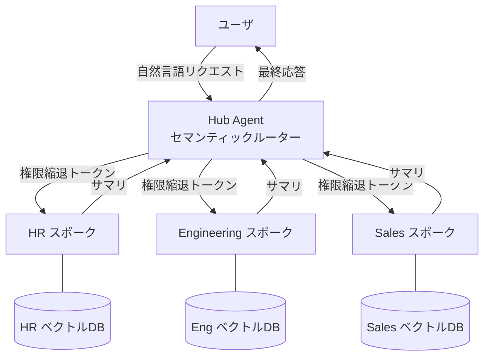

# RT-1 Org-Hierarchical Hub & Spoke（意図ルーティング＋ドメインスポーク）

## 概要

ハブエージェントが受け取った自然言語の意図を解釈し、HR・Engineering・Sales などのドメインスポークへルーティングする。各スポークは独立したコンテキストウィンドウを持ち、結果をサマリとしてハブへ返す。権限は親から子へしか渡らず、子が親の権限を超えることはできない。

## 設計

ハブはセマンティックルーターとして機能し、リクエストのドメイン分類を行う。分類結果に基づき対象スポークを選択し、呼び出す。各スポークは自身のドメインに特化したツール・ベクトルDB・ケイパビリティを持つ。スポークは処理完了後にサマリをハブへ返し、ハブがユーザへ最終応答を組み立てる。

権限の減衰（permission attenuation）は全ルートで強制される。ハブは呼び出し元ユーザの権限を委譲トークンに変換し、スポークに渡す。スポークはその権限スコープを超えた操作を要求できない。

スポークのサマリ返却により、ハブのコンテキストウィンドウには全ドメインの生データが蓄積されない。各スポークは独立してスケール・バージョンアップでき、ハブへの影響が局所化される。

## 解決する企業課題

モノリシックなプロンプトに全ドメインのツール・ポリシー・データを詰め込むと、コンテキストウィンドウが枯渇し、精度が低下する。このパターンはコンテキスト分割によりその課題を解消する。

各スポークがドメイン固有のAPIや権限ロジックを内包するため、特定SaaSのAPI変更がシステム全体に波及しない。HR系SaaSのAPIが変更されてもHRスポークのアダプタのみを修正すれば済む。

組織ドメイン間の権限サイロを尊重した設計になるため、Sales スポークがHRデータに無認可でアクセスする構造的欠陥を防ぐ。権限の縮退を強制する仕組みが、最小権限原則の自然な実装となる。

## 向き／不向き

**向いている条件**

- 部門ごとに異なる権限境界・SaaS連携・ベクトルDBが存在する大規模組織。
- ドメイン横断リクエストが多く、単一エージェントでのコンテキスト管理が現実的でない規模。
- 各ドメインチームが独立してスポークを開発・更新する必要がある場合。

**向いていない条件**

- ドメインが1〜2つしかなく、スポーク分割のオーバーヘッドがメリットを上回る小規模な用途。
- リクエストの大半がドメイン横断的で、ほぼ全スポークを毎回呼び出すケース（ファンアウトによるレイテンシが問題になる）。
- スポーク間の密結合な連携（共有状態の頻繁な読み書きなど）が前提となる業務フロー。

## 要素技術・既存システム連携

- セマンティックルーター：意図分類モデル、埋め込みベクトル類似度検索
- マルチエージェントフレームワーク：LangGraph、AutoGen、CrewAI
- ドメイン別ベクトルDB：Pinecone、Weaviate、pgvector（部門ごとにテナント分離）
- ケイパビリティレジストリ：各スポークが公開するツール一覧を管理する中央カタログ
- 権限縮退：ID-4 Permission Mirror と連携し、OBO トークン（RFC 8693）でスポークに委譲
- 部門SaaS連携：Workday（HR）、Salesforce（Sales）、GitHub/Jira（Engineering）

## 落とし穴／選定の勘所

**単一メガエージェント化**。「とりあえず1エージェントに全ツール・全ポリシーを持たせる」構成は、コンテキスト汚染・権限過多・変更影響の広域化を引き起こす典型的アンチパターンである。規模が小さいうちは問題が見えないが、ドメイン数・ツール数の増加とともに破綻する。

**セマンティックルーターの精度不足**。ルーティングの誤分類はリクエストが誤ったドメインのスポークに届くことを意味する。ルーターのテストカバレッジ確保と、低信頼度時のフォールバック（人間確認、複数スポーク並列呼び出し）を設計に組み込む。

**スポーク間の暗黙的な権限依存**。あるスポークが別スポークのデータを必要とする場合、ハブを経由せずに直接呼び出す設計が生まれやすい。これは権限縮退の一貫性を破壊する。スポーク間の連携は必ずハブを中継し、権限チェックを通過させること。

**ケイパビリティレジストリの放棄**。スポークが増えるにつれ、どのスポークがどのツールを持つかの管理が散漫になる。レジストリを中央管理し、GV-2 Agent Catalog と統合する。

## 関連パターン

- [RT-2 RACI-based Multi-Agent Orchestration](rt2-raci-multi-agent.md)
- [ID-4 Permission Mirror & Least-of](../id-identity/id4-permission-mirror-least-of.md)
- [EX-1 Enterprise Agent Gateway](../ex-experience/ex1-enterprise-agent-gateway.md)
- [KM-4 Scoped Memory Hierarchy](../km-knowledge/km4-scoped-memory-hierarchy.md)
