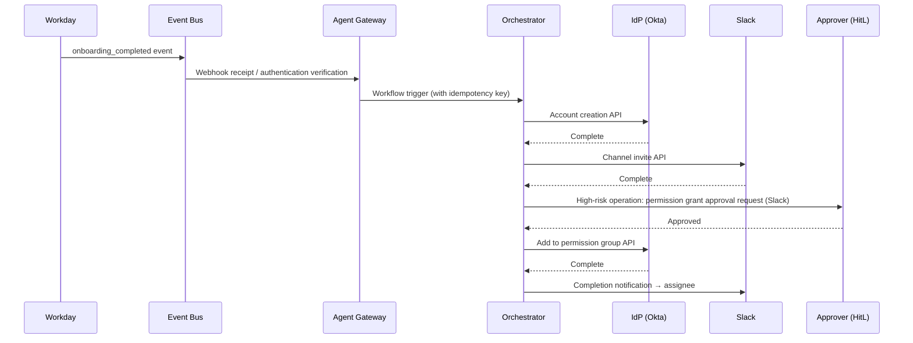

# RT-10 Event-Driven Enterprise Orchestrator (Event-Driven)

## Overview

The moment an "onboarding completed" event fires from Workday, an agent autonomously starts and executes IdP account creation, license assignment, Slack channel invitation, Jira board initial setup, and welcome email send — all at once. This is the event-driven agent. Rather than waiting to be called by a human, the progression of business processes naturally triggers the agent. LLMs absorb the exceptions and judgment variations that RPA cannot handle, combining async Saga and human approval for write operations. This is the configuration where agents' business value is most directly demonstrated for back-office automation.

## Enterprise Problem Addressed

This pattern solves the passivity problem in traditional system integration. Rather than an agent that "only moves when called," it functions as a backend worker that moves autonomously in line with business process flow. It is a configuration that keeps business flows continuously autonomous that previously could not proceed without human operator involvement, achieving fundamental back-office automation.

Copy-and-paste work between multiple SaaS — Workday, Salesforce, GitHub — (account creation during onboarding, notification integration during contract renewals, document updates after code merges) is a typical example of expensive and error-prone inter-system integration. RPA is fragile to HTML structure changes and has difficulty handling exception patterns, but agents can handle non-standard exceptions through natural language understanding.

The problem of "Webhook chaos" — where it becomes impossible to manage "who handles which Webhook how" as Webhooks multiply — is also serious. Centralizing management around an event bus eliminates scattered Webhooks. Concentrating event authentication, filtering, debounce, and cost management in a gateway layer enables building a secure event-driven foundation.

!!! tip "Minimum Viable Configuration (MVP)"
    Receive one SaaS event (e.g., Workday's onboarding_completed) via an event bus and trigger a 2–3 step Durable Workflow. The minimum viable configuration is achieved by adding debounce and HMAC signature verification to the gateway layer.

## Value Hypothesis

Event-driven autonomous business triggering eliminates human "start the next task" judgment and manual input. Achieving end-to-end business automation significantly reduces processing lead time and costs.

## Solution and Design

The core of the solution is "standardizing SaaS events as enterprise business events and designing agents as their consumers." The event bus serves as a loosely-coupled connection point between systems, and agents interpret event meaning to determine appropriate actions. Processing involving writes is executed with the Saga pattern, inserting HitL approval based on risk assessment.

Events are received from SaaS via the event bus, and the orchestrator triggers workflows.



Trigger conditions, rate limits, debounce, and risk classification are evaluated in the gateway layer before the orchestrator is triggered. When the same event fires multiple times in a short period (event storm), debounce prevents duplicate triggering. Workflow execution budget limits and step limits are delegated to the Durable Workflow engine (RT-8).

External Webhooks are authenticated by HMAC signature verification, source IP whitelist, and CloudEvents `source` field verification. Blocking illegitimate events before triggering prevents Webhook spoofing attacks.

## When to Use / When Not to Use

| When to Use | When Not to Use |
|---|---|
| Business flows triggered by standard events from SaaS (onboarding completion, contract renewal, incident detection, etc.) exist | Interactive processing requiring immediate user response (synchronous chat, real-time search, etc.) |
| Cross-system copy-and-paste work and routine integration need to be automated | Processing with extremely high event firing frequency (hundreds per second or more) where agent trigger cost is impractical |
| The majority of processing is async/background and does not require humans to wait in real time | Ad-hoc business workflows where trigger conditions cannot be defined |
| Prior attempts at RPA automation failed due to exception handling complexity | — |

## Component Technologies and System Integration

- **Event bus**: Amazon EventBridge, Google Pub/Sub, Azure Service Bus, Apache Kafka
- **Event standard**: CloudEvents (event format standardization — source, type, and ID in unified schema)
- **CDC (Change Data Capture)**: Debezium (extracting DB changes as events)
- **Workflow engine**: Temporal, AWS Step Functions, Azure Durable Functions (integrated with RT-8)
- **iPaaS**: Workato, MuleSoft, Zapier Enterprise (SaaS to event bus connection and transformation)
- **SaaS event sources**: Workday (HR), Salesforce (CRM), GitHub (development), PagerDuty (incidents)
- **HitL approval channels**: Slack (approval buttons), ServiceNow (approval tasks)
- **Governance integration**: combined with GV-9 Kill Switch to stop event processing during runaway events

## Pitfalls and Selection Criteria

!!! danger "Cost and execution runaway from event storms"
    The greatest risk of event-driven design is event storms. Bulk updates in SaaS, batch processing, and failure recovery can cause the same event type to fire massively in a short time, triggering massive parallel agent launches. Token consumption, API charges, and SaaS rate limit excess cascade. Always build the following into the design:
    1. Debounce (aggregate duplicate events to the same entity within a short period into one)
    2. Rate limiting (upper limit on workflow trigger count)
    3. Risk classification (place high-cost processing in approval queue rather than auto-triggering)
    4. Budget limits (monthly/daily token and API consumption limits and emergency stop via GV-9)

!!! warning "Insufficient trigger condition design"
    Using "Salesforce update events" unconditionally as triggers causes agents to trigger with minor changes to opportunity status (e.g., a sales rep adding a memo). Narrow trigger conditions by field, status, amount of change, and source IP to eliminate unnecessary triggers.

!!! warning "Do not fully automate write operations without HitL"
    The autonomy of event-driven processing is attractive, but fully automating writes to production systems (account creation, permission grants, external sends) without approval increases the risk of erroneous events and malicious event injection. Refer to RT-6 SoR write boundary and always insert HitL approval flows in Slack/ServiceNow for high-risk operations.

!!! warning "Omitting event authentication and verification"
    Using external Webhooks directly as agent triggers creates a Webhook spoofing attack risk. Perform HMAC signature verification, source IP whitelist, and CloudEvents `source` field verification at receipt time to block illegitimate events before triggering.

## Interfaces

The following are the key interfaces for implementing this pattern. Coding agents can generate stub code from these definitions.

```yaml
interfaces:
  - name: Event Gateway
    description: "Validates incoming webhooks via HMAC signature, source IP allowlist, and CloudEvents source field before routing to the orchestrator."
    input:
      request: object
    output:
      response: object
    errors:
      - code: GENERAL_ERROR
        description: "Error occurred during Event Gateway processing"
    protocol: "REST / gRPC"
    implementation_hints:
      - "See the Solution and Design section for details"
  - name: Debounce / Rate Limiter
    description: "Collapses duplicate events for the same entity within a short window and enforces a maximum concurrent workflow launch rate."
    input:
      request: object
    output:
      response: object
    errors:
      - code: GENERAL_ERROR
        description: "Error occurred during Debounce / Rate Limiter processing"
    protocol: "REST / gRPC"
    implementation_hints:
      - "See the Solution and Design section for details"
  - name: Durable Workflow Engine (RT-8)
    description: "Manages long-running post-event processing with crash resilience and HitL approval integration."
    input:
      request: object
    output:
      response: object
    errors:
      - code: GENERAL_ERROR
        description: "Error occurred during Durable Workflow Engine (RT-8) processing"
    protocol: "REST / gRPC"
    implementation_hints:
      - "See the Solution and Design section for details"
```

## Related Patterns

- [RT-7 Enterprise Saga Agent](rt7-enterprise-saga.md): Complementary. Combined with Saga workflow implementation triggered by events to ensure multi-system write consistency.
- [RT-8 Durable Enterprise Agent Workflow](rt8-durable-workflow.md): Complementary. Manages long-running processing after event triggering as Durable Workflow, providing crash resilience and state persistence.
- [RT-4 Human Approval Chain](rt4-human-approval-chain.md): Complementary. Incorporates HitL approval before write operations into event-driven flows, guaranteeing human involvement for high-risk operations.
- [IN-1 Tool & MCP Gateway](../in-integration/in1-tool-mcp-gateway.md): Complementary. Manages agent calls to each SaaS through a gateway, centralizing rate limiting and auditing.
- [GV-9 Incident Response & Kill Switch](../gv-governance/gv9-incident-response-kill-switch.md): Complementary. Provides emergency shutdown of agent execution during event storms or runaway events. Particularly important as a safety mechanism for event-driven designs.
