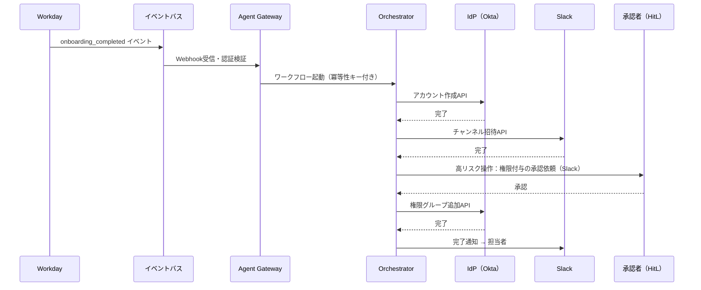

# RT-10 Event-Driven Enterprise Orchestrator（イベント駆動）

## 概要

ユーザーが呼び出すのを待つのではなく、SaaS や社内システムが発するイベント（Workday の入社完了・Box への契約書アップロード・Salesforce の商談クローズなど）をトリガーにエージェントが自律起動するパターンである。RPA では対応できない例外処理や判断の揺らぎを LLM が吸収し、複数システムへの後続アクション（アカウント作成・ライセンス付与・通知・チケット起票）を自動実行する。書き込み操作には非同期 Saga と人間承認（Slack/ServiceNow の Approve/Reject）を必須とする。経営が求めるバックオフィス自動化の本丸である。

## 解決する企業課題

従来のシステム連携における受動性の問題を解決する。エージェントを「呼ばれたときだけ動く」存在ではなく、業務プロセスの流れに沿って自律的に動くバックエンドワーカーとして機能させる。経営が求める抜本的自動化の本丸であり、人間のオペレーターが介在しなければ進まなかった業務フローを常時自律稼働させる。

Workday・Salesforce・GitHubなど複数SaaSの間で発生するコピー&ペースト作業（オンボーディング時のアカウント作成、契約更新時の通知連携、コードマージ後のドキュメント更新など）は、コストが高く、ミスが起きやすいシステム間連携の典型例である。RPAはHTML構造変化に脆く、例外パターンへの対処が困難だが、エージェントは自然言語理解によって非定型の例外を処理できる。

Webhookが増加するにつれて「誰がどのWebhookをどう処理しているか」が管理不能になる問題（Webhook混乱）も深刻である。イベントバスを中心とした一元管理で、Webhookの散在を解消する。イベントの認証・フィルタリング・デバウンス・コスト管理をゲートウェイ層に集約することで、安全なイベント駆動基盤を構築できる。

## 解決策と設計

解決策の核心は「SaaS のイベントをエンタープライズのビジネスイベントとして標準化し、エージェントをそのコンシューマとして設計すること」である。イベントバスをシステム間の疎結合な接続点とし、エージェントはイベントの意味を解釈して適切なアクションを判断する。書き込みを伴う処理はSagaパターンで実行し、リスク判定に基づいてHitL承認を挟む。

イベントバスを介してSaaSからイベントを受け取り、オーケストレーターがワークフローを起動する。書き込みを伴う処理はSagaパターンで実行し、リスク判定に基づいてHitL承認を挟む。

トリガー条件・レートリミット・デバウンス・リスク分類はオーケストレーター起動前のゲートウェイ層で評価する。同一イベントが短時間に複数発火した場合（イベントストーム）はデバウンスにより重複起動を防ぐ。ワークフロー実行中の予算上限・ステップ上限はDurable Workflowエンジン（RT-8）に委譲する。

外部WebhookはHMAC署名検証・送信元IPホワイトリスト・CloudEventsの`source`フィールド検証により認証する。不正なイベントを起動前に遮断することでWebhook偽装攻撃を防ぐ。

## 向き／不向き

**向いている条件**

- SaaSが発する標準的なイベント（オンボーディング完了、契約更新、インシデント検知など）を起点とする業務フローが存在する
- 複数システムにまたがるコピー&ペースト作業や定型連携を自動化したい
- 処理の大部分が非同期・バックグラウンドで完結し、人間がリアルタイムで待機する必要がない業務
- RPAで自動化を試みたが例外処理の複雑さで断念した経緯がある

**向いていない条件**

- ユーザーが即座に応答を必要とするインタラクティブな処理（同期チャット、リアルタイム検索など）
- イベント発火頻度が極端に高く（毎秒数百件以上）、エージェント起動コストが非現実的な処理
- トリガー条件が定義できないほどアドホックな業務

## 要素技術・既存システム連携

- **イベントバス**：Amazon EventBridge、Google Pub/Sub、Azure Service Bus、Apache Kafka
- **イベント標準**：CloudEvents（イベント形式の標準化。発信元・種別・IDを統一スキーマで表現）
- **CDC（Change Data Capture）**：Debezium（DBの変更をイベントとして取り出す）
- **ワークフローエンジン**：Temporal、AWS Step Functions、Azure Durable Functions（RT-8と連携）
- **iPaaS**：Workato、MuleSoft、Zapier Enterprise（SaaSとイベントバスの接続・変換）
- **SaaSイベントソース**：Workday（HR）、Salesforce（CRM）、GitHub（開発）、PagerDuty（インシデント）
- **HitL承認チャネル**：Slack（承認ボタン）、ServiceNow（承認タスク）
- **ガバナンス連携**：GV-9 Kill Switchと組み合わせ、暴走時にイベント処理を停止する

## 落とし穴／選定の勘所

!!! danger "イベントストームによるコスト・実行暴走"
    イベントドリブン設計の最大のリスクはイベントストームである。SaaSの一括更新・バッチ処理・障害復旧時などに同一種類のイベントが短時間に大量発火し、エージェントが大量並列起動する。トークン消費・API課金・SaaSレートリミット超過が連鎖的に発生する。対策として以下を必ず設計に組み込む：
    1. デバウンス（同一エンティティへの短時間内重複イベントを1件に集約）
    2. レートリミット（ワークフロー起動数の上限）
    3. リスク分類（高コスト処理は自動起動せず承認キューに積む）
    4. 予算上限（月次・日次のトークン・API消費上限とGV-9による緊急停止）

!!! warning "トリガー条件の設計不足"
    「Salesforceの更新イベント」を無条件にトリガーとすると、商談ステータスの微細な変更（営業担当者のメモ追加など）のたびにエージェントが起動する。トリガー条件はフィールド・ステータス・変化量・発信元IPなどで絞り込み、不要な起動を排除すること。

!!! warning "書き込み操作をHitLなしで自動実行しない"
    イベント駆動の自律性は魅力的だが、本番システムへの書き込み（アカウント作成・権限付与・外部送信）を承認なしで全自動化すると、誤イベント・悪意あるイベント注入のリスクが高まる。RT-6のSoR書き込み境界を参照し、高リスク操作はSlack/ServiceNowのHitL承認フローを必ず挟むこと。

!!! warning "イベントの認証・検証省略"
    外部WebhookをそのままエージェントのトリガーとするとWebhook偽装攻撃のリスクがある。受信時にHMAC署名検証・送信元IPホワイトリスト・CloudEventsの`source`フィールド検証を実施し、不正なイベントを起動前に遮断すること。

## 関連パターン

- [RT-7 Enterprise Saga Agent](rt7-enterprise-saga.md)：補完関係。イベントをトリガーとして起動するSagaワークフローの実装に組み合わせ、マルチシステム書き込みの整合性を確保する。
- [RT-8 Durable Enterprise Agent Workflow](rt8-durable-workflow.md)：補完関係。イベント起動後の長時間処理をDurable Workflowとして管理し、クラッシュ耐性と状態永続化を提供する。
- [RT-4 Human Approval Chain](rt4-human-approval-chain.md)：補完関係。書き込み操作前のHitL承認をイベント駆動フローに組み込み、高リスク操作の人間介在を保証する。
- [IN-1 Tool & MCP Gateway](../in-integration/in1-tool-mcp-gateway.md)：補完関係。エージェントから各SaaSへの呼び出しをゲートウェイ経由で管理し、レートリミットと監査を一元化する。
- [GV-9 Incident Response & Kill Switch](../gv-governance/gv9-incident-response-kill-switch.md)：補完関係。イベントストームや暴走時にエージェント実行を緊急停止する。イベント駆動では特に重要な安全装置となる。
