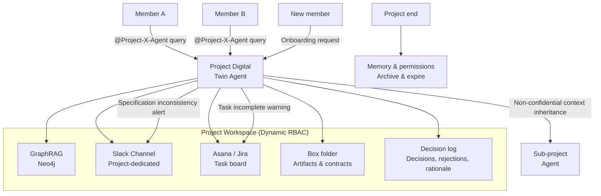

# RT-11 Project Workspace / Digital Twin Agent (Project Digital Twin)

## Overview

Project context is scattered across Slack, Notion, Jira, meeting notes, and email, taking days for new members to catch up. This pattern designs agents not as personal assistants but as "shared members tied to the project." At project start, it auto-provisions a GraphRAG-based shared memory, Slack channel, Jira board, and Box folder, allowing anyone to interact via `@Project-X-Agent`. It behaves proactively — for example, cross-referencing Jira and Slack each morning to warn about specification inconsistencies. At project end, memory and permissions are automatically expired.

## Enterprise Problem Addressed

Project context scattered across Slack, Notion, Jira, meeting notes, and email — with no one having a complete picture — is a typical enterprise problem. Information silos directly translate to business costs through delayed onboarding of new entrants, loss of decision rationale, and failure to detect specification divergence.

!!! tip "Minimum Viable Configuration (MVP)"
    First implement Slack channel + Jira board auto-provisioning and mention-response Q&A. Replace GraphRAG with simple vector search at initial stages, and narrow proactive monitoring to one specification inconsistency check.

In matrix organizations, agile teams, and long-term large projects especially, member turnover is frequent and "who chose that design and why" context depends on individual memory. The problem of this context being lost from the organization due to transfers or departures becomes a breeding ground for "I said / you said" disputes.

From an enterprise security perspective, if memory and permissions remain after project end, departed former members retain continuous access to confidential information from previous projects. Individual assistant-type agents cannot structurally solve this problem as lifecycle management is not included in their design.

## Value Hypothesis

Instant sharing of project context reduces member information-gathering time and improves project productivity. Early detection of bottlenecks and delays improves decision-making speed and reduces project delay risk.

## Solution and Design

The core of the solution is "treating the project as a single cognitive entity and having an agent that crosses all its information sources participate as a project member." The agent handles project memory, monitoring, and inquiry window all at once, reducing the cognitive load of human members. Dynamic RBAC ensures that member permission changes, additions, and deletions are immediately reflected in the agent's action permissions.

The project workspace is provisioned at project creation and its reference scope is controlled by member RBAC. The agent holds all workspace information sources as context, and each tool call is executed with permissions attenuated to member permissions.

Shared memory (GraphRAG) follows the principles of [KM-1 Access-Controlled RAG](../km-knowledge/km1-access-controlled-rag.md). Each document's ACL is included at ingestion time, and at read time it is filtered by the requesting member's permissions. There are two approaches when there are permission differences between members: (1) Configure shared memory with the minimum common permissions of all members (strict but reduces information volume), (2) Apply per-member read-time filters (maintains information volume but increases dependencies on [KM-1](../km-knowledge/km1-access-controlled-rag.md)/[KM-4](../km-knowledge/km4-scoped-memory-hierarchy.md)). In either case, "a state where access controls from the source are invalidated the moment of aggregation" is not acceptable.



GraphRAG holds a relationship graph of "people, decisions, artifacts, and tasks" within the project, answering relationship queries like "why was that design chosen" and "who made that decision." The decision log structurally records "decision content, decision-maker, rejected alternatives, and rationale," serving as a basis for retrospectives and audits.

Lifecycle processing at project end automatically executes: memory archiving (converting to read-only), dynamic RBAC group dissolution, Slack channel archiving, and task board closing.

## When to Use / When Not to Use

| When to Use | When Not to Use |
|---|---|
| Project teams (typically 5–50 members) spanning multiple tools (Slack, Jira, Box, Notion, etc.) | One-off, short-duration (1–2 day) tasks where workspace setup overhead is not worth it |
| Projects lasting several weeks or more where decision-making history needs to be referenced later | Individual projects with 1–2 members (individual assistant type is more appropriate) |
| When member turnover occurs and onboarding costs need to be reduced | Environments where enterprise systems (ERP, etc.) that centrally manage all information are already in place and information silos do not exist |
| When monitoring to detect specification and task divergence early is needed | — |

## Component Technologies and System Integration

- **GraphRAG**: Neo4j (graph DB) + vector index combination, holding relationship graphs of people, decisions, artifacts, and tasks
- **Slack Bot**: project-dedicated channel invitation, mention response, proactive notifications
- **Dynamic RBAC**: group provisioning at project creation, automatic dissolution at end (Okta Groups, Azure AD Groups)
- **Decision log**: structured DB (PostgreSQL) or document DB (MongoDB) recording decisions, rejections, and rationale
- **Task management API**: Asana API, Jira REST API (task state reading and updating)
- **File storage**: Box API, SharePoint (artifact reference and permission control)
- **RACI matrix**: mapping team role definitions to agent action permissions

## Pitfalls and Selection Criteria

!!! danger "Do not leave memory and permissions after project end"
    Failing to delete agent memory and dynamic RBAC groups after project end maintains a state where transferred former members can continue accessing confidential information from previous projects. If departed employees' accounts remain in groups, permission orphans occur. Automate lifecycle processing triggered by project end events (memory archiving, group dissolution, channel archiving) so it does not depend on human action.

!!! warning "Stale context from GraphRAG update delays"
    When GraphRAG graph updates are not real-time, the latest state of decisions may not be reflected in agent responses. Estimate the latency of pipelines synchronizing Slack, Jira, and Box updates to the graph at the design stage and define acceptable ranges.

!!! warning "Confidential context leakage to sub-projects"
    When sub-projects inherit context from parent projects, implement context confidentiality classification and filtering so that highly sensitive information (personal information, unpublished financial information, etc.) is not inherited. Enforce the principle of "inherit only non-confidential context" at the RBAC level.

!!! warning "Excessive notifications from proactive behavior"
    Proactive behavior such as specification inconsistency checks and task completion warnings is useful, but if notification frequency and detection condition design is poor, members receive massive Slack notifications and start ignoring them. Define notification frequency, thresholds, and aggregation rules at the design stage and prepare a settings UI that members can tune.

## Interfaces

The following are the key interfaces for implementing this pattern. Coding agents can generate stub code from these definitions.

```yaml
interfaces:
  - name: Project Workspace Provisioner
    description: "On project creation, auto-provisions Slack channel, Jira board, Box folder, and dynamic RBAC group; auto-deprovisions all on project closure."
    input:
      request: object
    output:
      response: object
    errors:
      - code: GENERAL_ERROR
        description: "Error occurred during Project Workspace Provisioner processing"
    protocol: "REST / gRPC"
    implementation_hints:
      - "See the Solution and Design section for details"
    code_examples:
      typescript: |
        interface ProjectWorkspaceProvisionerRequest {
          projectId: string;
          projectName: string;
          memberIds: string[];
          action: string;
        }
        interface ProjectWorkspaceProvisionerResponse {
          slackChannelId: string;
          jiraBoardId: string;
          boxFolderId: string;
          rbacGroupId: string;
        }
        interface ProjectWorkspaceProvisioner {
          projectWorkspaceProvisioner(req: ProjectWorkspaceProvisionerRequest): Promise<ProjectWorkspaceProvisionerResponse>;
        }
      python: |
        @dataclass
        class ProjectWorkspaceProvisionerRequest:
            project_id: str
            project_name: str
            member_ids: list[str]
            action: str
        
        @dataclass
        class ProjectWorkspaceProvisionerResponse:
            slack_channel_id: str
            jira_board_id: str
            box_folder_id: str
            rbac_group_id: str
        
        class ProjectWorkspaceProvisioner(Protocol):
            async def project_workspace_provisioner(self, req: ProjectWorkspaceProvisionerRequest) -> ProjectWorkspaceProvisionerResponse: ...
  - name: GraphRAG Memory
    description: "Maintains a knowledge graph of people, decisions, artifacts, and tasks within the project, filtered by each member's RBAC permissions at read time."
    input:
      request: object
    output:
      response: object
    errors:
      - code: GENERAL_ERROR
        description: "Error occurred during GraphRAG Memory processing"
    protocol: "REST / gRPC"
    implementation_hints:
      - "See the Solution and Design section for details"
    code_examples:
      typescript: |
        interface GraphragMemoryRequest {
          projectId: string;
          query: string;
          userId: string;
        }
        interface GraphragMemoryResponse {
          nodes: object[];
          relationships: object[];
          filteredByRbac: boolean;
        }
        interface GraphragMemory {
          graphragMemory(req: GraphragMemoryRequest): Promise<GraphragMemoryResponse>;
        }
      python: |
        @dataclass
        class GraphragMemoryRequest:
            project_id: str
            query: str
            user_id: str
        
        @dataclass
        class GraphragMemoryResponse:
            nodes: list[dict]
            relationships: list[dict]
            filtered_by_rbac: bool
        
        class GraphragMemory(Protocol):
            async def graphrag_memory(self, req: GraphragMemoryRequest) -> GraphragMemoryResponse: ...
  - name: Decision Log Store
    description: "Structured record of decisions made, rejected alternatives, and rationale for retrospective and audit use."
    input:
      request: object
    output:
      response: object
    errors:
      - code: GENERAL_ERROR
        description: "Error occurred during Decision Log Store processing"
    protocol: "REST / gRPC"
    implementation_hints:
      - "See the Solution and Design section for details"
    code_examples:
      typescript: |
        interface DecisionLogStoreRequest {
          projectId: string;
          decisionText: string;
          alternatives: string[];
          rationale: string;
          authorId: string;
        }
        interface DecisionLogStoreResponse {
          decisionId: string;
          recordedAt: Date;
        }
        interface DecisionLogStore {
          decisionLogStore(req: DecisionLogStoreRequest): Promise<DecisionLogStoreResponse>;
        }
      python: |
        @dataclass
        class DecisionLogStoreRequest:
            project_id: str
            decision_text: str
            alternatives: list[str]
            rationale: str
            author_id: str
        
        @dataclass
        class DecisionLogStoreResponse:
            decision_id: str
            recorded_at: datetime
        
        class DecisionLogStore(Protocol):
            async def decision_log_store(self, req: DecisionLogStoreRequest) -> DecisionLogStoreResponse: ...
```

## Related Patterns

- [KM-1 Access-Controlled RAG](../km-knowledge/km1-access-controlled-rag.md): Complementary. The foundation for ACL inclusion at ingestion time and permission filtering at read time for shared memory (GraphRAG). Essential for safely handling permission differences between members.
- [KM-4 Scoped Memory Hierarchy](../km-knowledge/km4-scoped-memory-hierarchy.md): Complementary. Combined as the foundation for project-scoped memory design and lifecycle management. Design memory expiration and archiving strategies together with this pattern.
- [KM-3 Canonical Object Knowledge Graph](../km-knowledge/km3-canonical-object-knowledge-graph.md): Complementary. Strengthens project knowledge structuring by combining GraphRAG design with the canonical object model.
- [RT-2 RACI Multi-Agent](rt2-raci-multi-agent.md): Complementary. Reflects the team's RACI matrix in agent permissions and roles, incorporating team responsibility division into agent design.
- [RT-8 Durable Enterprise Agent Workflow](rt8-durable-workflow.md): Complementary. Implements proactive scheduled check processing (specification inconsistency monitoring, etc.) as Durable Workflows to ensure fault tolerance.
- [ID-4 Permission Mirror & Least-of](../id-identity/id4-permission-mirror-least-of.md): Complementary. Faithfully reflects dynamic RBAC group permissions in agent API call permissions, preventing access beyond member permission boundaries.
