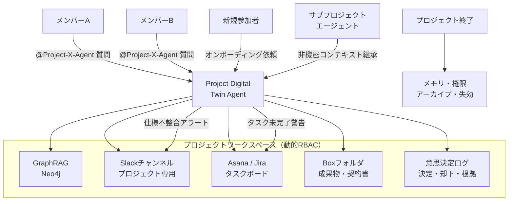

# RT-11 Project Workspace / Digital Twin Agent（プロジェクト・デジタルツイン）

## 概要

エージェントを「個人アシスタント」ではなく「プロジェクトまたはチームに紐付いた存在」として設計するパターンである。プロジェクトのコンテキスト・成果物・意思決定履歴・タスク状態を動的RBACワークスペース（GraphRAG、Slackチャンネル、AsanaまたはJiraボード、Boxフォルダ）として共有する。メンバーは `@Project-X-Agent` として呼び出す。サブプロジェクトは親の非機密コンテキストを継承する。エージェントは受動的に呼ばれるだけでなく、定期的にSlackとAsanaを横断チェックして仕様の不整合を検出するといった能動的な監視も担う。プロジェクト終了時にはメモリと権限を明示的にアーカイブ・失効させる。

## 設計

プロジェクトワークスペースはプロジェクト作成時にプロビジョニングされ、メンバーのRBACにより参照範囲が制御される。エージェントはワークスペース内の全情報源をコンテキストとして持ち、各ツール呼び出しはメンバーの権限に縮退させて実行する。

GraphRAGはプロジェクト内の「人・決定・成果物・タスク」の関係グラフを保持し、「なぜその設計になったか」「誰がその決定をしたか」といった関係性クエリに答える。意思決定ログは「決定内容・決定者・却下した選択肢・根拠」を構造化して記録し、振り返りと監査の基盤となる。

プロジェクト終了時のライフサイクル処理：メモリのアーカイブ（読み取り専用化）、動的RBACグループの解除、Slackチャンネルのアーカイブ、タスクボードのクローズを自動実行する。

## 解決する企業課題

プロジェクトのコンテキストがSlack・Notion・Jira・会議メモ・メールに散在し、誰も全体を把握できない状態はエンタープライズの典型的な問題である。新規参加者のオンボーディングに数日かかり、過去の意思決定理由が失われ、複数ツール間で仕様が乖離しても誰も気づかない。

このパターンは全情報源を横断するプロジェクト専有エージェントを置くことで、情報サイロを解消する。オンボーディング時間の短縮、意思決定履歴の保持、仕様不整合の能動的検出という効果が得られる。組織的には、プロジェクト終了後の知識が個人のSlackに埋もれて消える問題も、意思決定ログとGraphRAGにより組織知として残せる。

## 向き／不向き

**向いている条件**

- 複数ツール（Slack・Jira・Box・Notion等）を横断するプロジェクトチーム（5〜50名規模が典型的）
- プロジェクト期間が数週間以上で、意思決定の経緯を後から参照したいケース
- メンバーの入れ替えが発生し、オンボーディングコストを削減したい
- 仕様とタスクの乖離を早期に検出する監視ニーズがある

**向いていない条件**

- 単発・短期間（1〜2日）のタスクで、ワークスペース構築のオーバーヘッドが割に合わない
- メンバーが1〜2名の個人プロジェクト（個人アシスタント型の方が適する）
- 全情報を一元管理するエンタープライズシステム（ERP等）がすでに整備されており、情報サイロが存在しない環境

## 要素技術・既存システム連携

- **GraphRAG**：Neo4j（グラフDB）+ ベクトルインデックスの組み合わせ。人・決定・成果物・タスクの関係グラフを保持
- **Slack Bot**：プロジェクト専用チャンネルへの招待・メンション応答・プロアクティブ通知
- **動的RBAC**：プロジェクト作成時にグループプロビジョニング、終了時に自動解除（Okta Groups、Azure AD Groups）
- **意思決定ログ**：構造化DB（PostgreSQL）またはドキュメントDB（MongoDB）に決定・却下・根拠を記録
- **タスク管理API**：Asana API、Jira REST API（タスク状態の読み取り・更新）
- **ファイルストレージ**：Box API、SharePoint（成果物の参照・権限制御）
- **RACIマトリクス**：チームの役割定義をエージェントのアクション権限にマッピング

## 落とし穴／選定の勘所

!!! danger "プロジェクト終了後にメモリと権限を残存させない"
    プロジェクト終了後にエージェントのメモリと動的RBACグループを削除しないと、以下のリスクが生じる。異動した元メンバーが旧プロジェクトの機密情報に引き続きアクセスできる状態が維持される。退職者のアカウントがグループに残ったままだと権限の孤児が発生する。プロジェクト終了イベントをトリガーとしたライフサイクル処理（メモリアーカイブ・グループ解除・チャンネルアーカイブ）を自動化し、人手に依存しない設計にすること。

!!! warning "GraphRAGの更新遅延による古いコンテキスト"
    GraphRAGのグラフ更新がリアルタイムでない場合、意思決定の最新状態がエージェントの応答に反映されないことがある。Slack・Jira・Boxの更新をグラフに同期するパイプラインのレイテンシを設計段階で見積もり、許容範囲を定義すること。

!!! warning "サブプロジェクトへの機密コンテキスト漏洩"
    サブプロジェクトが親プロジェクトのコンテキストを継承する際に、機密度の高い情報（個人情報・未公開財務情報など）まで継承しないよう、コンテキストの機密分類とフィルタリングを実装すること。「非機密コンテキストのみ継承」という原則をRBACレベルで強制する。

!!! warning "プロアクティブ動作の過剰通知"
    仕様不整合チェック・タスク未完了警告などのプロアクティブ動作は有用だが、頻度・検知条件の設計が甘いとSlackに大量通知が届き、メンバーに無視されるようになる。通知頻度・閾値・集約ルールを設計段階で定め、メンバーがチューニングできる設定UIを用意すること。

## 関連パターン

- [KM-4 Scoped Memory Hierarchy](../km-knowledge/km4-scoped-memory-hierarchy.md)：プロジェクトスコープのメモリ設計とライフサイクル管理の基盤として参照する
- [KM-3 Canonical Object Knowledge Graph](../km-knowledge/km3-canonical-object-knowledge-graph.md)：GraphRAGの設計と正規オブジェクトモデルの参照に組み合わせる
- [RT-2 RACI Multi-Agent](rt2-raci-multi-agent.md)：チームのRACIマトリクスをエージェントの権限・役割に反映する
- [RT-8 Durable Enterprise Agent Workflow](rt8-durable-workflow.md)：プロアクティブな定期チェック処理をDurable Workflowとして実装する
- [ID-4 Permission Mirror & Least-of](../id-identity/id4-permission-mirror-least-of.md)：動的RBACグループの権限をエージェントのAPI呼び出し権限に忠実に反映する
