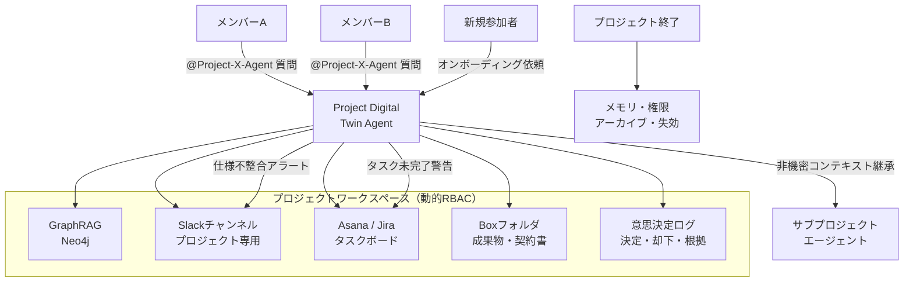

# RT-11 Project Workspace / Digital Twin Agent（プロジェクト・デジタルツイン）

## 概要

プロジェクトの文脈は Slack・Notion・Jira・会議録・メールに散らばり、新メンバーが追いつくのに何日もかかる。このパターンは、エージェントを個人アシスタントではなく「プロジェクトに紐づく共有メンバー」として設計する。プロジェクト開始時に GraphRAG ベースの共有メモリ・Slack チャンネル・Jira ボード・Box フォルダを自動プロビジョニングし、`@Project-X-Agent` で誰でも対話できる。毎朝 Jira と Slack を突き合わせて仕様の不整合を警告するなど、能動的に振る舞う。プロジェクト終了時にはメモリと権限を自動で失効させる。

## 解決する企業課題

プロジェクトのコンテキストがSlack・Notion・Jira・会議メモ・メールに散在し、誰も全体を把握できない状態はエンタープライズの典型的な問題である。情報サイロは新規参加者のオンボーディング遅延・意思決定理由の消失・仕様の乖離検知の失敗という形で業務コストに直結する。

!!! tip "最小成立条件（MVP）"
    まず Slack チャンネル＋Jira ボードの自動プロビジョニングと、メンション応答による Q&A を実装する。GraphRAG は初期段階ではシンプルなベクトル検索で代替し、プロアクティブ監視は仕様不整合チェック1本に絞る。

特にマトリクス組織・アジャイル・長期大型プロジェクトでは、メンバーの入れ替えが頻繁に発生し、「誰がなぜその設計を選んだか」という文脈が個人の記憶に依存する。担当者の異動・退職によりこの文脈が組織から失われる問題は、「言った言わない」の温床となる。

エンタープライズのセキュリティ観点では、プロジェクト終了後もメモリと権限が残存すると、異動した元メンバーが旧プロジェクトの機密情報に継続アクセスできる状態が生じる。個人アシスタント型のエージェントではライフサイクル管理が設計に含まれないため、この問題を構造的に解決できない。

## 解決策と設計

解決策の核心は「プロジェクトを一つの認識主体として扱い、その全情報源を横断するエージェントをプロジェクトメンバーとして参加させること」である。エージェントはプロジェクトの記憶・監視・問い合わせ窓口を一手に担い、人間メンバーの認知負荷を低減する。動的 RBAC により、メンバーの権限変更・追加・削除がエージェントのアクション権限に即時反映される。

プロジェクトワークスペースはプロジェクト作成時にプロビジョニングされ、メンバーの RBAC により参照範囲が制御される。エージェントはワークスペース内の全情報源をコンテキストとして持ち、各ツール呼び出しはメンバーの権限に縮退させて実行する。

共有メモリ（GraphRAG）は [KM-1 権限認識 RAG](../km-knowledge/km1-access-controlled-rag.md) の原則に従う。取り込み時に各ドキュメントの ACL を同梱し、読み出し時に要求元メンバーの権限でフィルタする。メンバー間で権限差がある場合の方針は2つある。(1) 共有メモリを全メンバーの最小共通権限で構成する（厳格だが情報量が減る）、(2) メンバーごとに読み出し時フィルタを適用する（情報量を維持するが [KM-1](../km-knowledge/km1-access-controlled-rag.md)/[KM-4](../km-knowledge/km4-scoped-memory-hierarchy.md) への依存が増す）。いずれの場合も「集約した瞬間に源のアクセス制御が無効化される」状態を許容しない。

GraphRAGはプロジェクト内の「人・決定・成果物・タスク」の関係グラフを保持し、「なぜその設計になったか」「誰がその決定をしたか」といった関係性クエリに答える。意思決定ログは「決定内容・決定者・却下した選択肢・根拠」を構造化して記録し、振り返りと監査の基盤となる。

プロジェクト終了時のライフサイクル処理として、メモリのアーカイブ（読み取り専用化）、動的 RBAC グループの解除、Slack チャンネルのアーカイブ、タスクボードのクローズを自動実行する。

## 向き／不向き

| 向き | 不向き |
|---|---|
| 複数ツール（Slack・Jira・Box・Notion等）を横断するプロジェクトチーム（5〜50名規模が典型的） | 単発・短期間（1〜2日）のタスクで、ワークスペース構築のオーバーヘッドが割に合わない |
| プロジェクト期間が数週間以上で、意思決定の経緯を後から参照したいケース | メンバーが1〜2名の個人プロジェクト（個人アシスタント型の方が適する） |
| メンバーの入れ替えが発生し、オンボーディングコストを削減したい | 全情報を一元管理するエンタープライズシステム（ERP等）がすでに整備されており、情報サイロが存在しない環境 |
| 仕様とタスクの乖離を早期に検出する監視ニーズがある | — |

## 要素技術・既存システム連携

- **GraphRAG**：Neo4j（グラフDB）+ ベクトルインデックスの組み合わせ。人・決定・成果物・タスクの関係グラフを保持
- **Slack Bot**：プロジェクト専用チャンネルへの招待・メンション応答・プロアクティブ通知
- **動的RBAC**：プロジェクト作成時にグループプロビジョニング、終了時に自動解除（Okta Groups、Azure AD Groups）
- **意思決定ログ**：構造化DB（PostgreSQL）またはドキュメントDB（MongoDB）に決定・却下・根拠を記録
- **タスク管理API**：Asana API、Jira REST API（タスク状態の読み取り・更新）
- **ファイルストレージ**：Box API、SharePoint（成果物の参照・権限制御）
- **RACIマトリクス**：チームの役割定義をエージェントのアクション権限にマッピング

## 落とし穴／選定の勘所

!!! danger "プロジェクト終了後にメモリと権限を残存させない"
    プロジェクト終了後にエージェントのメモリと動的 RBAC グループを削除しないと、異動した元メンバーが旧プロジェクトの機密情報に引き続きアクセスできる状態が維持される。退職者のアカウントがグループに残ったままだと権限の孤児が発生する。プロジェクト終了イベントをトリガーとしたライフサイクル処理（メモリアーカイブ・グループ解除・チャンネルアーカイブ）を自動化し、人手に依存しない設計にすること。

!!! warning "GraphRAGの更新遅延による古いコンテキスト"
    GraphRAGのグラフ更新がリアルタイムでない場合、意思決定の最新状態がエージェントの応答に反映されないことがある。Slack・Jira・Boxの更新をグラフに同期するパイプラインのレイテンシを設計段階で見積もり、許容範囲を定義すること。

!!! warning "サブプロジェクトへの機密コンテキスト漏洩"
    サブプロジェクトが親プロジェクトのコンテキストを継承する際に、機密度の高い情報（個人情報・未公開財務情報など）まで継承しないよう、コンテキストの機密分類とフィルタリングを実装すること。「非機密コンテキストのみ継承」という原則をRBACレベルで強制する。

!!! warning "プロアクティブ動作の過剰通知"
    仕様不整合チェック・タスク未完了警告などのプロアクティブ動作は有用だが、頻度・検知条件の設計が甘いとSlackに大量通知が届き、メンバーに無視されるようになる。通知頻度・閾値・集約ルールを設計段階で定め、メンバーがチューニングできる設定UIを用意すること。

## 関連パターン

- [KM-1 Access-Controlled RAG](../km-knowledge/km1-access-controlled-rag.md)：補完関係。共有メモリ（GraphRAG）の取り込み時ACL同梱・読み出し時権限フィルタの基盤。メンバー間の権限差を安全に扱うために必須。
- [KM-4 Scoped Memory Hierarchy](../km-knowledge/km4-scoped-memory-hierarchy.md)：補完関係。プロジェクトスコープのメモリ設計とライフサイクル管理の基盤として組み合わせる。メモリの有効期限・アーカイブ戦略を本パターンと合わせて設計する。
- [KM-3 Canonical Object Knowledge Graph](../km-knowledge/km3-canonical-object-knowledge-graph.md)：補完関係。GraphRAGの設計と正規オブジェクトモデルを組み合わせ、プロジェクト知識の構造化を強化する。
- [RT-2 RACI Multi-Agent](rt2-raci-multi-agent.md)：補完関係。チームのRACIマトリクスをエージェントの権限・役割に反映し、チーム内の責任分担をエージェント設計に組み込む。
- [RT-8 Durable Enterprise Agent Workflow](rt8-durable-workflow.md)：補完関係。プロアクティブな定期チェック処理（仕様不整合監視など）をDurable Workflowとして実装し、障害耐性を確保する。
- [ID-4 Permission Mirror & Least-of](../id-identity/id4-permission-mirror-least-of.md)：補完関係。動的RBACグループの権限をエージェントのAPI呼び出し権限に忠実に反映し、メンバーの権限境界を超えたアクセスを防ぐ。
