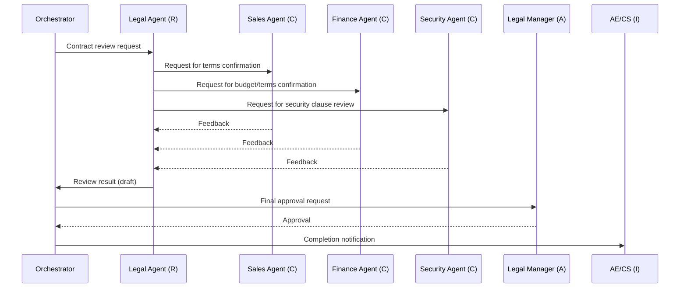

# RT-2 RACI-based Multi-Agent Orchestration

## Overview

Multi-agent architectures fail when the justification is "the task is complex." They succeed when "organizational responsibility is divided across multiple parties." For contract review, for example: the Legal Agent executes, Sales/Finance Agents consult, the legal manager holds final accountability, and the sales rep is notified of the result — this RACI structure maps directly to agent topology. Without clear responsibility boundaries, multiple agents end up debating endlessly with no one deciding.

## Enterprise Problem Addressed

A frequent enterprise challenge is the state where "who holds final accountability" is unclear. In multi-agent systems, the involvement of multiple agents makes accountability diffuse. For cross-departmental workflows such as contract approval involving legal, finance, and security, if each domain does not know "how far its own judgment extends," a structural risk emerges where agents make decisions that exceed their authority.

Building a system motivated by "multi-agent because it's complex" produces architecture without responsibility boundaries. Delegating high-risk decisions to agents without clear accountability means no one is responsible when mistakes occur. From a regulatory compliance perspective (SOX, personal information protection laws), a structure that cannot record "who decided what, when, and on what basis" as an audit trail presents a serious compliance risk.

This pattern resolves these issues by treating the RACI matrix as an input to system design and directly mapping responsibility assignments to the architecture.

!!! tip "Minimum Viable Configuration (MVP)"
    Define only R and A roles for one business flow (e.g., contract review), with the orchestrator delegating processing to the R agent and then seeking approval from the A human. C and I can be added later.

!!! note "Relative Cost and Operational Burden"
    Defining and maintaining RACI matrices, developing and testing multiple agents, and designing handoff protocols all require significant effort, with higher initial and operational costs compared to single-agent configurations. This is overkill for workflows where organizational responsibility division does not exist.

## Value Hypothesis

Responsibility division across multiple agents enables automation of cross-departmental workflows. Automating complex business processes that cannot be handled by a single agent improves project productivity.

## Solution and Design

The core of the solution is "limiting the justification for adding agents to the existence of responsibility division (RACI)." The criterion for going multi-agent is not task complexity but whether organizational responsibility is divided across multiple parties. The order must be preserved: the RACI matrix is defined first, and the corresponding agent configuration is derived from it.

Agents or human actors are defined for each role, and the orchestrator advances processing according to the matrix. Accountable is always held by a human. Assigning A to an agent leaves no one responsible when mistakes occur.

Using contract review as an example: R is the Legal Agent (executes), A is the Legal Manager (final approval), C is the Sales/Finance/Security Agents (provide input), and I is the AE/CS representatives (notified of results).



The orchestrator records who is R, A, C, and I at each phase in a decision log. A gate is set that prevents moving to the next phase until approval (A) is obtained. Feedback from C is aggregated at R, which is responsible for integrating it into the final decision. C involvement is limited to one round to prevent infinite loops. Decision logs are recorded in real time at the start and end of each phase (not backfilled after the fact).

## When to Use / When Not to Use

| When to Use | When Not to Use |
|---|---|
| Cross-departmental decision-making flows where the accountable party differs at each step | Simple tasks completed within a single department — RACI complexity becomes overhead |
| High-risk tasks requiring approval, escalation, and learning from rejections | Interactive use cases requiring real-time responsiveness (RACI consultation flows increase latency) |
| Compliance domains where audit trails of R/A/C/I records are required | Cases where a responsibility matrix does not exist or is difficult to define organizationally |
| — | Routine tasks where deterministic RPA or form processing suffices (AI agent adoption itself is unnecessary) |

## Component Technologies and System Integration

- Multi-agent orchestrator: LangGraph, AutoGen, Semantic Kernel
- RACI matrix definition: responsibility mapping in YAML/JSON format
- Handoff protocol: inter-agent handover specifications (input/output schema, status definitions)
- Approval workflow: ServiceNow, Slack workflows, Workday approval flows
- Decision log: structured logging (OpenTelemetry), audit DB
- Org chart integration: Workday, Microsoft Entra (dynamic resolution of who holds A)

## Pitfalls and Selection Criteria

**Lack of design rationale — "multi-agent because it's complex."** Adding agents only because a task is difficult produces architecture without responsibility boundaries. Transitions to multi-agent must always define the RACI matrix first, then derive the corresponding agent configuration.

**Empty Accountable seat.** In multi-agent systems, there is temptation to assign A to another agent. However, A should always be held by a human. Assigning A to an agent leaves no one responsible when mistakes occur.

**Infinite feedback loops from Consulted.** Consulted agents can end up requesting additional opinions from each other. Limit C involvement to one round and explicitly design R's responsibility to aggregate.

**Backfilling decision logs.** Designs that write logs in a batch after processing completes will lose records upon mid-process failure. Record in real time at the start and end of each phase.

## Interfaces

The following are the key interfaces for implementing this pattern. Coding agents can generate stub code from these definitions.

```yaml
interfaces:
  - name: Orchestrator
    description: "Drives the workflow according to the RACI matrix, recording each phase start/end in the decision log in real time."
    input:
      request: object
    output:
      response: object
    errors:
      - code: GENERAL_ERROR
        description: "Error occurred during Orchestrator processing"
    protocol: "REST / gRPC"
    implementation_hints:
      - "See the Solution and Design section for details"
    code_examples:
      typescript: |
        interface OrchestratorRequest {
          workflowId: string;
          raciMatrix: object;
          initialContext: object;
        }
        interface OrchestratorResponse {
          executionId: string;
          phase: string;
          state: string;
        }
        interface Orchestrator {
          orchestrator(req: OrchestratorRequest): Promise<OrchestratorResponse>;
        }
      python: |
        @dataclass
        class OrchestratorRequest:
            workflow_id: str
            raci_matrix: dict
            initial_context: dict
        
        @dataclass
        class OrchestratorResponse:
            execution_id: str
            phase: str
            state: str
        
        class Orchestrator(Protocol):
            async def orchestrator(self, req: OrchestratorRequest) -> OrchestratorResponse: ...
  - name: Decision Log
    description: "Structured log (OpenTelemetry) that records which role (R/A/C/I) performed which action and when."
    input:
      request: object
    output:
      response: object
    errors:
      - code: GENERAL_ERROR
        description: "Error occurred during Decision Log processing"
    protocol: "REST / gRPC"
    implementation_hints:
      - "See the Solution and Design section for details"
    code_examples:
      typescript: |
        interface DecisionLogRequest {
          projectId: string;
          decisionText: string;
          alternatives: string[];
          rationale: string;
          authorId: string;
        }
        interface DecisionLogResponse {
          decisionId: string;
          recordedAt: Date;
        }
        interface DecisionLog {
          decisionLog(req: DecisionLogRequest): Promise<DecisionLogResponse>;
        }
      python: |
        @dataclass
        class DecisionLogRequest:
            project_id: str
            decision_text: str
            alternatives: list[str]
            rationale: str
            author_id: str
        
        @dataclass
        class DecisionLogResponse:
            decision_id: str
            recorded_at: datetime
        
        class DecisionLog(Protocol):
            async def decision_log(self, req: DecisionLogRequest) -> DecisionLogResponse: ...
  - name: Approval Gate
    description: "Prevents progression to the next phase until the Accountable human provides approval."
    input:
      request: object
    output:
      response: object
    errors:
      - code: GENERAL_ERROR
        description: "Error occurred during Approval Gate processing"
    protocol: "REST / gRPC"
    implementation_hints:
      - "See the Solution and Design section for details"
    code_examples:
      typescript: |
        interface ApprovalGateRequest {
          phaseId: string;
          accountableId: string;
          workflowExecutionId: string;
        }
        interface ApprovalGateResponse {
          approved: boolean;
          approvedBy: string;
          approvedAt: Date;
        }
        interface ApprovalGate {
          approvalGate(req: ApprovalGateRequest): Promise<ApprovalGateResponse>;
        }
      python: |
        @dataclass
        class ApprovalGateRequest:
            phase_id: str
            accountable_id: str
            workflow_execution_id: str
        
        @dataclass
        class ApprovalGateResponse:
            approved: bool
            approved_by: str
            approved_at: datetime
        
        class ApprovalGate(Protocol):
            async def approval_gate(self, req: ApprovalGateRequest) -> ApprovalGateResponse: ...
```

## Related Patterns

- [RT-1 Org-Hierarchical Hub & Spoke](rt1-org-hierarchical-hub-spoke.md): Complementary. Applying RACI to responsibility coordination between Hub & Spoke spokes enables designing cross-domain decision-making flows.
- [RT-4 Human Approval Chain](rt4-human-approval-chain.md): Complementary. Used as the approval flow implementation when humans hold the A (Accountable) role in RACI.
- [GV-1 Enterprise Agent Control Plane](../gv-governance/gv1-agent-control-plane.md): Complementary. Centrally manages RACI matrix definition and change management through the control plane.
- [OB-2 Unified Audit & Lineage](../ob-observability/ob2-unified-audit-lineage.md): Complementary. Records decisions made by each R/A/C/I role in audit logs to ensure regulatory traceability.
