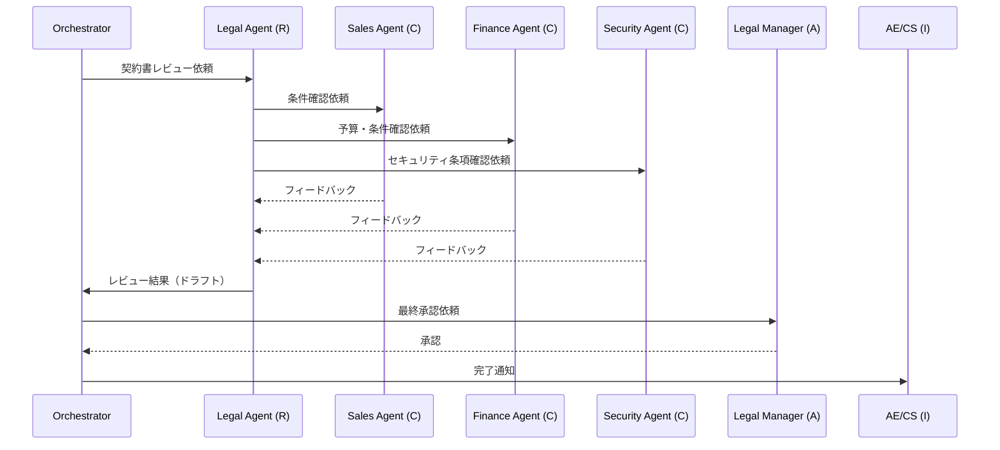

# RT-2 RACI-based Multi-Agent Orchestration

## 概要

マルチエージェント構成の根拠を「タスクが複雑だから」ではなく、RACI マトリクスの責任構造に置くパターンである。Responsible（実行）を担うドメインエージェント、Accountable（最終説明責任）を持つ人間オーナー、Consulted（専門知識提供）を担うスペシャリストエージェント、Informed（結果通知）を受けるステークホルダーをそれぞれ明確に定義し、エージェント間のハンドオフと承認フローを責任境界に沿って設計する。

## 解決する企業課題

エンタープライズで頻出する課題は「誰が最終的な説明責任を持つか不明確」な状態である。マルチエージェントシステムでは、複数のエージェントが関与することで責任の所在が拡散しやすい。法務・財務・セキュリティが関わる契約承認のような複数部門にまたがる業務では、各ドメインが「どこまでが自分の判断範囲か」を把握していないと、エージェントが越権した判断を下す構造的リスクが生まれる。

「複雑だからマルチエージェント」という動機でシステムを構築すると、責任境界のないアーキテクチャが生まれる。責任が不明確なまま高リスク判断をエージェントに委ねると、ミス発生時の責任者が不在になる。規制対応（SOX、個人情報保護法など）の観点では、「誰がいつどの根拠で判断したか」を監査証跡として残せない構造は、コンプライアンス上の重大なリスクになる。

このパターンは RACI マトリクスをシステム設計の入力として扱い、責任割り当てをアーキテクチャに直接写像することでこれらの課題を解決する。

## 解決策と設計

解決策の核心は「エージェントを増やす理由を責任分担（RACI）の存在に限定すること」である。マルチエージェント化の判断基準は処理の複雑さではなく、組織上の責任が複数の主体に分かれているかどうかである。RACI マトリクスが先に存在し、それに対応するエージェント構成を導出する順序を守る。

各ロールに対応するエージェントまたは人間アクターを定義し、オーケストレーターがマトリクスに従って処理を進める。Accountable は常に人間が担う。エージェントに A を割り当てると、ミス発生時の責任者が不在になるためである。

契約書レビューを例にとると、RはLegalエージェント（実行）、AはLegal Manager（最終承認）、CはSales/Finance/Securityエージェント（意見提供）、IはAE/CS担当者（結果通知）となる。

オーケストレーターは各フェーズで誰が R・A・C・I であるかをデシジョンログに記録する。承認（A）が得られるまで次フェーズへ進まないゲートを設ける。C からのフィードバックは R に集約され、R が最終判断に統合する責任を持つ。C の関与は1ラウンドに限定し、無限ループを防ぐ。デシジョンログは各フェーズの開始・終了時点でリアルタイムに記録する（事後補完ではなく）。

## 向き／不向き

**向いている条件**

- 複数部門にまたがる意思決定フローが存在し、各ステップで説明責任者が異なる業務。
- 承認・エスカレーション・拒否時の学習が必要な高リスクタスク。
- 監査証跡でR/A/C/Iの記録が求められるコンプライアンス領域。

**向いていない条件**

- 単一部門内で完結するシンプルなタスク。RACI の複雑さがオーバーヘッドになる。
- リアルタイム性が要求されるインタラクティブな用途（RACI の協議フローはレイテンシを増す）。
- 責任マトリクスが組織上存在しない、または定義困難なケース。

## 要素技術・既存システム連携

- マルチエージェントオーケストレーター：LangGraph、AutoGen、Semantic Kernel
- RACI マトリクス定義：YAML/JSON 形式での責任マッピング
- ハンドオフプロトコル：エージェント間の引き継ぎ仕様（入出力スキーマ、ステータス定義）
- 承認ワークフロー：ServiceNow、Slack ワークフロー、Workday承認フロー
- デシジョンログ：構造化ログ（OpenTelemetry）、監査DB
- 組織図連携：Workday、Microsoft Entra（誰が A であるかの動的解決）

## 落とし穴／選定の勘所

**「複雑だからマルチエージェント」という設計根拠の欠如**。タスクの難しさだけを理由にエージェントを増やすと、責任境界のないアーキテクチャが生まれる。マルチエージェントへの移行は必ず RACI マトリクスを先に定義し、それに対応するエージェント構成を導出する順序を守ること。

**Accountable の空席**。マルチエージェントシステムでは A を別のエージェントに担わせたくなる誘惑がある。しかし A は常に人間が担うべきである。エージェントに A を割り当てると、ミス発生時の責任者が不在になる。

**C フィードバックの無限ループ**。Consulted エージェントが互いに追加意見を要求し合う状況が生じうる。C の関与は1ラウンドに限定し、R が集約する責任を明示的に設計する。

**デシジョンログの事後補完**。ログを処理完了後にまとめて書き込む設計は、途中失敗時に記録が失われる。各フェーズの開始・終了時点でリアルタイムに記録する。

## 関連パターン

- [RT-1 Org-Hierarchical Hub & Spoke](rt1-org-hierarchical-hub-spoke.md)：補完関係。Hub & Spoke の各スポーク間の責任調整に RACI を適用することで、ドメインをまたぐ意思決定フローを設計できる。
- [RT-4 Human Approval Chain](rt4-human-approval-chain.md)：補完関係。RACI の A（Accountable）を人間が担う際の承認フロー実装として組み合わせる。
- [GV-1 Enterprise Agent Control Plane](../gv-governance/gv1-agent-control-plane.md)：補完関係。RACI マトリクスの定義・変更管理をコントロールプレーンで一元管理する。
- [OB-2 Unified Audit & Lineage](../ob-observability/ob2-unified-audit-lineage.md)：補完関係。R/A/C/I の各ロールが下した判断を監査ログに記録し、規制対応のトレーサビリティを確保する。
