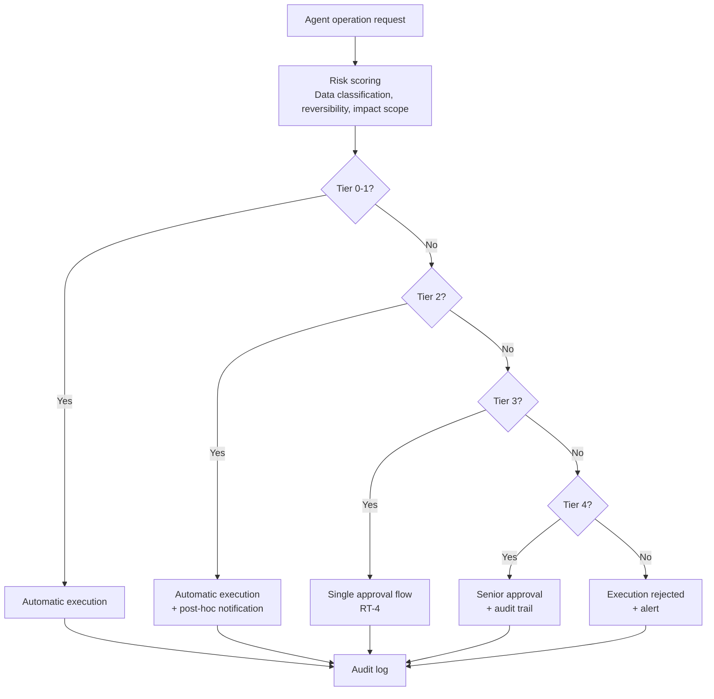

# RT-3 Risk-Tiered Autonomy (Autonomy Hierarchy)

## Overview

Summarizing an internal document and processing a customer refund should not run at the same autonomy level. This pattern stratifies operation risk from Tier 0 (answer/summarize only) to Tier 5 (prohibited/dual authorization required) and enforces automatic execution, single approval, multi-party approval, or prohibition by policy for each tier. It resolves the false dichotomy of "full automation is dangerous, full approval is slow" — automating low-risk operations while preserving human judgment for high-risk ones.

## Enterprise Problem Addressed

In enterprise agent deployment, the biggest barrier is that organizations cannot make the judgment of "how far can we allow autonomy." Requiring approval for all operations creates an approval backlog bottleneck that undermines the value of agent adoption. Conversely, automating all operations carries risk of misexecution for fund transfers, permission grants, and customer communications.

In companies where risk tolerance differs by department, the criterion of "is it OK for this agent to do this automatically?" tends to become person-dependent. Cases where operations executed without approval become problems retroactively are common, surfacing as cost, audit, and compliance concerns. Operations related to money, personnel, and customer data are particularly irreversible once executed.

Tier design codifies and enforces this tradeoff, ensuring cross-departmental consistency and reconciling scale with control. Automating read operations (Tier 0) across nearly all business workflows alone yields significant efficiency gains and allows approval resources to be concentrated on high-risk operations.

!!! tip "Minimum Viable Configuration (MVP)"
    Define just two tiers — Tier 0 (reads are automatic) and Tier 3 (writes require approval) — and enforce via a policy engine. Add intermediate tiers incrementally based on operational data.

## Value Hypothesis

By combining full automation of low-risk operations with human approval for high-risk operations, automation rates are maximized while maintaining safety. Staged autonomy provides a path from quick wins at initial deployment (read-only automation) to advanced automation.

## Solution and Design

The core of the solution is "codifying operation autonomy as policy and enforcing it at the agent execution infrastructure." Rather than delegating risk evaluation to the agent itself, the policy engine (ID-7) evaluates operation attributes to determine the tier. This achieves defense at the execution infrastructure level (robust) rather than security-through-prompting (fragile).

Six tiers are defined:

| Tier | Example Operations | Autonomy Level |
|------|-------------------|----------------|
| Tier 0 | Answering, summarizing, searching | Fully automatic (read-only) |
| Tier 1 | Draft creation, proposal generation | Fully automatic (not sent externally) |
| Tier 2 | Writing to internal records | Automatic execution + post-hoc notification |
| Tier 3 | Sending to external parties or customers | Prior approval required |
| Tier 4 | Financial, contract, HR, permission changes | Senior approval + audit trail |
| Tier 5 | Prohibited operations | Cannot execute (even with dual authorization) |



Risk scoring is handled by the policy engine (ID-7). The tier is determined using the target resource's data classification, operation irreversibility (deletion, sending, payment, etc.), and the scope of affected users and organizations as inputs. The tier is not a fixed value — it can change dynamically based on context. The same "write to internal records" operation may be elevated to Tier 4 equivalent if the target contains personal information.

## When to Use / When Not to Use

| When to Use | When Not to Use |
|---|---|
| Workflows with diverse operation types where uniform autonomy settings are unreasonable (ranging from inquiry responses to procurement approval) | Cases where all operations are simple reads only and tier classification complexity is unnecessary |
| Enterprise systems involving financial, personnel, or customer data operations | Stages where policy design resources to define tier boundaries cannot be secured |
| Organizations where acceptable risk varies by department or role and flexible tier assignment is needed | Routine tasks where deterministic RPA or form processing suffices (no judgment variation; AI agent adoption itself is unnecessary) |

## Component Technologies and System Integration

- Risk scoring engine: rules engine calculating tier from operation attributes, data classification, and irreversibility
- Policy engine: OPA (Open Policy Agent), Cedar (integrated with ID-7)
- Approval workflow: RT-4 Human Approval Chain
- Data classification infrastructure: file/record sensitivity labels (Microsoft Purview, Varonis, etc.)
- Segregation of Duties: control ensuring the requester and approver are not the same person at Tier 4
- Audit log: records operation, decision rationale, and execution result for all tiers

## Pitfalls and Selection Criteria

**Fixed tier boundaries.** "This operation is always Tier 2" is a dangerous static classification. The same write to internal records may become Tier 4 if the target contains personal information. Design tiers to be determined dynamically, combining data classification, operation irreversibility, and the executor's role.

**Omitting Tier 5.** Designs that skip Tier 5 with "we don't really need prohibited operations" leave no defensive mechanism when unexpected operation paths emerge. Explicitly list direct production DB deletion, unapproved privilege escalation, and bulk export of personal information as Tier 5.

**Decoupling autonomy from data classification.** Many implementations evaluate only risk level in tier design without considering the classification of the target data. Even read access to highly sensitive data may need to be elevated from Tier 0 to Tier 1–2.

**Approval fatigue.** Too many Tier 3–4 operations cause approvers to approve superficially. Design the Tier 1–2 scope appropriately and monitor and optimize the volume of Tier 3+ operations.

## Interfaces

The following are the key interfaces for implementing this pattern. Coding agents can generate stub code from these definitions.

```yaml
interfaces:
  - name: Risk Scoring Engine
    description: "Calculates the risk tier dynamically from operation attributes, data classification, irreversibility, and affected scope."
    input:
      request: object
    output:
      response: object
    errors:
      - code: GENERAL_ERROR
        description: "Error occurred during Risk Scoring Engine processing"
    protocol: "REST / gRPC"
    implementation_hints:
      - "See the Solution and Design section for details"
  - name: Policy Engine (ID-7)
    description: "Enforces the tier decision at the execution infrastructure level, preventing agents from self-reporting their own tier."
    input:
      request: object
    output:
      response: object
    errors:
      - code: GENERAL_ERROR
        description: "Error occurred during Policy Engine (ID-7) processing"
    protocol: "REST / gRPC"
    implementation_hints:
      - "See the Solution and Design section for details"
  - name: Approval Workflow (RT-4)
    description: "Triggered for Tier 3–4 operations to route to human approval before execution proceeds."
    input:
      request: object
    output:
      response: object
    errors:
      - code: GENERAL_ERROR
        description: "Error occurred during Approval Workflow (RT-4) processing"
    protocol: "REST / gRPC"
    implementation_hints:
      - "See the Solution and Design section for details"
```

## Related Patterns

- [ID-7 Policy-as-Code Guardrail](../id-identity/id7-policy-as-code-guardrail.md): Complementary. The foundational pattern for implementing tier determination as policy and enforcing it at the agent execution infrastructure.
- [RT-4 Human Approval Chain](rt4-human-approval-chain.md): Complementary. Used as the concrete implementation of human approval flows required at Tiers 3–4.
- [ID-6 Zero-Trust PDP/PEP](../id-identity/id6-zero-trust-pdp-pep.md): Complementary. Implements policy decision (PDP) and enforcement (PEP) with zero-trust architecture, placing tier determination at the execution infrastructure.
- [GV-7 Evaluation & Governance Pipeline](../gv-governance/gv7-evaluation-governance-pipeline.md): Complementary. Continuously evaluates tier classification validity and approval/escalation rates through the governance pipeline.
