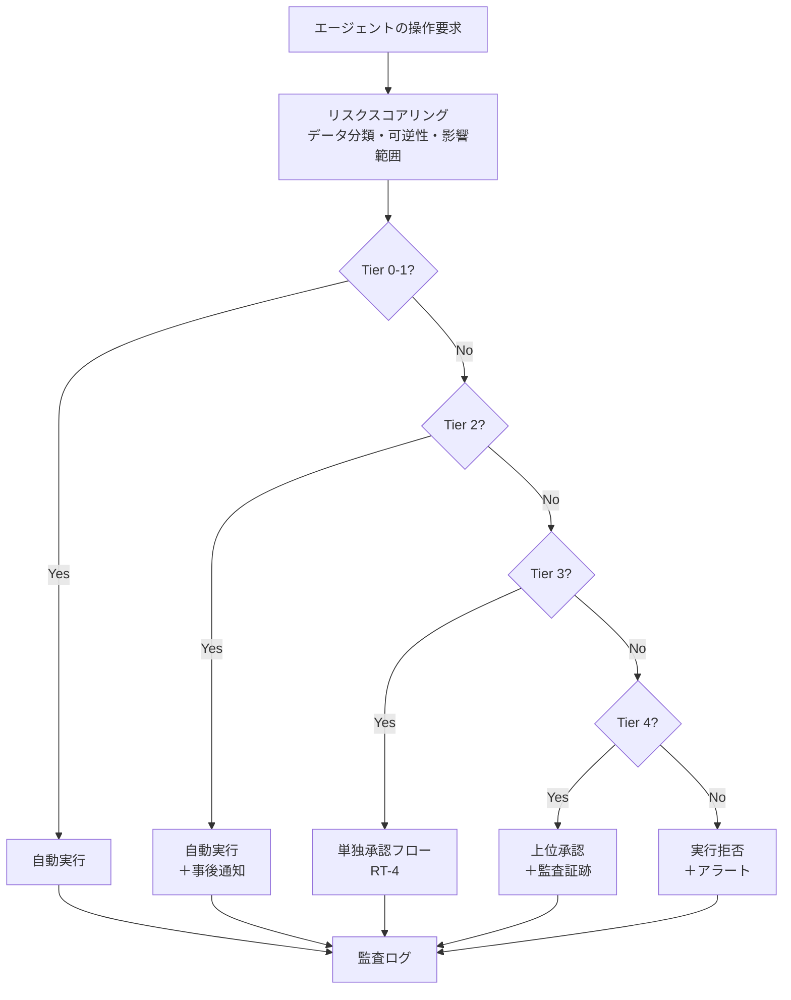

# RT-3 Risk-Tiered Autonomy（自律度の階層）

## 概要

「社内文書の要約」と「顧客への返金処理」を同じ自律度で実行させるべきではありません。このパターンは操作のリスクを Tier 0（回答・要約のみ）から Tier 5（禁止/二者承認必須）まで段階化し、Tier ごとに自動実行・単独承認・複数承認・禁止をポリシーで強制します。「全自動は危険、全承認は遅い」という二項対立を解消し、低リスクは自動化しつつ高リスクには人間の判断を残します。

## 解決する企業課題

エンタープライズにおけるエージェント展開では、「どこまで自律させてよいか」という判断を組織が下せないことが最大の障壁になります。「全操作を承認必須にする」運用は承認待ちのボトルネックを生み、エージェントの価値を損ないます。一方、「全操作を自動化する」設計は、資金移動・権限付与・顧客への送信を誤実行するリスクを抱えます。

部門ごとにリスク感覚が異なる企業では、「このエージェントがここまで自動でやっていいのか」という基準が属人化しやすいです。承認なしで実行した操作が後から問題になるケースも多く、コスト・監査・コンプライアンスの観点で表面化します。特に金銭・人事・顧客データに関わる操作は、一度実行すると取り消しが困難な不可逆性を持つ点に注意が必要です。

Tier 設計はこのトレードオフを明文化・強制することで部門横断的な一貫性を確保し、スケールと統制を両立させます。読み取り操作（Tier 0）をほぼすべての業務で自動化するだけでも大きな効率化が得られ、承認リソースを高リスク操作に集中できます。

!!! tip "最小成立条件（MVP）"
    Tier 0（読み取り自動）と Tier 3（書き込みは承認必須）の2段階だけを定義し、ポリシーエンジンで強制する構成。中間 Tier は運用データを見ながら段階的に追加します。

## 価値仮説

低リスク操作の完全自動化と高リスク操作の人間承認を両立することで、安全性を保ちながら自動化率を最大化します。段階的自律は導入初期のクイックウィン（読み取り専用自動化）から高度な自動化への拡張路を提供します。

## 解決策と設計

解決策の核心は「操作の自律度をポリシーとして明文化し、エージェントの実行基盤側で強制すること」です。リスク評価をエージェント自身の判断に委ねず、ポリシーエンジン（ID-7）が操作属性を評価して Tier を決定する構造にします。プロンプトでセキュリティを守る設計は脆弱ですが、実行基盤側での防御は堅牢です——その核心がここにあります。

6段階の Tier を定義します。

| Tier | 操作例 | 自律度 |
|------|--------|--------|
| Tier 0 | 回答・要約・検索 | 完全自動（読み取り専用） |
| Tier 1 | 下書き作成・提案生成 | 完全自動（外部未送信） |
| Tier 2 | 社内記録への書き込み | 自動実行＋事後通知 |
| Tier 3 | 社外・顧客向け送信 | 事前承認必須 |
| Tier 4 | 金銭・契約・HR・権限変更 | 上位承認＋監査証跡 |
| Tier 5 | 禁止操作 | 実行不可（二者承認でも不可） |



リスクスコアリングはポリシーエンジン（ID-7）が担います。対象リソースのデータ分類、操作の不可逆性（削除・送信・支払いなど）、影響を受けるユーザ・組織の範囲を入力として Tier を決定します。Tier は固定値ではなく、文脈によって動的に変わります。同じ「社内記録への書き込み」でも、対象が個人情報を含む場合は Tier 4 相当に引き上げられます。

## 向き／不向き

| 向き | 不向き |
|---|---|
| 操作の種類が多様で、一律の自律度設定が不合理な業務（問い合わせ応答から購買承認まで幅広く扱う） | すべての操作が単純な読み取りのみで、Tier 分類の複雑さが不要なケース |
| 金銭・人事・顧客データに関わる操作を含むエンタープライズシステム | Tier 境界を定義するポリシー設計リソースが確保できない段階 |
| 部門やロールごとに許容リスクが異なり、柔軟な Tier 割り当てが必要な組織 | 決定論的な RPA やフォーム処理で十分な定型業務（判断の揺らぎがなく、AI エージェント化自体が不要） |

## 要素技術・既存システム連携

- リスクスコアリングエンジン：操作属性・データ分類・不可逆性から Tier を計算するルールエンジン
- ポリシーエンジン：OPA（Open Policy Agent）、Cedar（ID-7 と連携）
- 承認ワークフロー：RT-4 Human Approval Chain
- データ分類基盤：ファイル・レコードの機密度ラベル（Microsoft Purview、Varonis 等）
- 職務分離（Segregation of Duties）：Tier 4 では申請者と承認者を同一人物にしない制御
- 監査ログ：すべての Tier で操作・判断根拠・実行結果を記録

## 落とし穴／選定の勘所

**Tier 境界の固定化**。「この操作は常に Tier 2」という静的な分類は危険です。同じ社内記録への書き込みでも、対象が個人情報を含む場合は Tier 4 相当になりえます。Tier はデータ分類・操作の不可逆性・実行者の職責を組み合わせて動的に決定する設計にしてください。

**Tier 5 の定義放棄**。「禁止操作など実際には必要ない」として Tier 5 を省略すると、予想外の操作経路が生じたときに防御手段がなくなります。生産 DB の直接削除・権限の無審査昇格・個人情報の一括エクスポートなどは明示的に Tier 5 として列挙しておきましょう。

**自律度とデータ分類の切り離し**。Tier 設計でリスクレベルのみを見て操作対象のデータ分類を考慮しない実装は多いです。機密度の高いデータへの読み取りでさえ、Tier 0 ではなく Tier 1〜2 に引き上げる必要があります。

**承認疲れ**。Tier 3〜4 の操作が多すぎると、承認者が形骸的な承認をするようになります。Tier 1〜2 の範囲を適切に設計し、Tier 3 以上の件数を定期的に監視・最適化してください。

## Interfaces

以下はこのパターンを実装する際の主要インターフェイスです。コーディングエージェントはこの定義からスタブコードを生成できます。

```yaml
interfaces:
  - name: Risk Scoring Engine
    description: "Calculates the risk tier dynamically from operation attributes, data classification, irreversibility, and affected scope."
    input:
      request: object
    output:
      response: object
    errors:
      - code: GENERAL_ERROR
        description: "Risk Scoring Engine の処理中にエラーが発生"
    protocol: "REST / gRPC"
    implementation_hints:
      - "詳細は本文の「解決策と設計」節を参照"
    code_examples:
      typescript: |
        interface RiskScoringEngineRequest {
          operationType: string;
          dataClassification: string;
          irreversible: boolean;
          affectedScope: string;
        }
        interface RiskScoringEngineResponse {
          riskTier: number;
          score: number;
          scoringFactors: object;
        }
        interface RiskScoringEngine {
          riskScoringEngine(req: RiskScoringEngineRequest): Promise<RiskScoringEngineResponse>;
        }
      python: |
        @dataclass
        class RiskScoringEngineRequest:
            operation_type: str
            data_classification: str
            irreversible: bool
            affected_scope: str
        
        @dataclass
        class RiskScoringEngineResponse:
            risk_tier: int
            score: float
            scoring_factors: dict
        
        class RiskScoringEngine(Protocol):
            async def risk_scoring_engine(self, req: RiskScoringEngineRequest) -> RiskScoringEngineResponse: ...
  - name: Policy Engine (ID-7)
    description: "Enforces the tier decision at the execution infrastructure level, preventing agents from self-reporting their own tier."
    input:
      request: object
    output:
      response: object
    errors:
      - code: GENERAL_ERROR
        description: "Policy Engine (ID-7) の処理中にエラーが発生"
    protocol: "REST / gRPC"
    implementation_hints:
      - "詳細は本文の「解決策と設計」節を参照"
    code_examples:
      typescript: |
        interface PolicyEngineRequest {
          inputId: string;
          policyVersion: string;
          attributes: object;
        }
        interface PolicyEngineResponse {
          verdict: string;
          reason: string;
          requiresApproval: boolean;
          redact: boolean;
        }
        interface PolicyEngine {
          policyEngine(req: PolicyEngineRequest): Promise<PolicyEngineResponse>;
        }
      python: |
        @dataclass
        class PolicyEngineRequest:
            input_id: str
            policy_version: str
            attributes: dict
        
        @dataclass
        class PolicyEngineResponse:
            verdict: str
            reason: str
            requires_approval: bool
            redact: bool
        
        class PolicyEngine(Protocol):
            async def policy_engine(self, req: PolicyEngineRequest) -> PolicyEngineResponse: ...
  - name: Approval Workflow (RT-4)
    description: "Triggered for Tier 3–4 operations to route to human approval before execution proceeds."
    input:
      request: object
    output:
      response: object
    errors:
      - code: GENERAL_ERROR
        description: "Approval Workflow (RT-4) の処理中にエラーが発生"
    protocol: "REST / gRPC"
    implementation_hints:
      - "詳細は本文の「解決策と設計」節を参照"
    code_examples:
      typescript: |
        interface ApprovalWorkflowRequest {
          operationId: string;
          riskTier: number;
          requesterId: string;
          operationDetails: object;
        }
        interface ApprovalWorkflowResponse {
          approvalRequestId: string;
          approved: boolean;
          approvedBy: string;
        }
        interface ApprovalWorkflow {
          approvalWorkflow(req: ApprovalWorkflowRequest): Promise<ApprovalWorkflowResponse>;
        }
      python: |
        @dataclass
        class ApprovalWorkflowRequest:
            operation_id: str
            risk_tier: int
            requester_id: str
            operation_details: dict
        
        @dataclass
        class ApprovalWorkflowResponse:
            approval_request_id: str
            approved: bool
            approved_by: str
        
        class ApprovalWorkflow(Protocol):
            async def approval_workflow(self, req: ApprovalWorkflowRequest) -> ApprovalWorkflowResponse: ...
```

## 関連パターン

- [ID-7 Policy-as-Code Guardrail](../id-identity/id7-policy-as-code-guardrail.md)：補完関係。Tier 判定をポリシーとして実装し、エージェントの実行基盤側で強制する基盤パターンです。
- [RT-4 Human Approval Chain](rt4-human-approval-chain.md)：補完関係。Tier 3〜4 で必要となる人間承認フローの具体的な実装として組み合わせます。
- [ID-6 Zero-Trust PDP/PEP](../id-identity/id6-zero-trust-pdp-pep.md)：補完関係。ポリシー決定（PDP）と強制（PEP）をゼロトラスト構造で実装し、Tier 判定を実行基盤側に置きます。
- [GV-7 Evaluation & Governance Pipeline](../gv-governance/gv7-evaluation-governance-pipeline.md)：補完関係。Tier 分類の妥当性と承認率・エスカレーション率をガバナンスパイプラインで継続評価します。

## Decision Summary

```yaml
decision_summary:
  pattern: RT-3
  participates_in:
    - decision: DC-1
      role: primary
    - decision: TO-5
      role: enabler
  recommended_if:
    - "操作のリスクレベルに応じて自律度を変えたい"
    - "高リスク操作のみ人間承認を要求する"
  avoid_if:
    - "全操作が同一リスクレベル"
  combines_with: [RT-4, ID-7, GV-9]
  conflicts_with: []
  value_outcome:
    drivers: [automation, audit_compliance]
    kpis: [リスクティア判定精度, 人間介入率]
  mvp: "3段階のティア分類を高リスク操作から適用"
  cost: S
```
