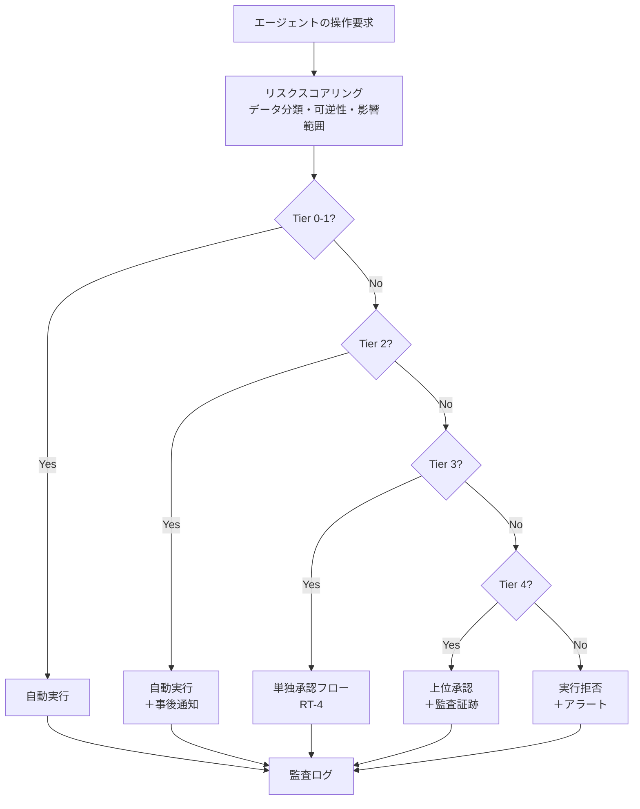

# RT-3 Risk-Tiered Autonomy（自律度の階層）

## 概要

「社内文書の要約」と「顧客への返金処理」を同じ自律度で実行させるべきではない。このパターンは、操作のリスクを Tier 0（回答・要約のみ）から Tier 5（禁止/二者承認必須）まで段階化し、Tier ごとに自動実行・単独承認・複数承認・禁止をポリシーで強制する。「全自動は危険、全承認は遅い」という二項対立を解消し、低リスクは自動化しつつ高リスクは人間の判断を残す。

## 解決する企業課題

エンタープライズにおけるエージェント展開では「どこまで自律させてよいか」という判断を組織が下せないことが最大の障壁になる。「全操作を承認必須にする」運用は承認待ちのボトルネックを生み、エージェント活用の価値を損なう。一方「全操作を自動化する」設計は、資金移動・権限付与・顧客送信の誤実行リスクを抱える。

部門ごとにリスク感覚が異なる企業では、「このエージェントがここまで自動でやっていいのか」という基準が属人化しやすい。承認なしで実行された操作が後から問題になる場面も多く、コスト・監査・コンプライアンスの観点で表面化する。特に金銭・人事・顧客データに関わる操作は、一度実行すると取り消しが困難な不可逆性を持つ。

Tier 設計はこのトレードオフを明文化・強制することで、部門横断的な一貫性を確保し、スケールと統制を両立する。読み取り操作（Tier 0）をほぼすべての業務で自動化するだけでも大きな業務効率化が得られ、高リスク操作への承認リソースを集中できる。

## 解決策と設計

解決策の核心は「操作の自律度をポリシーとして明文化し、エージェントの実行基盤側で強制すること」である。リスク評価をエージェント自身の判断に委ねるのではなく、ポリシーエンジン（ID-7）が操作属性を評価して Tier を決定する構造にする。これにより、プロンプトでセキュリティを守る設計（脆弱）ではなく、実行基盤側での防御（堅牢）を実現する。

6段階の Tier を定義する。

| Tier | 操作例 | 自律度 |
|------|--------|--------|
| Tier 0 | 回答・要約・検索 | 完全自動（読み取り専用） |
| Tier 1 | 下書き作成・提案生成 | 完全自動（外部未送信） |
| Tier 2 | 社内記録への書き込み | 自動実行＋事後通知 |
| Tier 3 | 社外・顧客向け送信 | 事前承認必須 |
| Tier 4 | 金銭・契約・HR・権限変更 | 上位承認＋監査証跡 |
| Tier 5 | 禁止操作 | 実行不可（二者承認でも不可） |

リスクスコアリングはポリシーエンジン（ID-7）が担う。対象リソースのデータ分類、操作の不可逆性（削除・送信・支払いなど）、影響を受けるユーザ・組織の範囲を入力として Tier を決定する。Tier は固定値ではなく、文脈によって動的に変わりうる。同じ「社内記録への書き込み」でも、対象が個人情報を含む場合は Tier 4 相当に引き上げられる。

## 向き／不向き

**向いている条件**

- 操作の種類が多様で、一律の自律度設定が不合理な業務（問い合わせ応答から購買承認まで幅広く扱う）。
- 金銭・人事・顧客データに関わる操作を含むエンタープライズシステム。
- 部門やロールごとに許容リスクが異なり、柔軟な Tier 割り当てが必要な組織。

**向いていない条件**

- すべての操作が単純な読み取りのみで、Tier 分類の複雑さが不要なケース。
- Tier 境界を定義するポリシー設計リソースが確保できない段階。
- 決定論的な RPA やフォーム処理で十分な定型業務（判断の揺らぎがなく、AI エージェント化自体が不要）。

## 要素技術・既存システム連携

- リスクスコアリングエンジン：操作属性・データ分類・不可逆性から Tier を計算するルールエンジン
- ポリシーエンジン：OPA（Open Policy Agent）、Cedar（ID-7 と連携）
- 承認ワークフロー：RT-4 Human Approval Chain
- データ分類基盤：ファイル・レコードの機密度ラベル（Microsoft Purview、Varonis 等）
- 職務分離（Segregation of Duties）：Tier 4 では申請者と承認者を同一人物にしない制御
- 監査ログ：すべての Tier で操作・判断根拠・実行結果を記録

## 落とし穴／選定の勘所

**Tier 境界の固定化**。「この操作は常に Tier 2」という静的な分類は危険である。同じ社内記録への書き込みでも、対象が個人情報を含む場合は Tier 4 相当になりうる。Tier はデータ分類・操作の不可逆性・実行者の職責を組み合わせて動的に決定する設計にすること。

**Tier 5 の定義放棄**。「禁止操作など実際には必要ない」として Tier 5 を省略する設計は、予想外の操作経路が生じたときに防御手段がなくなる。生産DBの直接削除、権限の無審査昇格、個人情報の一括エクスポートなどを明示的に Tier 5 として列挙しておく。

**自律度とデータ分類の切り離し**。Tier 設計でリスクレベルのみを見て、操作対象のデータ分類を考慮しない実装が多い。機密レベルの高いデータへの読み取りでさえ、Tier 0 ではなく Tier 1〜2 に引き上げる必要がある。

**承認疲れ**。Tier 3〜4 の操作が多すぎると承認者が形骸的な承認を行うようになる。Tier 1〜2 の範囲を適切に設計し、Tier 3 以上の件数を監視・最適化する。

## 関連パターン

- [ID-7 Policy-as-Code Guardrail](../id-identity/id7-policy-as-code-guardrail.md)：補完関係。Tier 判定をポリシーとして実装し、エージェントの実行基盤側で強制する基盤パターン。
- [RT-4 Human Approval Chain](rt4-human-approval-chain.md)：補完関係。Tier 3〜4 で必要となる人間承認フローの具体的な実装として組み合わせる。
- [ID-6 Zero-Trust PDP/PEP](../id-identity/id6-zero-trust-pdp-pep.md)：補完関係。ポリシー決定（PDP）と強制（PEP）をゼロトラスト構造で実装し、Tier 判定を実行基盤側に置く。
- [GV-7 Evaluation & Governance Pipeline](../gv-governance/gv7-evaluation-governance-pipeline.md)：補完関係。Tier 分類の妥当性と承認率・エスカレーション率をガバナンスパイプラインで継続評価する。
