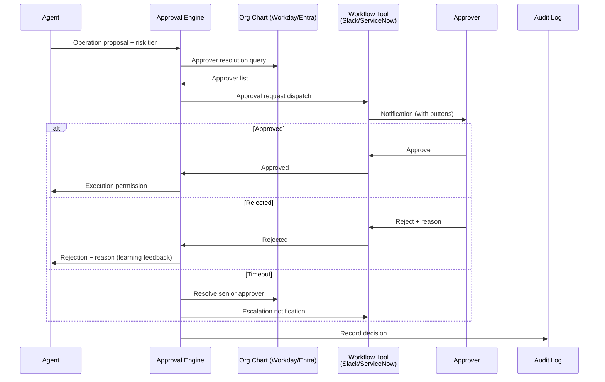

# RT-4 Human Approval Chain (Org-Resolved Approval)

## Overview

The agent's job ends at proposing "Shall I renew this contract?" Execution happens only after human approval. In this pattern, approvers are dynamically resolved from the organizational graph (Workday org chart) — direct managers, responsible owners, and cost owners — and their approval is requested. Hard-coding approvers into configuration leads to undeliverable requests when people change roles. A design that resolves from the org chart each time is essential. The design covers the entire flow: approval experience in Slack or ServiceNow, delegation during absences, SLA timers, and feedback from rejection reasons.

## Enterprise Problem Addressed

When agents directly execute irreversible operations (mass email sends, fund transfers, permission changes), the damage from misjudgment is severe. In enterprises, misexecution of irrecoverable operations is a critical problem. An approval chain structurally guarantees human involvement before execution, limiting agent autonomy to "up to proposal."

In companies where "who is the approver" depends on tribal knowledge, approval flows stall when the responsible person is relocated or on leave. Hard-coded approvers require configuration changes with every org change, and missed changes occur. Dynamic resolution from the org chart eliminates this problem, always identifying the approver with the appropriate authority.

From an audit perspective, records of approval actions (who approved or rejected, when, and why) are indispensable for internal controls and regulatory compliance. Rejection reasons can be used as feedback signals to improve the quality of subsequent proposals of the same type.

!!! tip "Minimum Viable Configuration (MVP)"
    A single-approver flow via Slack buttons. The minimum configuration resolves one approver from the org chart API and logs the approval or rejection result. Delegation, escalation, and SLA timers are added in subsequent phases.

## Value Hypothesis

Automated routing of approvals reduces approval wait time (lead time). Agents can be safely applied to operations requiring human judgment, expanding the automation scope of high-risk business processes.

## Solution and Design

The core of the solution is two points: resolving approvers dynamically from the org chart rather than from static definitions, and embedding the approval experience in existing tools. This eliminates the need for employees to learn new systems and lowers adoption barriers.

The approval flow consists of four phases:

1. **Approver resolution**: Based on the request type, target resource, cost, and risk tier (RT-3), dynamically identify the appropriate approver (line manager, cost owner, data owner) from the org chart.
2. **Approval request dispatch**: Send notifications to existing workflow tools and provide a UI (Slack buttons, ServiceNow tasks, etc.) where approvers can take action.
3. **SLA monitoring and escalation**: Set approval deadlines and automatically escalate to senior approvers on timeout.
4. **Result recording**: Record the approval, rejection, or delegation reason and decision-maker in the decision log, and pass rejection reasons to the agent as learning feedback.

The approver resolution logic must track changes in organizational structure (transfers, promotions, departures). Hard-coding causes failures with every org change, so dynamically deriving approvers from the org chart API in real time is the preferred design that ensures correct routing even after departures or transfers.

## When to Use / When Not to Use

| When to Use | When Not to Use |
|---|---|
| Business flows involving irreversible or high-risk operations (fund transfers, permission grants, customer contacts) | Real-time processing with strict latency requirements where human involvement cannot be tolerated |
| Companies with well-maintained org charts where approvers can be identified by role, cost authority, and data ownership | Low-risk operations (Tier 0–1) where excessive approval flows would significantly impair operational efficiency |
| Environments with existing approval workflow tools (ServiceNow, Slack workflows, Workday) already deployed | Stages where the org chart is not maintained and the approver resolution infrastructure is absent |

## Component Technologies and System Integration

- Approval engine: custom implementation, or Temporal workflows, AWS Step Functions
- Org chart and permission information: Workday HCM, Microsoft Entra (formerly Azure AD), BambooHR
- Delegation management: recording and automatic expiry of delegation period and scope
- SLA timer: escalation automation
- Workflow tool integration: Slack (Block Kit buttons), ServiceNow (automatic task creation), Workday approval flow
- Digital signatures: non-repudiation assurance for high-risk approvals
- Audit log: structured recording of approver, reason, and timestamp (OpenTelemetry)

## Pitfalls and Selection Criteria

**Hard-coded approvers.** Patterns that directly specify "this request is approved by the department manager" in code require configuration changes with every org change and lead to missed updates. Approvers should always be dynamically resolved from the org chart. A design that routes correctly even after departures or transfers is essential.

**Missing escalation design.** Setting an SLA without automatic escalation to senior approvers means approvals silently backlog. Always design the escalation target and notification path.

**Discarding rejection reasons.** Rejection reasons are the most valuable learning signals for agents to appropriately revise requests of the same type. Rather than just burying reasons in audit logs, build a feedback loop that reflects them in the agent's proposal generation.

**Unlimited delegation chains.** Approval delegation chains where one approver delegates to another, then that one delegates again, obscures accountability. Limit delegation to one hop and verify the delegatee's qualifications from the org chart.

## Related Patterns

- [RT-3 Risk-Tiered Autonomy](rt3-risk-tiered-autonomy.md): Complementary. This pattern's approval flow is triggered for Tier 3–4 operations. Tier determination is the trigger.
- [RT-5 Intent-to-Enterprise Command Envelope](rt5-command-envelope.md): Complementary. This approval chain is triggered when the Command Envelope's `requires_approval` flag is true.
- [RT-7 Enterprise Saga](rt7-enterprise-saga.md): Complementary. An approval chain is inserted before non-compensatable Saga steps (such as sending customer emails).
- [ID-7 Policy-as-Code Guardrail](../id-identity/id7-policy-as-code-guardrail.md): Complementary. The determination of whether approval is needed is implemented as policy and enforced at the execution infrastructure.
- [OB-2 Unified Audit & Lineage](../ob-observability/ob2-unified-audit-lineage.md): Complementary. Records approver, reason, and timestamp in audit logs to ensure internal control evidence.
