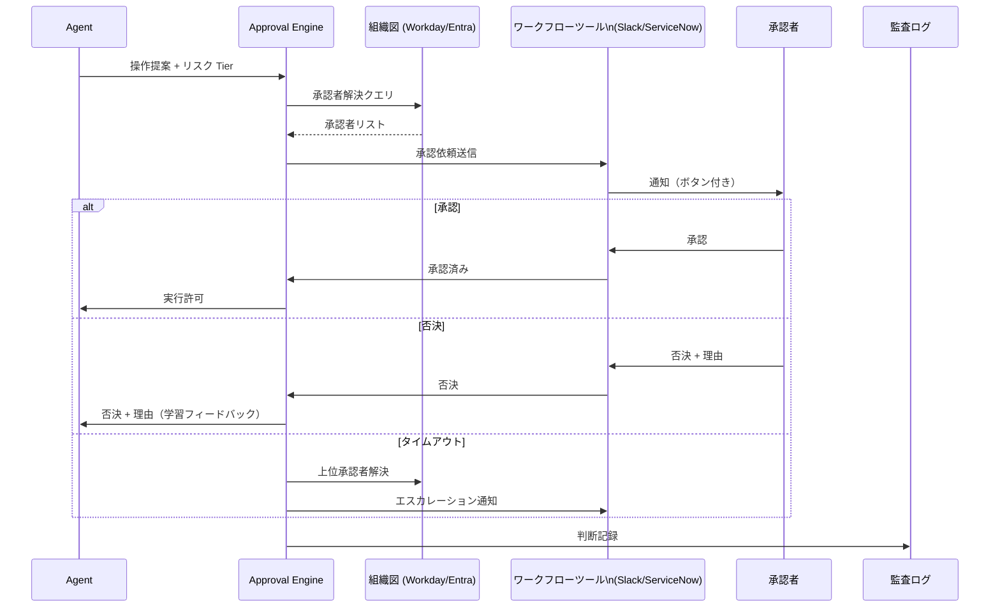

# RT-4 Human Approval Chain（組織解決型承認）

## 概要

エージェントは操作を提案するにとどまり、実行は人間の承認を経る。承認者は組織図（org graph）から動的に解決する。権限委譲、エスカレーション、SLA タイマー、否決理由の学習を備え、Slack・ServiceNow・Workday などの既存ワークフローツールに統合することで、承認体験を従業員の日常業務に埋め込む。

## 設計

承認フローは4つのフェーズで構成される。

1. **承認者解決**：リクエストの種類・対象リソース・コスト・リスク Tier（RT-3）を入力として、組織図から適切な承認者（ライン管理職、コストオーナー、データオーナー）を動的に特定する。
2. **承認依頼送信**：既存ワークフローツールへ通知を送信し、承認者がアクションできる UI（Slack ボタン、ServiceNow タスク等）を提供する。
3. **SLA 監視・エスカレーション**：承認期限を設定し、タイムアウト時は上位承認者へ自動エスカレーションする。
4. **結果記録**：承認・否決・委譲の理由と判断者をデシジョンログに記録し、否決理由はエージェントの学習フィードバックに渡す。

承認者の解決ロジックは組織構造の変化（異動・昇格・退職）に追従するため、ハードコードは禁忌である。組織図APIをリアルタイムで参照し、承認者を導出する。

## 解決する企業課題

不可逆操作（大量メール送信・資金移動・権限変更）をエージェントが直接実行すると、誤判断時の損害が大きい。承認チェーンは実行前の人間介在を構造として保証する。

「誰が承認者か」が属人的知識に依存している企業では、担当者の異動・休暇時に承認フローが止まる。組織図からの動的解決はこの問題を排除し、常に適切な権限を持つ承認者を特定する。

承認行為を既存ツール（Slack 等）に統合することで、承認者が新規システムを学習する必要がなく、採用障壁を下げる。承認の記録は自動的に監査証跡となり、事後の内部統制レビューに活用できる。

## 向き／不向き

**向いている条件**

- 不可逆性・高リスクの操作（資金移動、権限付与、顧客連絡）を含む業務フロー。
- 組織図が整備されており、承認者を役職・コスト権限・データオーナーシップで特定できる企業。
- 既存の承認ワークフローツール（ServiceNow、Slack ワークフロー、Workday）が導入済みの環境。

**向いていない条件**

- レイテンシ要件が厳しく、人間介在を許容できないリアルタイム処理。
- 承認フローが過剰になり業務効率を著しく損なう低リスク操作（Tier 0〜1）。
- 組織図が整備されておらず、承認者解決の基盤がない段階。

## 要素技術・既存システム連携

- 承認エンジン：カスタム実装、または Temporal ワークフロー、AWS Step Functions
- 組織図・権限情報：Workday HCM、Microsoft Entra（旧 Azure AD）、BambooHR
- 権限委譲管理：委譲期間・範囲の記録と自動失効
- SLA タイマー：エスカレーション自動化
- ワークフローツール統合：Slack（Block Kit ボタン）、ServiceNow（タスク自動生成）、Workday 承認フロー
- デジタル署名：高リスク承認の非否認性確保
- 監査ログ：承認者・理由・タイムスタンプの構造化記録（OpenTelemetry）

## 落とし穴／選定の勘所

**承認者のハードコード**。「このリクエストは山田部長が承認する」とコードに直接記述するパターンは、組織変更のたびに設定変更が必要になり、変更漏れが発生する。承認者は常に組織図から動的に解決する。退職・異動後も正しい承認者にルーティングされる設計が必須である。

**エスカレーション設計の欠如**。SLA を設定しても上位承認者への自動エスカレーションがないと、承認がサイレントに滞留する。エスカレーション先の定義と通知経路を必ず設計する。

**否決理由の捨て置き**。否決理由はエージェントが同種のリクエストを適切に修正するための最も価値ある学習シグナルである。理由を監査ログに埋めるだけでなく、エージェントの提案生成に反映するフィードバックループを構築する。

**委譲の無制限連鎖**。承認者が別の承認者に委譲し、さらに委譲される連鎖は責任の所在を不透明にする。委譲は1ホップに制限し、委譲先の資格要件を組織図から検証する。

## 関連パターン

- [RT-3 Risk-Tiered Autonomy](rt3-risk-tiered-autonomy.md)
- [RT-5 Intent-to-Enterprise Command Envelope](rt5-command-envelope.md)
- [RT-7 Enterprise Saga](rt7-enterprise-saga.md)
- [ID-7 Policy-as-Code Guardrail](../id-identity/id7-policy-as-code-guardrail.md)
- [OB-2 Unified Audit & Lineage](../ob-observability/ob2-unified-audit-lineage.md)
