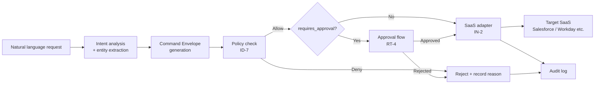

# RT-5 Intent-to-Enterprise Command Envelope (Structured Command Envelope)

## Overview

The natural language request "Schedule a meeting for next week" should never be passed directly to the Google Calendar API. Natural language is well-suited for user interaction but is too ambiguous as an internal protocol for auditing or policy verification. In this pattern, natural language is first converted into a structured Command Envelope (actor / agent / target_system / action / risk_tier, etc.), then fed through a consistent pipeline of policy check → approval → SaaS adapter.

## Enterprise Problem Addressed

In designs that pass natural language directly to APIs, LLM output becomes a SaaS write operation as-is. The risk is high that ambiguous instructions, misinterpretations, and prompt injections cause real harm. A structure where text generated from the phrase "contact the customer" is passed directly to a CRM send API is unacceptable from an enterprise governance perspective.

The audit requirements for business operations also present a serious problem. Natural language logs cannot accurately reconstruct "who, through which agent, executed what, and why." Failing to prove the correspondence between operation intent and execution content in regulatory responses or internal control audits becomes a legal risk.

SaaS API specification changes are also an ongoing challenge. Designs that require modification of agent prompts or code with each Salesforce or Workday upgrade have high maintenance costs. Placing a stable contract between agents and SaaS localizes the impact of changes.

!!! tip "Minimum Viable Configuration (MVP)"
    Define a JSON schema with four fields — actor, target_system, action, params — and configure LLM output to always be validated against this schema before passing to downstream processing. risk_tier and approval integration can be added later.

## Value Hypothesis

Structuring operations ensures auditability and reproducibility, enabling safe expansion of agent write operations. Expanding write automation directly translates to efficiency gains across business processes.

## Solution and Design

The core of the solution is "explicitly separating the natural language UI from enterprise protocols." The LLM handles interpreting intent and extracting entities, converting the result into a validated structure (Command Envelope) before passing to downstream processing. The agent's nondeterminism is stopped by the Command Envelope barrier.

The Command Envelope is a JSON object with the following fields:

```json
{
  "actor": "user:alice@example.com",
  "agent": "sales-assistant-v2",
  "target_system": "salesforce",
  "resource": "Opportunity/0065x000001ABCD",
  "action": "update_stage",
  "params": {"stage": "Closed Won"},
  "risk_tier": 3,
  "requires_approval": true,
  "reason": "Update opportunity stage because the deal has closed"
}
```

The processing flow is as follows:



Intent analysis is performed by the LLM, but its output is validated against the Command Envelope schema. Envelopes that do not conform to the schema do not proceed to downstream processing. The policy engine (ID-7) uses the Envelope as input to evaluate the combination of actor permissions, risk_tier, and target_system. The risk_tier is not self-reported by the agent but is computed independently by the policy engine from the Envelope's other fields.

## When to Use / When Not to Use

| When to Use | When Not to Use |
|---|---|
| Automated business workflows involving write operations to multiple SaaS platforms | Read-only query agents (no write risk, limited benefit from Envelope) |
| Enterprise environments with strict policy checks, approval flows, and audit requirements | Cases where Envelope schema design cost is too high at the prototype stage (can be introduced later, but designing early is preferable) |
| Environments where diverse agents operate on the same SaaS (Envelope enables a shared adapter) | — |

## Component Technologies and System Integration

- JSON Schema: Command Envelope structure definition and validation
- Command bus: messaging infrastructure receiving Envelopes and routing to appropriate handlers
- Domain Command Pattern (DDD): Envelopes are designed as domain commands
- Policy engine: OPA, Cedar (ID-7) for Envelope evaluation
- Approval workflow: RT-4 Human Approval Chain
- SaaS adapters: IN-2 (Salesforce, Workday, Slack, etc.)
- Audit store: structured storage of Envelope + execution results

## Pitfalls and Selection Criteria

**Passing natural language directly to APIs.** The most common anti-pattern. Designs where "LLM-generated text is used directly as API arguments" expose LLM nondeterminism directly to production systems. No matter how small the operation, always route through an Envelope.

**Bloated Envelope schema.** Trying to absorb all use cases in a single schema makes the schema enormous and required fields ambiguous. Separate command types by domain and isolate common fields from extension fields.

**Self-reported risk_tier.** Designs where agents set their own risk_tier allow misconfiguration or intentional under-reporting. The risk_tier is computed independently by the policy engine from the Envelope's other fields.

**Hollow reason field.** Filling reason with an empty string or boilerplate has no audit value. reason is a faithful verbalization of the user's intent, and an LLM-summarized and formatted explanation should be placed there.

## Interfaces

The following are the key interfaces for implementing this pattern. Coding agents can generate stub code from these definitions.

```yaml
interfaces:
  - name: Intent Parser + Entity Extractor
    description: "LLM interprets natural language and extracts entities to produce a validated Command Envelope JSON object."
    input:
      request: object
    output:
      response: object
    errors:
      - code: GENERAL_ERROR
        description: "Error occurred during Intent Parser + Entity Extractor processing"
    protocol: "REST / gRPC"
    implementation_hints:
      - "See the Solution and Design section for details"
    code_examples:
      typescript: |
        interface IntentParserEntityExtractorRequest {
          naturalLanguageInput: string;
          userId: string;
          context: object;
        }
        interface IntentParserEntityExtractorResponse {
          commandEnvelope: object;
          intent: string;
          entities: object;
          validated: boolean;
        }
        interface IntentParserEntityExtractor {
          intentParserEntityExtractor(req: IntentParserEntityExtractorRequest): Promise<IntentParserEntityExtractorResponse>;
        }
      python: |
        @dataclass
        class IntentParserEntityExtractorRequest:
            natural_language_input: str
            user_id: str
            context: dict
        
        @dataclass
        class IntentParserEntityExtractorResponse:
            command_envelope: dict
            intent: str
            entities: dict
            validated: bool
        
        class IntentParserEntityExtractor(Protocol):
            async def intent_parser_entity_extractor(self, req: IntentParserEntityExtractorRequest) -> IntentParserEntityExtractorResponse: ...
  - name: Policy Engine (ID-7)
    description: "Evaluates the Envelope fields including actor permissions, risk_tier, and target_system combination independently of agent self-reporting."
    input:
      request: object
    output:
      response: object
    errors:
      - code: GENERAL_ERROR
        description: "Error occurred during Policy Engine (ID-7) processing"
    protocol: "REST / gRPC"
    implementation_hints:
      - "See the Solution and Design section for details"
    code_examples:
      typescript: |
        interface PolicyEngineRequest {
          inputId: string;
          policyVersion: string;
          attributes: object;
        }
        interface PolicyEngineResponse {
          verdict: string;
          reason: string;
          requiresApproval: boolean;
          redact: boolean;
        }
        interface PolicyEngine {
          policyEngine(req: PolicyEngineRequest): Promise<PolicyEngineResponse>;
        }
      python: |
        @dataclass
        class PolicyEngineRequest:
            input_id: str
            policy_version: str
            attributes: dict
        
        @dataclass
        class PolicyEngineResponse:
            verdict: str
            reason: str
            requires_approval: bool
            redact: bool
        
        class PolicyEngine(Protocol):
            async def policy_engine(self, req: PolicyEngineRequest) -> PolicyEngineResponse: ...
  - name: SaaS Adapter (IN-2)
    description: "Receives the approved Envelope and translates it into the target SaaS API call, shielding agents from SaaS-specific schemas."
    input:
      request: object
    output:
      response: object
    errors:
      - code: GENERAL_ERROR
        description: "Error occurred during SaaS Adapter (IN-2) processing"
    protocol: "REST / gRPC"
    implementation_hints:
      - "See the Solution and Design section for details"
    code_examples:
      typescript: |
        interface SaasAdapterRequest {
          commandEnvelope: object;
          saasTarget: string;
          authToken: string;
        }
        interface SaasAdapterResponse {
          apiResult: object;
          saasAuditId: string;
          executedAt: Date;
        }
        interface SaasAdapter {
          saasAdapter(req: SaasAdapterRequest): Promise<SaasAdapterResponse>;
        }
      python: |
        @dataclass
        class SaasAdapterRequest:
            command_envelope: dict
            saas_target: str
            auth_token: str
        
        @dataclass
        class SaasAdapterResponse:
            api_result: dict
            saas_audit_id: str
            executed_at: datetime
        
        class SaasAdapter(Protocol):
            async def saas_adapter(self, req: SaasAdapterRequest) -> SaasAdapterResponse: ...
```

## Related Patterns

- [RT-4 Human Approval Chain](rt4-human-approval-chain.md): Complementary. The parent pattern that receives the Envelope's `requires_approval` flag and triggers the approval flow.
- [RT-6 System-of-Record Write Boundary](rt6-sor-write-boundary.md): Complementary. Combined with the design where Envelopes are passed to domain services that route through the SoR write boundary.
- [ID-7 Policy-as-Code Guardrail](../id-identity/id7-policy-as-code-guardrail.md): Complementary. Implements the Envelope policy check as a guardrail at the execution infrastructure.
- [IN-2 SaaS Adapter & Connector](../in-integration/in2-saas-connector-adapter.md): Complementary. The adapter layer that receives Envelopes and calls each SaaS API. The Envelope serves as a stable contract between adapters and agents.
- [OB-2 Unified Audit & Lineage](../ob-observability/ob2-unified-audit-lineage.md): Complementary. Records Envelopes and their execution results in audit logs to ensure complete operation traceability.
