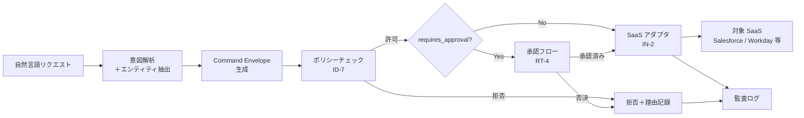

# RT-5 Intent-to-Enterprise Command Envelope（構造化コマンド封筒）

## 概要

自然言語はユーザインターフェースであり、エージェントの内部プロトコルではない。このパターンは、エージェントが受け取った自然言語の意図を Command Envelope（構造化コマンド）に変換し、ポリシーチェック・承認フロー・SaaS アダプタへ一貫したインターフェースで渡す。自然言語を直接 API に渡す危険を排除し、すべての操作を監査可能な構造体として記録する。

## 設計

Command Envelope は以下のフィールドを持つ JSON オブジェクトである。

```json
{
  "actor": "user:alice@example.com",
  "agent": "sales-assistant-v2",
  "target_system": "salesforce",
  "resource": "Opportunity/0065x000001ABCD",
  "action": "update_stage",
  "params": {"stage": "Closed Won"},
  "risk_tier": 3,
  "requires_approval": true,
  "reason": "商談がクローズしたため商談フェーズを更新する"
}
```

処理フローは以下の通りである。



意図解析は LLM が担うが、その出力を Command Envelope スキーマでバリデーションする。スキーマ不適合の Envelope は後続処理に進まない。ポリシーエンジン（ID-7）は Envelope を入力として、actor の権限・risk_tier・target_system の組み合わせを評価する。

## 解決する企業課題

自然言語を直接 API に渡す設計では、LLM の出力がそのまま SaaS の書き込み操作になる。曖昧な指示・誤解釈・プロンプトインジェクションが実害を引き起こすリスクが高い。Command Envelope を経由させることで、操作の意図・対象・リスクレベルが明示的に構造化され、実行前にポリシーと照合できる。

SaaS の API 仕様が変更されても、アダプタ層（IN-2）のみを修正すれば済む。Command Envelope のスキーマはエージェントと SaaS の間の安定した契約として機能する。

すべての操作が Envelope として記録されるため、監査時に「誰が・どのエージェントを通じて・何を・なぜ実行したか」を正確に再現できる。自然言語のログでは達成できない監査精度が得られる。

## 向き／不向き

**向いている条件**

- 複数の SaaS への書き込み操作を伴う自動化業務。
- ポリシーチェック・承認フロー・監査要件が厳しいエンタープライズ環境。
- 多様なエージェントが同一 SaaS を操作する環境（Envelope によりアダプタを共通化できる）。

**向いていない条件**

- 読み取り専用のクエリエージェント（書き込みリスクがなく Envelope の恩恵が薄い）。
- プロトタイプ段階で Envelope スキーマ設計のコストが高すぎる場合（後から導入も可能だが、初期に設計しておく方がよい）。

## 要素技術・既存システム連携

- JSON Schema：Command Envelope の構造定義とバリデーション
- コマンドバス：Envelope を受け取り適切なハンドラへルーティングするメッセージング基盤
- ドメインコマンドパターン（DDD）：Envelope はドメインコマンドとして設計する
- ポリシーエンジン：OPA、Cedar（ID-7）による Envelope の評価
- 承認ワークフロー：RT-4 Human Approval Chain
- SaaS アダプタ：IN-2（Salesforce、Workday、Slack 等）
- 監査ストア：Envelope + 実行結果の構造化保存

## 落とし穴／選定の勘所

**自然言語を直接 API に渡す**。最も頻出するアンチパターンである。「LLM が生成したテキストをそのまま API の引数にする」設計は、LLM の不確定性を本番システムに直接暴露する。どれほど小さな操作でも必ず Envelope を経由させること。

**Envelope スキーマの肥大化**。全ユースケースを1つのスキーマで吸収しようとすると、フィールドが膨大になり、必須フィールドが曖昧になる。ドメインごとにコマンドタイプを分け、共通フィールドと拡張フィールドを分離する。

**risk_tier の自己申告**。エージェントが自分で risk_tier を設定する設計では、誤設定または意図的な低設定が発生しうる。risk_tier はポリシーエンジンが Envelope の他フィールドから独立して計算する。

**理由（reason）フィールドの形骸化**。reason を空文字列や定型文で埋めるだけでは、監査時の価値がない。reason はユーザの意図の忠実な言語化であり、LLM が要約・整形した説明文を入れる。

## 関連パターン

- [RT-4 Human Approval Chain](rt4-human-approval-chain.md)
- [RT-6 System-of-Record Write Boundary](rt6-sor-write-boundary.md)
- [ID-7 Policy-as-Code Guardrail](../id-identity/id7-policy-as-code-guardrail.md)
- [IN-2 SaaS Adapter & Connector](../in-integration/in2-saas-connector-adapter.md)
- [OB-2 Unified Audit & Lineage](../ob-observability/ob2-unified-audit-lineage.md)
