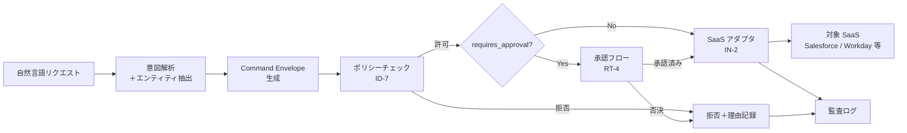

# RT-5 Intent-to-Enterprise Command Envelope（構造化コマンド封筒）

## 概要

「来週の会議を設定して」という自然言語を、そのまま Google Calendar API に渡してはいけない。自然言語はユーザーとの対話には向いているが、内部プロトコルとしては曖昧すぎて監査もポリシー検証もできない。このパターンでは自然言語をまず構造化された Command Envelope（actor / agent / target_system / action / risk_tier 等）に変換し、ポリシーチェック → 承認 → SaaS アダプタという一貫したパイプラインに流す。

## 解決する企業課題

自然言語を直接 API に渡す設計では、LLM の出力がそのまま SaaS の書き込み操作になる。曖昧な指示・誤解釈・プロンプトインジェクションが実害を引き起こすリスクは高い。「顧客に連絡して」という一文から生成されたテキストがそのまま CRM の送信 API に渡る構造は、エンタープライズのガバナンス観点から到底許容できない。

監査要件も深刻な問題だ。自然言語のログでは「誰が・どのエージェントを通じて・何を・なぜ実行したか」を正確に再現できない。規制対応や内部統制審査で操作の意図と実行内容の対応を証明できなければ、法的リスクに直結する。

SaaS の API 仕様変更も継続的な課題だ。Salesforce・Workday のバージョンアップのたびにエージェントのプロンプトやコードを修正する設計は維持コストが高い。エージェントと SaaS の間に安定した契約（Envelope）を置くことで、変更の影響を局所化できる。

!!! tip "最小成立条件（MVP）"
    actor・target_system・action・params の4フィールドを持つ JSON スキーマを定義し、LLM 出力を必ずこのスキーマでバリデーションしてから後続処理に渡す構成。risk_tier や承認連携は後から追加できる。

## 価値仮説

操作の構造化により監査可能性と再現性を確保し、エージェントによる書き込み操作を安全に拡大する。書き込み自動化の拡大は業務プロセス全体の効率化に直結する。

## 解決策と設計

解決策の核心は「自然言語 UI とエンタープライズプロトコルを明示的に分離すること」だ。LLM は意図を解釈してエンティティを抽出し、その結果を検証済みの構造体（Command Envelope）に変換してから後続処理に渡す。エージェントの不確定性を Command Envelope というバリアで食い止める設計だ。

Command Envelope は以下のフィールドを持つ JSON オブジェクトである。

```json
{
  "actor": "user:alice@example.com",
  "agent": "sales-assistant-v2",
  "target_system": "salesforce",
  "resource": "Opportunity/0065x000001ABCD",
  "action": "update_stage",
  "params": {"stage": "Closed Won"},
  "risk_tier": 3,
  "requires_approval": true,
  "reason": "商談がクローズしたため商談フェーズを更新する"
}
```

処理フローは以下の通りである。



意図解析は LLM が担うが、その出力は Command Envelope スキーマでバリデーションする。スキーマ不適合の Envelope は後続処理に進めない。ポリシーエンジン（ID-7）は Envelope を入力として actor の権限・risk_tier・target_system の組み合わせを評価する。risk_tier はエージェントが自己申告するのではなく、ポリシーエンジンが Envelope の他フィールドから独立して算出する——この点が設計上の要所だ。

## 向き／不向き

| 向き | 不向き |
|---|---|
| 複数の SaaS への書き込み操作を伴う自動化業務 | 読み取り専用のクエリエージェント（書き込みリスクがなく Envelope の恩恵が薄い） |
| ポリシーチェック・承認フロー・監査要件が厳しいエンタープライズ環境 | プロトタイプ段階で Envelope スキーマ設計のコストが高すぎる場合（後から導入も可能だが、初期に設計しておく方がよい） |
| 多様なエージェントが同一 SaaS を操作する環境（Envelope によりアダプタを共通化できる） | — |

## 要素技術・既存システム連携

- JSON Schema：Command Envelope の構造定義とバリデーション
- コマンドバス：Envelope を受け取り適切なハンドラへルーティングするメッセージング基盤
- ドメインコマンドパターン（DDD）：Envelope はドメインコマンドとして設計する
- ポリシーエンジン：OPA、Cedar（ID-7）による Envelope の評価
- 承認ワークフロー：RT-4 Human Approval Chain
- SaaS アダプタ：IN-2（Salesforce、Workday、Slack 等）
- 監査ストア：Envelope + 実行結果の構造化保存

## 落とし穴／選定の勘所

**自然言語を直接 API に渡す**。最も頻出するアンチパターンだ。「LLM が生成したテキストをそのまま API の引数にする」設計は、LLM の不確定性を本番システムに直接暴露する。どれほど小さな操作でも必ず Envelope を経由させること。

**Envelope スキーマの肥大化**。全ユースケースを1つのスキーマで吸収しようとすると、フィールドが膨大になり必須フィールドが曖昧になる。ドメインごとにコマンドタイプを分け、共通フィールドと拡張フィールドを明確に分離すること。

**risk_tier の自己申告**。エージェントが自分で risk_tier を設定する設計では、誤設定や意図的な低設定が発生しうる。risk_tier はポリシーエンジンが Envelope の他フィールドから独立して計算する設計にすること。

**理由（reason）フィールドの形骸化**。reason を空文字列や定型文で埋めるだけでは、監査時の価値がない。reason はユーザの意図を忠実に言語化したものであり、LLM が要約・整形した説明文を入れること。

## Interfaces

以下はこのパターンを実装する際の主要インターフェイスである。コーディングエージェントはこの定義からスタブコードを生成できる。

```yaml
interfaces:
  - name: Intent Parser + Entity Extractor
    description: "LLM interprets natural language and extracts entities to produce a validated Command Envelope JSON object."
    input:
      request: object
    output:
      response: object
    errors:
      - code: GENERAL_ERROR
        description: "Intent Parser + Entity Extractor の処理中にエラーが発生"
    protocol: "REST / gRPC"
    implementation_hints:
      - "詳細は本文の「解決策と設計」節を参照"
    code_examples:
      typescript: |
        interface IntentParserEntityExtractorRequest {
          naturalLanguageInput: string;
          userId: string;
          context: object;
        }
        interface IntentParserEntityExtractorResponse {
          commandEnvelope: object;
          intent: string;
          entities: object;
          validated: boolean;
        }
        interface IntentParserEntityExtractor {
          intentParserEntityExtractor(req: IntentParserEntityExtractorRequest): Promise<IntentParserEntityExtractorResponse>;
        }
      python: |
        @dataclass
        class IntentParserEntityExtractorRequest:
            natural_language_input: str
            user_id: str
            context: dict
        
        @dataclass
        class IntentParserEntityExtractorResponse:
            command_envelope: dict
            intent: str
            entities: dict
            validated: bool
        
        class IntentParserEntityExtractor(Protocol):
            async def intent_parser_entity_extractor(self, req: IntentParserEntityExtractorRequest) -> IntentParserEntityExtractorResponse: ...
  - name: Policy Engine (ID-7)
    description: "Evaluates the Envelope fields including actor permissions, risk_tier, and target_system combination independently of agent self-reporting."
    input:
      request: object
    output:
      response: object
    errors:
      - code: GENERAL_ERROR
        description: "Policy Engine (ID-7) の処理中にエラーが発生"
    protocol: "REST / gRPC"
    implementation_hints:
      - "詳細は本文の「解決策と設計」節を参照"
    code_examples:
      typescript: |
        interface PolicyEngineRequest {
          inputId: string;
          policyVersion: string;
          attributes: object;
        }
        interface PolicyEngineResponse {
          verdict: string;
          reason: string;
          requiresApproval: boolean;
          redact: boolean;
        }
        interface PolicyEngine {
          policyEngine(req: PolicyEngineRequest): Promise<PolicyEngineResponse>;
        }
      python: |
        @dataclass
        class PolicyEngineRequest:
            input_id: str
            policy_version: str
            attributes: dict
        
        @dataclass
        class PolicyEngineResponse:
            verdict: str
            reason: str
            requires_approval: bool
            redact: bool
        
        class PolicyEngine(Protocol):
            async def policy_engine(self, req: PolicyEngineRequest) -> PolicyEngineResponse: ...
  - name: SaaS Adapter (IN-2)
    description: "Receives the approved Envelope and translates it into the target SaaS API call, shielding agents from SaaS-specific schemas."
    input:
      request: object
    output:
      response: object
    errors:
      - code: GENERAL_ERROR
        description: "SaaS Adapter (IN-2) の処理中にエラーが発生"
    protocol: "REST / gRPC"
    implementation_hints:
      - "詳細は本文の「解決策と設計」節を参照"
    code_examples:
      typescript: |
        interface SaasAdapterRequest {
          commandEnvelope: object;
          saasTarget: string;
          authToken: string;
        }
        interface SaasAdapterResponse {
          apiResult: object;
          saasAuditId: string;
          executedAt: Date;
        }
        interface SaasAdapter {
          saasAdapter(req: SaasAdapterRequest): Promise<SaasAdapterResponse>;
        }
      python: |
        @dataclass
        class SaasAdapterRequest:
            command_envelope: dict
            saas_target: str
            auth_token: str
        
        @dataclass
        class SaasAdapterResponse:
            api_result: dict
            saas_audit_id: str
            executed_at: datetime
        
        class SaasAdapter(Protocol):
            async def saas_adapter(self, req: SaasAdapterRequest) -> SaasAdapterResponse: ...
```

## 関連パターン

- [RT-4 Human Approval Chain](rt4-human-approval-chain.md)：補完関係。Envelope の `requires_approval` フラグを受けて、承認フローを起動する上位パターン。
- [RT-6 System-of-Record Write Boundary](rt6-sor-write-boundary.md)：補完関係。Envelope がドメインサービスに渡り、SoR への書き込み境界を経由する設計と組み合わせる。
- [ID-7 Policy-as-Code Guardrail](../id-identity/id7-policy-as-code-guardrail.md)：補完関係。Envelope のポリシーチェックを実行基盤側のガードレールとして実装する。
- [IN-2 SaaS Adapter & Connector](../in-integration/in2-saas-connector-adapter.md)：補完関係。Envelope を受け取って各 SaaS の API を呼び出すアダプタ層。Envelope はアダプタとエージェントの安定した契約となる。
- [OB-2 Unified Audit & Lineage](../ob-observability/ob2-unified-audit-lineage.md)：補完関係。Envelope とその実行結果を監査ログに記録し、操作の完全なトレーサビリティを確保する。
