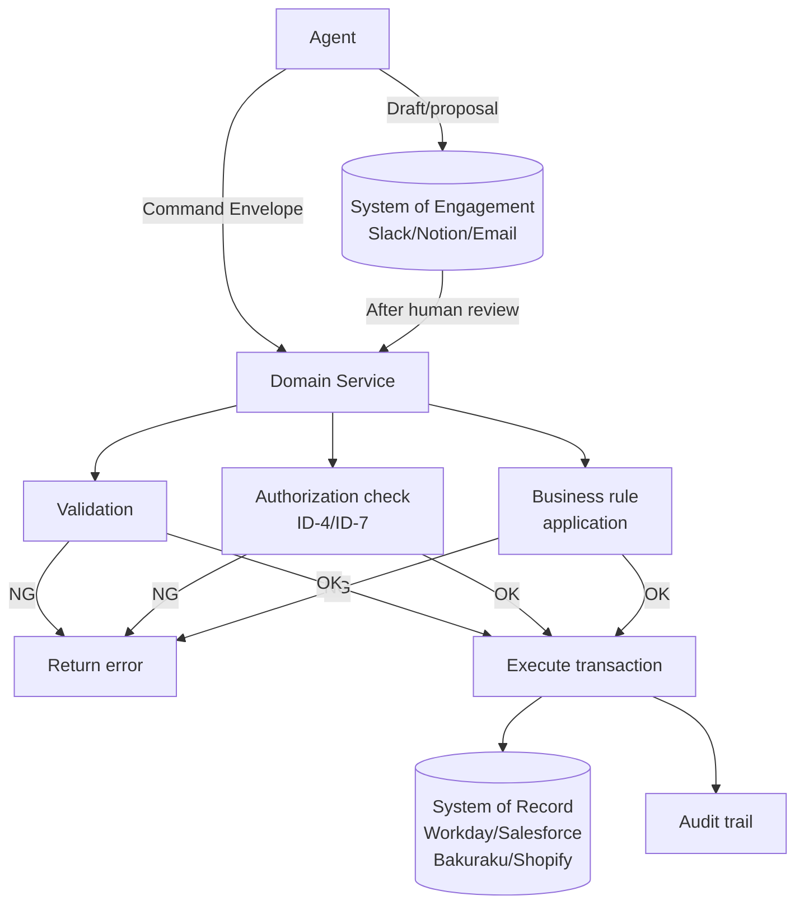

# RT-6 System-of-Record Write Boundary (Write Boundary)

## Overview

Granting agents direct write access to Workday or Salesforce trades the integrity of core data for speed. In this pattern, agents only propose "what they want to do," while domain services handle validation, business rules, and transaction management before reflecting changes in the SoR (System of Record). Drafts and proposals stay in SoE (System of Engagement) such as Slack and Notion, and only human-confirmed data is promoted to the SoR.

## Enterprise Problem Addressed

LLM judgments are probabilistic. Granting direct write access to production databases creates the risk that misjudgments, hallucinations, and prompt injections corrupt master data. Inconsistent updates to core data — personnel, accounting, customer master records — directly lead to business disruption and regulatory violations. The temptation to "grant agents direct SoR write access for speed" exists, but the cost of recovering corrupted master data is enormous.

The problem of multiple agents independently updating the SoR and generating conflicting inconsistent updates is also serious. Recording expenditures beyond approved budgets, invalid employment status transitions, and duplicate customer record creation — these are business-rule-violating updates occurring in silos.

SaaS API changes (Workday, Salesforce version upgrades, etc.) propagating to agent implementations also increases maintenance costs. Centralizing access through adapters (IN-2) localizes the impact of changes.

!!! tip "Minimum Viable Configuration (MVP)"
    Prohibit direct writes from agents to SoR and route through one domain service (validation + write). Draft flows and multi-SoR support can be added as extensions later.

## Value Hypothesis

Enabling agent-driven data updates while maintaining SoR integrity. Safe writes to core systems eliminate the final mile of manual work (human copy-paste operations) in business automation.

## Solution and Design

The core of the solution is "structurally separating agent nondeterminism from the SoR." The agent only proposes "what it wants to do" as a Command Envelope, while the domain service controls "how it actually writes." Making the domain service the single write path concentrates transaction management and consistency assurance in the domain service.

A domain service must always be interposed in the write path from agent to SoR. The domain service has three responsibilities:

1. **Validation**: Verifies input value format, range, and consistency.
2. **Authorization**: Cross-references with the policy engine to confirm the requester (actor) has permission to perform the operation.
3. **Business rule application**: Enforces SoR-specific business constraints (is it within the approved budget? does it satisfy employment status transition rules? etc.).



In the draft flow, proposals generated by agents (email content, contract terms, accounting entry drafts) are stored in the SoE, where humans review, revise, and approve them. Only approved data passes as a Command Envelope to the domain service and is reflected in the SoR.

The domain service calls SoR-specific adapters (IN-2). Agents do not need to know the SoR's API schema directly.

## When to Use / When Not to Use

| When to Use | When Not to Use |
|---|---|
| Business workflows targeting SoR that holds master data such as personnel, accounting, customer, and inventory | Low-risk store writes where overwriting and deletion are acceptable (logs, temporary data) |
| Environments where multiple agents access the same SoR and consistency assurance is necessary | Real-time use cases requiring immediate updates where draft flows in SoE don't fit the business process |
| Business workflows where regulatory requirements (SOX, internal controls) mandate approval and audit trails for SoR writes | — |

## Component Technologies and System Integration

- Domain-Driven Design (DDD): domain service, aggregate, command handler patterns
- Command handler: receives Command Envelopes and executes domain logic
- Validation layer: JSON Schema, domain-specific validators
- Authorization: integration with ID-4 Permission Mirror, ID-7 Policy-as-Code
- Audit trail: immutable log recording before/after values, operator, and timestamp
- SoR: Workday (HR), Salesforce (CRM), Bakuraku (expense/accounting), Shopify (EC)
- SoE: Slack, Notion, email (draft/proposal storage)
- SaaS adapters: integration with IN-2

## Pitfalls and Selection Criteria

**Granting agents direct SoR write access.** The most important anti-pattern to avoid. Many cases start with "for development efficiency" or "it's just a prototype" allowing direct access, which then reaches production. Agent service accounts must not be granted direct SoR write access.

**Thinning the domain service.** Implementations that make the domain service a mere proxy by saying "validation is done on the agent side" scatter business rules across agent prompts and make them unmanageable. Business rules must be concentrated in the domain service.

**Long-term SoE stagnation.** Drafts remain in the SoE and no one reviews or discards them. Set expiration dates on SoE proposals, and automatically archive or discard expired proposals.

**Isolated partial updates.** Implementations that split multi-field updates into multiple Command Envelopes and send them sequentially create inconsistent states when mid-process failures occur. Design composite updates as a single transaction and combine with RT-7 Enterprise Saga.

## Interfaces

The following are the key interfaces for implementing this pattern. Coding agents can generate stub code from these definitions.

```yaml
interfaces:
  - name: Domain Service
    description: "Single write path that enforces validation, authorization check (ID-4/ID-7), and business rules before executing the SoR transaction."
    input:
      request: object
    output:
      response: object
    errors:
      - code: GENERAL_ERROR
        description: "Error occurred during Domain Service processing"
    protocol: "REST / gRPC"
    implementation_hints:
      - "See the Solution and Design section for details"
    code_examples:
      typescript: |
        interface DomainServiceRequest {
          commandEnvelope: object;
          actorId: string;
          validationRules: string[];
        }
        interface DomainServiceResponse {
          transactionId: string;
          executed: boolean;
          beforeState: object;
          afterState: object;
        }
        interface DomainService {
          domainService(req: DomainServiceRequest): Promise<DomainServiceResponse>;
        }
      python: |
        @dataclass
        class DomainServiceRequest:
            command_envelope: dict
            actor_id: str
            validation_rules: list[str]
        
        @dataclass
        class DomainServiceResponse:
            transaction_id: str
            executed: bool
            before_state: dict
            after_state: dict
        
        class DomainService(Protocol):
            async def domain_service(self, req: DomainServiceRequest) -> DomainServiceResponse: ...
  - name: SoE Draft Store
    description: "Holds agent-generated proposals (Slack/Notion/email) for human review before escalation to the domain service."
    input:
      request: object
    output:
      response: object
    errors:
      - code: GENERAL_ERROR
        description: "Error occurred during SoE Draft Store processing"
    protocol: "REST / gRPC"
    implementation_hints:
      - "See the Solution and Design section for details"
    code_examples:
      typescript: |
        interface SoeDraftStoreRequest {
          draftContent: object;
          agentId: string;
          reviewerId: string;
          sourceSystem: string;
        }
        interface SoeDraftStoreResponse {
          draftId: string;
          createdAt: Date;
          reviewUrl: string;
        }
        interface SoeDraftStore {
          soeDraftStore(req: SoeDraftStoreRequest): Promise<SoeDraftStoreResponse>;
        }
      python: |
        @dataclass
        class SoeDraftStoreRequest:
            draft_content: dict
            agent_id: str
            reviewer_id: str
            source_system: str
        
        @dataclass
        class SoeDraftStoreResponse:
            draft_id: str
            created_at: datetime
            review_url: str
        
        class SoeDraftStore(Protocol):
            async def soe_draft_store(self, req: SoeDraftStoreRequest) -> SoeDraftStoreResponse: ...
  - name: Audit Trail
    description: "Records before/after values, operator identity, and timestamp as an immutable log for internal control evidence."
    input:
      request: object
    output:
      response: object
    errors:
      - code: GENERAL_ERROR
        description: "Error occurred during Audit Trail processing"
    protocol: "REST / gRPC"
    implementation_hints:
      - "See the Solution and Design section for details"
    code_examples:
      typescript: |
        interface AuditTrailRequest {
          actorId: string;
          agentId: string;
          correlationId: string;
          action: string;
          resource: string;
        }
        interface AuditTrailResponse {
          auditId: string;
          recordedAt: Date;
        }
        interface AuditTrail {
          auditTrail(req: AuditTrailRequest): Promise<AuditTrailResponse>;
        }
      python: |
        @dataclass
        class AuditTrailRequest:
            actor_id: str
            agent_id: str
            correlation_id: str
            action: str
            resource: str
        
        @dataclass
        class AuditTrailResponse:
            audit_id: str
            recorded_at: datetime
        
        class AuditTrail(Protocol):
            async def audit_trail(self, req: AuditTrailRequest) -> AuditTrailResponse: ...
```

## Related Patterns

- [RT-5 Intent-to-Enterprise Command Envelope](rt5-command-envelope.md): Prerequisite. The Command Envelope is the input interface to the domain service. This pattern cannot be implemented without Envelopes.
- [RT-7 Enterprise Saga](rt7-enterprise-saga.md): Complementary. Manages updates spanning multiple SoRs as a Saga and designs compensating actions for mid-process failures.
- [IN-2 SaaS Adapter & Connector](../in-integration/in2-saas-connector-adapter.md): Complementary. The adapter layer used when domain services call each SoR. SoR API change impacts are contained here.
- [ID-4 Permission Mirror & Least-of](../id-identity/id4-permission-mirror-least-of.md): Complementary. Faithfully maps agent permissions to SoR operation permissions in the domain service authorization check.
- [OB-2 Decision & Audit Trail](../ob-observability/ob2-unified-audit-lineage.md): Complementary. Records before/after values and operator as an immutable log, serving as internal control evidence.
