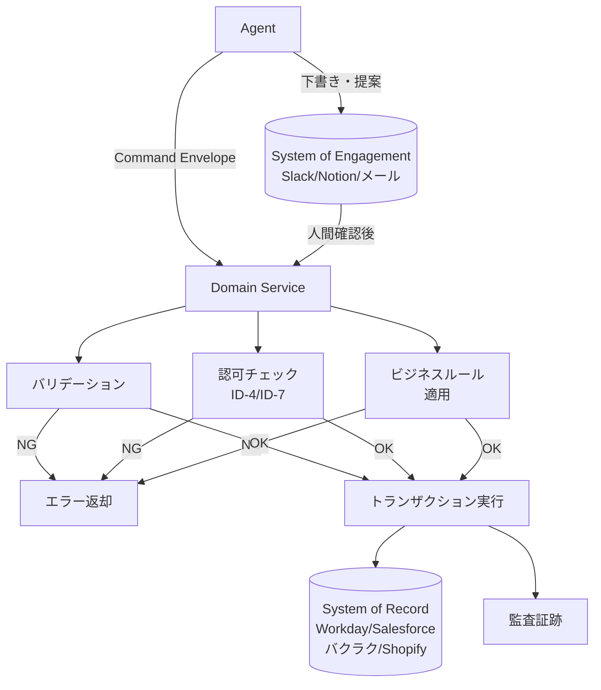

# RT-6 System-of-Record Write Boundary（書き込み境界）

## 概要

エージェントに Workday や Salesforce への直接書き込み権限を渡すのは、スピードと引き換えに基幹データの整合性を賭ける行為である。このパターンでは、エージェントは「何をしたいか」を提案し、ドメインサービスがバリデーション・業務ルール・トランザクション管理を行ってから SoR（基幹システム）に反映する。下書きや提案は Slack・Notion などの SoE に留め、人間が確認してから SoR に昇格する。

## 解決する企業課題

LLM の判断は確率的であり、生産データベースへの直接書き込み権限を与えると、誤判断・幻覚・プロンプトインジェクションがマスターデータを破壊するリスクが生じる。人事・会計・顧客マスターなど、基幹データへの不整合更新は業務停止や規制違反に直結する。エンタープライズでは「エージェントに直接 SoR へのwrite権限を付与して速い」という誘惑があるが、一度破損したマスターデータの修復コストは甚大である。

複数のエージェントが独立して SoR を更新すると、整合性のない更新が競合する問題も深刻である。承認済み予算を超えた支出の登録、無効な雇用ステータス遷移、重複した顧客レコード作成など、業務ルールを無視した更新がサイロ状に発生する。

SoR の API 変更（Workday・Salesforce のバージョンアップ等）がエージェントの実装に波及する構造も維持コストを増大させる。アダプタ（IN-2）を通じた一元アクセスにすることで、変更の影響を局所化できる。

## 解決策と設計

解決策の核心は「エージェントの不確定性を SoR から構造的に分離すること」である。エージェントは「何をしたいか」を Command Envelope として提案するだけで、「実際にどう書き込むか」はドメインサービスが制御する。ドメインサービスをシングルライトパスにすることで、トランザクション管理と整合性保証がドメインサービスに集約される。

エージェントから SoR への書き込みパスには必ずドメインサービスを介在させる。ドメインサービスは3つの責務を持つ。

1. **バリデーション**：入力値の形式・範囲・整合性を検証する。
2. **認可**：要求者（actor）がその操作を実行する権限を持つかをポリシーエンジンと照合する。
3. **ビジネスルール適用**：SoR 固有の業務制約（承認済み予算内か、雇用ステータスの遷移ルールを満たすか等）を強制する。

下書きフローでは、エージェントが生成した提案（メール文面・契約条件・会計仕訳案）を SoE に格納し、人間がレビュー・修正・承認する。承認後のデータのみが Command Envelope としてドメインサービスに渡り、SoR に反映される。

ドメインサービスは SoR 固有のアダプタ（IN-2）を呼び出す。エージェントは SoR の API スキーマを直接知る必要がない。

## 向き／不向き

**向いている条件**

- 人事・会計・顧客・在庫などのマスターデータを保持する SoR を対象とする業務。
- 複数エージェントが同一 SoR にアクセスし、整合性確保が必要な環境。
- 規制要件（SOX、内部統制）により SoR への書き込みに承認・監査証跡が必要な業務。

**向いていない条件**

- ログや一時データなど、上書き・削除が許容される低リスクストアへの書き込み。
- SoE での下書きフローが業務プロセスと合わない即時更新が必要なリアルタイムユースケース。

## 要素技術・既存システム連携

- ドメイン駆動設計（DDD）：ドメインサービス、集約、コマンドハンドラのパターン
- コマンドハンドラ：Command Envelope を受け取り、ドメインロジックを実行する
- バリデーション層：JSON Schema、ドメイン固有バリデーター
- 認可：ID-4 Permission Mirror、ID-7 Policy-as-Code との連携
- 監査証跡：変更前後の値・操作者・タイムスタンプの記録（イミュータブルログ）
- SoR：Workday（HR）、Salesforce（CRM）、バクラク（経費・会計）、Shopify（EC）
- SoE：Slack、Notion、メール（下書き・提案の格納先）
- SaaS アダプタ：IN-2 との連携

## 落とし穴／選定の勘所

**エージェントへの直接 SoR 書き込み権限付与**。最も避けるべきアンチパターンである。「開発効率のため」「プロトタイプだから」という理由で直接アクセスを許可し、そのまま本番に至るケースが多い。エージェントのサービスアカウントに SoR への直接書き込み権限を付与してはならない。

**ドメインサービスの薄層化**。「バリデーションはエージェント側でやる」としてドメインサービスをただのプロキシにする実装は、ビジネスルールがエージェントのプロンプトに分散し管理不能になる。ビジネスルールはドメインサービスに集約する。

**SoE の長期滞留**。下書きが SoE に残留し続け、誰も確認・破棄しない状態が発生する。SoE 上の提案には有効期限を設け、期限切れの提案は自動アーカイブまたは破棄する。

**部分更新の孤立**。複数フィールドにまたがる更新を複数の Command Envelope に分割して順次送信する実装では、途中失敗時に不整合状態が生じる。複合更新は1つのトランザクションとして設計し、RT-7 Enterprise Saga と組み合わせる。

## 関連パターン

- [RT-5 Intent-to-Enterprise Command Envelope](rt5-command-envelope.md)：前提関係。Command Envelope がドメインサービスへの入力インターフェースとなる。Envelope なしでは本パターンを実装できない。
- [RT-7 Enterprise Saga](rt7-enterprise-saga.md)：補完関係。複数 SoR にまたがる更新を Saga として管理し、途中失敗時の補償アクションを設計する。
- [IN-2 SaaS Adapter & Connector](../in-integration/in2-saas-connector-adapter.md)：補完関係。ドメインサービスが各 SoR を呼び出す際のアダプタ層。SoR の API 変更影響をここに閉じ込める。
- [ID-4 Permission Mirror & Least-of](../id-identity/id4-permission-mirror-least-of.md)：補完関係。ドメインサービスの認可チェックでエージェントの権限を SoR の操作権限に忠実にマッピングする。
- [OB-2 Decision & Audit Trail](../ob-observability/ob2-unified-audit-lineage.md)：補完関係。SoR への書き込み前後の値と操作者をイミュータブルログとして記録し、内部統制の証跡とする。
