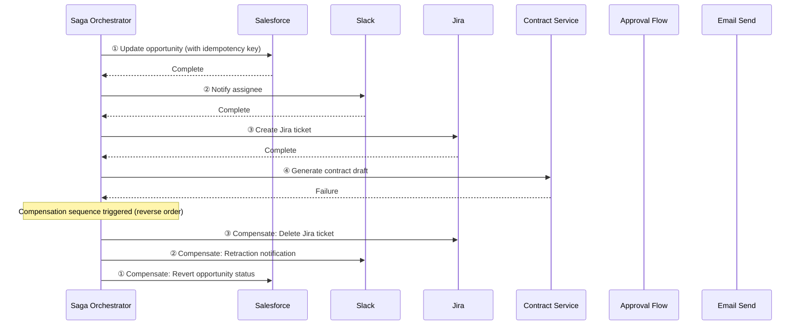

# RT-7 Enterprise Saga Agent (Compensating Transactions)

## Overview

Update a Salesforce opportunity → notify on Slack → create a Jira ticket → draft a contract → get approval → send email to customer — in this sequence, what happens if the Jira creation fails midway? This pattern is a Saga that confirms each step as an independent local transaction and, on failure, executes compensating actions (rollback, correction, or reversal) in reverse order to restore consistency. Since distributed transactions (2PC) are unavailable in SaaS environments, idempotency keys and compensation are the practical first choice. However, compensation is best-effort — not all side effects can be undone.

## Enterprise Problem Addressed

Mid-process failures always occur in enterprise multi-system updates. After a Salesforce opportunity is updated and Jira creation fails, a permanent divergence exists between opportunity data and tickets. Traditional RPA and simple sequential calls have no rollback mechanism, requiring manual correction. Business flows spanning multiple systems — onboarding, offboarding, contract renewals, returns and refunds — experience this problem regularly.

Designs that wrap long-running processes in DB transactions also create serious problems. Including external API calls within transaction boundaries means DB locks held for minutes to tens of minutes due to network delays and timeouts, completely blocking other processes. Enterprise business flows are not confined to a single DB, requiring a mechanism for consistency assurance in distributed environments.

From an audit perspective, the history of each step's execution and compensation remaining as an event log enables proof of compliance requirements (which steps succeeded and why compensation occurred).

!!! tip "Minimum Viable Configuration (MVP)"
    For 2–3 sequential steps (e.g., SoR update → notification send), define an idempotency key and one compensating action for each step. A minimal Temporal configuration is sufficient for the orchestrator.

## Value Hypothesis

Automating distributed processing across multiple SaaS platforms eliminates manual data entry and reconciliation. End-to-end automation of back-office operations (procurement, refunds, contract renewals) directly reduces labor costs and improves processing speed.

## Solution and Design

The core of the solution is "committing each step locally and, on failure, executing compensating actions in reverse order." Adopting the Saga pattern rather than distributed transactions (two-phase commit) guarantees multi-system consistency while avoiding long-duration DB locks.

Each Saga step is executed and recorded as an activity unit. Results are persisted in the store upon step completion, and on failure the compensation sequence is triggered. Other processes are not blocked because DB locks are not held for extended periods.



Compensating actions are executed only for steps that completed before the failed step. Each step has an idempotency key to prevent duplicate execution on retry. The orchestrator records activity state in a durable store and can resume from the same step after a crash.

!!! warning "Compensation is best-effort"
    Compensation cannot always completely undo all side effects. Irreversible side effects exist — email sends, payment confirmations, external public API calls — that once executed cannot physically be undone. Compensating actions themselves can also fail due to network failures or service outages. There is also the risk that probabilistic AI agents may make errors in compensation procedures (e.g., calling the compensation API with incorrect parameters). These risks require careful attention.

**Positioning of irreversible steps**: Steps with irreversible side effects (email sends, payment confirmations, etc.) should be placed **later** in the Saga, with the following defenses placed before them:

1. **Dry run**: Simulate execution before the irreversible step to confirm no problems
2. **[RT-4 Human Approval Chain](rt4-human-approval-chain.md)**: Insert human approval to introduce judgment before irreversible execution
3. **[RT-6 SoR Write Boundary](rt6-sor-write-boundary.md)**: Verify changes at the SoR write boundary

This ordering design minimizes the number of steps requiring compensation on failure and prevents the occurrence of non-compensatable side effects.

## When to Use / When Not to Use

| When to Use | When Not to Use |
|---|---|
| Business flows with sequential writes to multiple SaaS that require partial rollback on mid-process failure (order processing, onboarding, contract renewals, etc.) | Processing where atomicity is absolutely required and compensating actions are not business-acceptable (for financial transactions requiring strict ACID, consider distributed transactions rather than Saga) |
| Processing where compensating actions can be defined through business logic for each step | Processing with 1–2 steps that is completed by writes to a single system (Saga complexity becomes excessive) |
| System configurations where each step has an independent API and idempotent calls are possible | External systems where compensating actions cannot be defined (Saga cannot be applied when compensation implementation is impossible) |

## Component Technologies and System Integration

- **Saga orchestration**: Temporal, AWS Step Functions, Azure Durable Functions
- **Idempotency keys**: UUIDv4 attached to request headers, with duplicate detection on the service side
- **Outbox pattern**: Auxiliary pattern for atomically performing DB writes and message publishing
- **Compensating action implementations**: Salesforce (opportunity status rollback), Jira (ticket deletion/close), Slack (correction notification), contract service (draft discard)
- **State store**: PostgreSQL, DynamoDB, Redis (persisting Saga progress state)
- **Audit log**: each step's start, completion, and compensation recorded as events and sent to OB-2 audit infrastructure

## Pitfalls and Selection Criteria

!!! danger "Do not wrap the entire session in a DB transaction"
    The most typical anti-pattern is "wrapping all steps in a single DB transaction just in case." Including external API calls within transaction boundaries means DB locks held for minutes to tens of minutes due to network delays and timeouts, completely blocking other processes. Commit granularly at each step.

!!! warning "Non-idempotent compensating actions"
    If compensating actions themselves are not idempotent, double compensation occurs on retry. For example, if calling the Jira ticket deletion API twice results in an error, either insert an existence check before deletion or prepare an idempotent API wrapper.

!!! warning "Non-compensatable steps and compensation failures"
    Non-compensatable side effects — email sends, payment confirmations, external public API calls — should be placed later in the Saga, with dry runs, HitL approval ([RT-4](rt4-human-approval-chain.md)), and SoR boundary verification ([RT-6](rt6-sor-write-boundary.md)) placed before them. Compensating actions themselves can also fail due to network failures. Design escalation for compensation failures (human notification, switching to manual recovery). To guard against the risk of AI agents making errors in compensation procedures (incorrect parameters, etc.), implement compensation logic in deterministic code (Temporal Activities, etc.) rather than delegating to LLM judgment.

!!! warning "Poor idempotency key management"
    If idempotency keys are not generated per request and session IDs are reused directly, different steps within the same session will have the same key, causing unintended deduplication. Issue unique keys for each step.

## Interfaces

The following are the key interfaces for implementing this pattern. Coding agents can generate stub code from these definitions.

```yaml
interfaces:
  - name: Saga Orchestrator
    description: "Drives step execution, persists progress state durably, and triggers the compensation sequence in reverse order on failure."
    input:
      request: object
    output:
      response: object
    errors:
      - code: GENERAL_ERROR
        description: "Error occurred during Saga Orchestrator processing"
    protocol: "REST / gRPC"
    implementation_hints:
      - "See the Solution and Design section for details"
  - name: Idempotency Key Manager
    description: "Issues a unique key per step to prevent duplicate execution on retry; distinct from session IDs."
    input:
      request: object
    output:
      response: object
    errors:
      - code: GENERAL_ERROR
        description: "Error occurred during Idempotency Key Manager processing"
    protocol: "REST / gRPC"
    implementation_hints:
      - "See the Solution and Design section for details"
  - name: Compensation Action Library
    description: "Deterministic code (Temporal Activity etc.) implementing the rollback logic for each step without delegating decisions to the LLM."
    input:
      request: object
    output:
      response: object
    errors:
      - code: GENERAL_ERROR
        description: "Error occurred during Compensation Action Library processing"
    protocol: "REST / gRPC"
    implementation_hints:
      - "See the Solution and Design section for details"
```

## Related Patterns

- [RT-8 Durable Enterprise Agent Workflow](rt8-durable-workflow.md): Complementary. Executes Saga steps as activities within Durable Workflow, ensuring crash resilience and state persistence.
- [RT-6 SoR Write Boundary](rt6-sor-write-boundary.md): Complementary. Combined with the design of write target system boundaries and domain service routing at each Saga step.
- [RT-4 Human Approval Chain](rt4-human-approval-chain.md): Complementary. Combined when inserting HitL approval before non-compensatable steps.
- [RT-10 Event-Driven Enterprise Orchestrator](rt10-event-driven-orchestrator.md): Complementary. Combined with event-driven Saga trigger configurations to serve as the foundation for backend automation.
- [OB-2 Unified Audit & Lineage](../ob-observability/ob2-unified-audit-lineage.md): Complementary. Records execution and compensation history for each Saga step in audit logs as compliance evidence.
