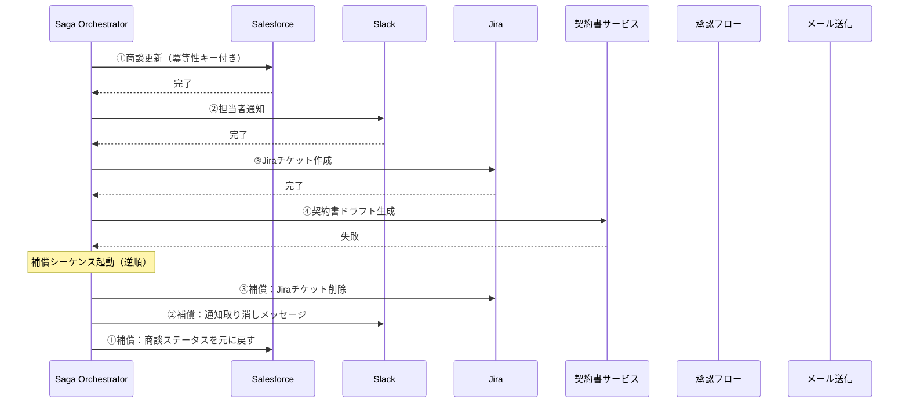

# RT-7 Enterprise Saga Agent（補償トランザクション）

## 概要

Salesforce の商談を更新→ Slack に通知→ Jira にチケット作成→ 契約書ドラフト→ 承認→ 顧客にメール送信——この一連の処理で、途中の Jira 作成が失敗したらどうなるか。このパターンは各ステップを独立したローカルトランザクションとして確定し、失敗時は補償アクション（取り消し・訂正・差し戻し）を逆順に実行して整合性を回復する Saga です。SaaS 環境では分散トランザクション（2PC）が使えないため、冪等性キーと補償が現実的な第一選択となります。ただし補償はベストエフォートであり、すべての副作用を取り消せるわけではない点に注意が必要です。

## 解決する企業課題

エンタープライズのマルチシステム更新では途中失敗が常に起こりえます。Salesforce の商談を更新した後に Jira 作成が失敗すると、商談データとチケットの間に永続的な乖離が生じます。従来の RPA や単純な逐次呼び出しはロールバック手段を持たないため、手動修正が必要になります。オンボーディング・退職・契約更新・返品返金など複数システムにまたがる業務フローでは、この問題が日常的に発生しがちです。

長時間プロセスを DB トランザクションで囲む設計も深刻な問題を引き起こします。外部 API 呼び出しをトランザクション境界内に含めると、ネットワーク遅延やタイムアウトにより DB ロックが数分〜数十分保持され、他のプロセスが完全にブロックされてしまいます。エンタープライズの業務フローは単一 DB で完結しないため、分散環境における整合性保証の仕組みが別途必要になります。

監査の観点では、各ステップの実行・補償の履歴がイベントログとして残ることで、「どのステップが成功し、何を理由に補償したか」というコンプライアンス要件を証明できます。

!!! tip "最小成立条件（MVP）"
    2〜3ステップの逐次処理（例：SoR 更新→通知送信）に対して、各ステップに冪等性キーと1つの補償アクションを定義する構成。オーケストレーターは Temporal の最小構成で十分です。

## 価値仮説

複数SaaSをまたぐ分散処理の自動化により、手作業による転記・突合を排除します。バックオフィス業務（調達・返金・契約更新）の端到端自動化は人件費削減と処理速度向上に直結します。

## 解決策と設計

解決策の核心は「各ステップをローカルコミットし、失敗時は補償アクションを逆順に実行すること」です。分散トランザクション（2フェーズコミット）ではなく Saga パターンを採用することで、長時間 DB ロックを回避しながらマルチシステムの整合性を保てます。

Saga の各ステップはアクティビティ単位で実行・記録されます。ステップ完了時に結果をストアに永続化し、失敗時は補償シーケンスを起動します。DB ロックを長時間保持しないため、他のプロセスへの影響を最小化できる点が Saga の大きな利点です。



補償アクションは「失敗ステップより前に完了したステップ」に対してのみ実行します。各ステップは冪等性キーを持ち、リトライ時の二重実行を防ぎます。オーケストレーター自体はアクティビティの状態をデュラブルストアに記録し、クラッシュ後も再開できます。

!!! warning "補償はベストエフォートです"
    補償はすべての副作用を完全に取り消せるとは限りません。メール送信・決済確定・外部公開 API 呼び出しなど、一度実行すると物理的に取り消し不能な副作用が存在します。また、補償アクション自体がネットワーク障害やサービス停止で失敗するリスクもあります。さらに、確率的に動作する AI エージェントが補償手順を誤る（不正確なパラメータで補償 API を呼ぶ等）リスクにも注意が必要です。

**不可逆ステップの配置設計**：不可逆な副作用を持つステップ（メール送信・決済確定等）は Saga の**後段**に配置し、その前段に以下の防御を置きます。

1. **ドライラン**：不可逆ステップの手前でシミュレーション実行し、問題がないことを確認します
2. **[RT-4 Human Approval Chain](rt4-human-approval-chain.md)**：人間の承認を挟み、不可逆な実行の前に判断を介在させます
3. **[RT-6 SoR Write Boundary](rt6-sor-write-boundary.md)**：書き込み先の SoR 境界で変更を検証します

この順序設計により、失敗時に補償が必要なステップの数を最小化し、補償不能な副作用の発生を防ぎます。

## 向き／不向き

| 向き | 不向き |
|---|---|
| 複数SaaSに順次書き込みを行い、途中失敗時に部分的なロールバックが必要な業務フロー（受注処理、オンボーディング、契約更新など） | 原子性が絶対に必要で、補償アクション自体が業務上許容されない処理（金融の入出金など厳密なACIDが必要な場合はSagaではなく分散トランザクションを検討します） |
| ステップ間にビジネスロジックによる補償アクションを定義できる処理 | ステップ数が1〜2個で、単一システムへの書き込みで完結する処理（Sagaの複雑性が過剰になります） |
| 各ステップが独立したAPIを持ち、冪等な呼び出しが可能なシステム構成 | 補償アクションを定義できない外部システム（補償の実装が不可能な場合は適用できません） |

## 要素技術・既存システム連携

- **Sagaオーケストレーション**：Temporal、AWS Step Functions、Azure Durable Functions
- **冪等性キー**：UUIDv4をリクエストヘッダに付与し、サービス側で重複検知
- **Outboxパターン**：DB書き込みとメッセージ発行を原子的に行うための補助パターン
- **補償アクション実装先**：Salesforce（商談ステータス巻き戻し）、Jira（チケット削除・クローズ）、Slack（訂正通知）、契約書サービス（ドラフト破棄）
- **状態ストア**：PostgreSQL、DynamoDB、Redis（Sagaの進行状態を永続化）
- **監査ログ**：各ステップの開始・完了・補償をイベントとして記録し、OB-2の監査基盤に送出

## 落とし穴／選定の勘所

!!! danger "セッション全体をDBトランザクションで囲まないこと"
    「念のため全ステップをひとつのDBトランザクションで囲む」設計は最も典型的なアンチパターンです。外部API呼び出しがトランザクション境界内にあると、ネットワーク遅延やタイムアウトによりDBロックが数分〜数十分保持され、他のプロセスが完全にブロックされます。コミットはステップごとに細かく行ってください。

!!! warning "補償アクションの非冪等性"
    補償アクション自体が冪等でない場合、リトライ時に二重補償が発生します。例として、Jiraチケットの削除APIを2回呼ぶとエラーになるケースでは、削除前に存在確認を挟むか、冪等対応のAPIラッパーを用意してください。

!!! warning "補償不可能なステップと補償自体の失敗"
    メール送信・決済確定・外部公開 API 呼び出しなど、補償不可能な副作用は Saga の後段に配置し、前段にドライラン・HitL 承認（[RT-4](rt4-human-approval-chain.md)）・SoR 境界検証（[RT-6](rt6-sor-write-boundary.md)）を置きます。また、補償アクション自体もネットワーク障害等で失敗しえます。補償失敗時のエスカレーション（人間への通知・手動復旧への切り替え）を設計に含めてください。AI エージェントが補償手順を誤るリスク（誤パラメータ等）にも備え、補償ロジックは決定論的なコード（Temporal の Activity 等）で実装し、LLM の判断に委ねないようにしてください。

!!! warning "冪等性キーの管理不備"
    冪等性キーをリクエストごとに生成せず、セッションIDをそのまま流用すると、同一セッション内の別ステップが同じキーを持ち、意図しない重複排除が起きます。ステップごとに一意なキーを発行してください。

## Interfaces

以下はこのパターンを実装する際の主要インターフェイスです。コーディングエージェントはこの定義からスタブコードを生成できます。

```yaml
interfaces:
  - name: Saga Orchestrator
    description: "Drives step execution, persists progress state durably, and triggers the compensation sequence in reverse order on failure."
    input:
      request: object
    output:
      response: object
    errors:
      - code: GENERAL_ERROR
        description: "Saga Orchestrator の処理中にエラーが発生"
    protocol: "REST / gRPC"
    implementation_hints:
      - "詳細は本文の「解決策と設計」節を参照"
    code_examples:
      typescript: |
        interface SagaOrchestratorRequest {
          workflowId: string;
          raciMatrix: object;
          initialContext: object;
        }
        interface SagaOrchestratorResponse {
          executionId: string;
          phase: string;
          state: string;
        }
        interface SagaOrchestrator {
          sagaOrchestrator(req: SagaOrchestratorRequest): Promise<SagaOrchestratorResponse>;
        }
      python: |
        @dataclass
        class SagaOrchestratorRequest:
            workflow_id: str
            raci_matrix: dict
            initial_context: dict
        
        @dataclass
        class SagaOrchestratorResponse:
            execution_id: str
            phase: str
            state: str
        
        class SagaOrchestrator(Protocol):
            async def saga_orchestrator(self, req: SagaOrchestratorRequest) -> SagaOrchestratorResponse: ...
  - name: Idempotency Key Manager
    description: "Issues a unique key per step to prevent duplicate execution on retry; distinct from session IDs."
    input:
      request: object
    output:
      response: object
    errors:
      - code: GENERAL_ERROR
        description: "Idempotency Key Manager の処理中にエラーが発生"
    protocol: "REST / gRPC"
    implementation_hints:
      - "詳細は本文の「解決策と設計」節を参照"
    code_examples:
      typescript: |
        interface IdempotencyKeyManagerRequest {
          sagaId: string;
          stepId: string;
        }
        interface IdempotencyKeyManagerResponse {
          idempotencyKey: string;
          alreadyExecuted: boolean;
          cachedResult: object;
        }
        interface IdempotencyKeyManager {
          idempotencyKeyManager(req: IdempotencyKeyManagerRequest): Promise<IdempotencyKeyManagerResponse>;
        }
      python: |
        @dataclass
        class IdempotencyKeyManagerRequest:
            saga_id: str
            step_id: str
        
        @dataclass
        class IdempotencyKeyManagerResponse:
            idempotency_key: str
            already_executed: bool
            cached_result: dict
        
        class IdempotencyKeyManager(Protocol):
            async def idempotency_key_manager(self, req: IdempotencyKeyManagerRequest) -> IdempotencyKeyManagerResponse: ...
  - name: Compensation Action Library
    description: "Deterministic code (Temporal Activity etc.) implementing the rollback logic for each step without delegating decisions to the LLM."
    input:
      request: object
    output:
      response: object
    errors:
      - code: GENERAL_ERROR
        description: "Compensation Action Library の処理中にエラーが発生"
    protocol: "REST / gRPC"
    implementation_hints:
      - "詳細は本文の「解決策と設計」節を参照"
    code_examples:
      typescript: |
        interface CompensationActionLibraryRequest {
          stepId: string;
          executionContext: object;
          failureReason: string;
        }
        interface CompensationActionLibraryResponse {
          compensated: boolean;
          compensationId: string;
          compensatedAt: Date;
        }
        interface CompensationActionLibrary {
          compensationActionLibrary(req: CompensationActionLibraryRequest): Promise<CompensationActionLibraryResponse>;
        }
      python: |
        @dataclass
        class CompensationActionLibraryRequest:
            step_id: str
            execution_context: dict
            failure_reason: str
        
        @dataclass
        class CompensationActionLibraryResponse:
            compensated: bool
            compensation_id: str
            compensated_at: datetime
        
        class CompensationActionLibrary(Protocol):
            async def compensation_action_library(self, req: CompensationActionLibraryRequest) -> CompensationActionLibraryResponse: ...
```

## 関連パターン

- [RT-8 Durable Enterprise Agent Workflow](rt8-durable-workflow.md)：補完関係。SagaステップをDurable Workflowの中で実行し、クラッシュ耐性と状態永続化を確保します。
- [RT-6 SoR 書き込み境界](rt6-sor-write-boundary.md)：補完関係。各Sagaステップにおける書き込み先システムの境界とドメインサービス経由の設計と組み合わせます。
- [RT-4 Human Approval Chain](rt4-human-approval-chain.md)：補完関係。補償不可能なステップの前にHitL承認を挟む際に組み合わせます。
- [RT-10 Event-Driven Enterprise Orchestrator](rt10-event-driven-orchestrator.md)：補完関係。イベント駆動でSagaを起動する構成と組み合わせ、バックエンド自動化の基盤とします。
- [OB-2 Unified Audit & Lineage](../ob-observability/ob2-unified-audit-lineage.md)：補完関係。各Sagaステップの実行・補償履歴を監査ログに記録し、コンプライアンス証跡とします。

## Decision Summary

```yaml
decision_summary:
  pattern: RT-7
  participates_in:
    - decision: TO-4
      role: enabler
    - decision: TO-11
      role: option_b
  recommended_if:
    - "複数SaaSにまたがるトランザクション整合性が必要"
    - "部分失敗時の自動補償が必要"
  avoid_if:
    - "単一SaaS内で完結する操作"
  combines_with: [RT-5, RT-6, RT-8, OB-2]
  conflicts_with: []
  value_outcome:
    drivers: [automation, audit_compliance]
    kpis: [Saga完了率, 補償トランザクション発動率]
  mvp: "2ステップSaga（実行＋補償）を1業務プロセスで検証"
  cost: L
```
