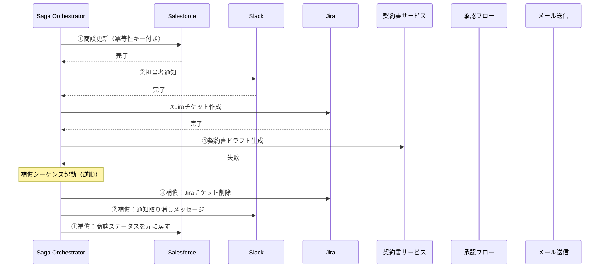

# RT-7 Enterprise Saga Agent（補償トランザクション）

## 概要

Salesforce の商談更新 → Slack 通知 → Jira チケット作成 → 契約書ドラフト → 承認 → 顧客メール送信のように、複数の SaaS にまたがる一連の書き込み処理を Saga パターンで管理するパターンである。各ステップは独立したローカルトランザクションとして確定し、後続ステップが失敗した場合は補償アクション（取り消し・訂正・差し戻し）を逆順に実行して整合性を回復する。分散トランザクション（2PC）は SaaS 環境では使えないため、冪等性キーによる二重実行防止と補償による巻き戻しが唯一の現実解となる。

## 解決する企業課題

エンタープライズのマルチシステム更新では途中失敗が常に起こりうる。Salesforceの商談を更新した後にJira作成が失敗すると、商談データとチケットの間に永続的な乖離が生じる。従来のRPAや単純な逐次呼び出しはロールバック手段を持たないため、手動修正が必要になる。オンボーディング・退職・契約更新・返品返金のような複数システムにまたがる業務フローでは、この問題が日常的に発生する。

長時間プロセスをDBトランザクションで囲む設計も深刻な問題を引き起こす。外部API呼び出しをトランザクション境界内に含めると、ネットワーク遅延やタイムアウトによりDBロックが数分〜数十分保持され、他のプロセスが完全にブロックされる。エンタープライズの業務フローは単一DBで完結しないため、分散環境における整合性保証の仕組みが必要になる。

監査の観点では、各ステップの実行・補償の履歴がイベントログとして残ることで、コンプライアンス要件（どのステップが成功し、何を理由に補償したか）を証明できる。

## 解決策と設計

解決策の核心は「各ステップをローカルコミットし、失敗時は補償アクションを逆順に実行すること」である。分散トランザクション（2フェーズコミット）ではなくSagaパターンを採用することで、長時間DBロックを回避しながらマルチシステムの整合性を保証する。

Sagaの各ステップはアクティビティ単位で実行・記録される。ステップ完了時に結果をストアに永続化し、失敗時は補償シーケンスを起動する。DBロックを長時間保持しないため、他のプロセスをブロックしない。

補償アクションは「失敗ステップより前に完了したステップ」に対してのみ実行する。各ステップは冪等性キーを持ち、リトライ時の二重実行を防ぐ。オーケストレーター自体はアクティビティの状態をデュラブルストアに記録し、クラッシュ後も再開できる。

補償不可能なアクション（顧客へのメール送信など）はSagaの最後のステップに配置するか、HitL承認（RT-4）を手前に挟んで送信前に人が確認する設計にする。

## 向き／不向き

**向いている条件**

- 複数SaaSに順次書き込みを行い、途中失敗時に部分的なロールバックが必要な業務フロー（受注処理、オンボーディング、契約更新など）
- ステップ間にビジネスロジックによる補償アクションを定義できる処理
- 各ステップが独立したAPIを持ち、冪等な呼び出しが可能なシステム構成

**向いていない条件**

- 原子性が絶対に必要で、補償アクション自体が業務上許容されない処理（金融の入出金など厳密なACIDが必要な場合はSagaではなく分散トランザクションを検討する）
- ステップ数が1〜2個で、単一システムへの書き込みで完結する処理（Sagaの複雑性が過剰になる）
- 補償アクションを定義できない外部システム（補償の実装が不可能な場合は適用できない）

## 要素技術・既存システム連携

- **Sagaオーケストレーション**：Temporal、AWS Step Functions、Azure Durable Functions
- **冪等性キー**：UUIDv4をリクエストヘッダに付与し、サービス側で重複検知
- **Outboxパターン**：DB書き込みとメッセージ発行を原子的に行うための補助パターン
- **補償アクション実装先**：Salesforce（商談ステータス巻き戻し）、Jira（チケット削除・クローズ）、Slack（訂正通知）、契約書サービス（ドラフト破棄）
- **状態ストア**：PostgreSQL、DynamoDB、Redis（Sagaの進行状態を永続化）
- **監査ログ**：各ステップの開始・完了・補償をイベントとして記録し、OB-2の監査基盤に送出

## 落とし穴／選定の勘所

!!! danger "セッション全体をDBトランザクションで囲まない"
    「念のため全ステップをひとつのDBトランザクションで囲む」設計は最も典型的なアンチパターンである。外部API呼び出しがトランザクション境界内にあると、ネットワーク遅延やタイムアウトによりDBロックが数分〜数十分保持され、他のプロセスが完全にブロックされる。コミットはステップごとに細かく行うこと。

!!! warning "補償アクションの非冪等性"
    補償アクション自体が冪等でない場合、リトライ時に二重補償が発生する。例として、Jiraチケットの削除APIを2回呼ぶとエラーになる場合は、削除前に存在確認を挟むか、冪等対応のAPIラッパーを用意する必要がある。

!!! warning "補償不可能なステップの存在"
    顧客へのメール送信など、一度実行すると取り消しが物理的に不可能なステップが存在する。これらは「補償不可能なアクション」として、Sagaの最後のステップに配置するか、HitL承認（RT-4）を手前に挟んで送信前に人が確認する設計にする。

!!! warning "冪等性キーの管理不備"
    冪等性キーをリクエストごとに生成せず、セッションIDをそのまま流用すると、同一セッション内の別ステップが同じキーを持ち、意図しない重複排除が起きる。ステップごとに一意なキーを発行すること。

## 関連パターン

- [RT-8 Durable Enterprise Agent Workflow](rt8-durable-workflow.md)：補完関係。SagaステップをDurable Workflowの中で実行し、クラッシュ耐性と状態永続化を確保する。
- [RT-6 SoR 書き込み境界](rt6-sor-write-boundary.md)：補完関係。各Sagaステップにおける書き込み先システムの境界とドメインサービス経由の設計と組み合わせる。
- [RT-4 Human Approval Chain](rt4-human-approval-chain.md)：補完関係。補償不可能なステップの前にHitL承認を挟む際に組み合わせる。
- [RT-10 Event-Driven Enterprise Orchestrator](rt10-event-driven-orchestrator.md)：補完関係。イベント駆動でSagaを起動する構成と組み合わせ、バックエンド自動化の基盤とする。
- [OB-2 Unified Audit & Lineage](../ob-observability/ob2-unified-audit-lineage.md)：補完関係。各Sagaステップの実行・補償履歴を監査ログに記録し、コンプライアンス証跡とする。
