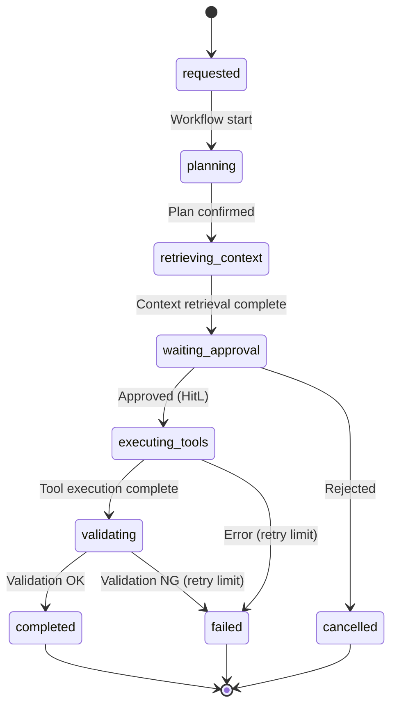

# RT-8 Durable Enterprise Agent Workflow (Durable Workflow)

## Overview

"The server restarted while waiting 3 hours for approval and the process was lost" — this is what happens when agent processing runs over synchronous HTTP. This pattern persists the agent's processing state at each step boundary, continuing processing across failures, restarts, and scale-out events. LLM outputs are fixed at activity boundaries so no different results can emerge during replay. Implemented with Temporal, Step Functions, or Durable Functions.

## Enterprise Problem Addressed

Enterprise business flows include cross-departmental approval waits (hours to days) and bulk processing of large data (tens of minutes). Synchronous HTTP execution hits load balancer timeouts (typically 60–300 seconds), causing process loss. Attempting to re-execute without idempotency guarantees causes duplicate processing.

Worker failures always occur. Kubernetes Pod eviction, deployments, and infrastructure failures — scenarios where a process stops mid-execution are common. Trying to maintain long-running processes synchronously causes connection occupation, memory growth, and cascading timeouts.

Idempotency and audit trail perspectives also present problems. When processing fails mid-way, safe resumption is impossible if "how far execution got" was not recorded. Enterprise business processing requires structured historical records for each step since the execution history is subject to audit.

!!! tip "Minimum Viable Configuration (MVP)"
    Implement one 2–3 step workflow on Temporal or Step Functions with LLM calls contained in activities. The minimum viable configuration is achieved when an asynchronous flow including approval waiting (HitL) works.

## Value Hypothesis

Fault tolerance of long-running workflows underpins the full automation of complex business processes. Automatic recovery from failures reduces human intervention workload and improves SLA compliance rates.

## Solution and Design

The core of the solution is "separating workflow state from workers." By externalizing state to a store, processing can continue even if workers are replaced. LLM inference results are fixed at activity boundaries and not re-called during replay, simultaneously solving cost increase and nondeterminism issues.

The workflow is defined as a clear state transition. Each state transitions on events, and activities (external API calls, LLM inference, file operations, etc.) are implemented idempotently. Because state is written to the store at step boundaries, the workflow can resume from the same step after a worker crash and restart.



LLM inference results are written to the store when the activity completes. When the workflow engine performs replay (reconstruction from history), it uses the saved results as-is without re-calling the LLM. This avoids the nondeterminism problem during replay (the problem of different results being returned on regeneration).

Budget, time, and step count limits are built into the workflow definition. When limits are exceeded, the workflow transitions to `failed` or `cancelled` and sends alerts to the OB-1 monitoring infrastructure.

## When to Use / When Not to Use

| When to Use | When Not to Use |
|---|---|
| Processing taking minutes to hours or more (bulk document processing, multi-step investigation, approval waits) | Processing requiring real-time responses completing in 1–3 seconds (single-turn chatbot responses, etc.) |
| Business flows that proceed while receiving human approvals/rejections asynchronously | Small-scale projects where the introduction cost of state management infrastructure (Temporal/Step Functions etc.) is not acceptable |
| High-availability processing where worker failures should not result in lost work | Environments where organizational policy prohibits workflow engine dependencies |
| Regulated industries (finance, healthcare, public sector) with strict idempotency and audit trail requirements | — |

## Component Technologies and System Integration

- **Workflow engines**: Temporal, AWS Step Functions, Azure Durable Functions
- **Agent framework persistence**: LangGraph Persistence (state saving using checkpoints)
- **State store**: PostgreSQL (Temporal), DynamoDB (Step Functions), Azure Storage (Durable Functions)
- **Queue**: SQS, ServiceBus, RabbitMQ (activity task queues)
- **Approval interface**: Slack (approval buttons), ServiceNow (tasks), email flows
- **Monitoring integration**: workflow execution metrics and events sent to OB-1 Observability Lake

## Pitfalls and Selection Criteria

!!! danger "Do not run long-running processes on synchronous HTTP"
    The most typical anti-pattern is accepting long-running agent processing at a REST endpoint synchronously and trying to maintain the connection until processing completes. When the connection is cut by load balancer/API gateway timeouts, processing results are lost; when clients retry without idempotency, double execution occurs. Return a job ID at acceptance time and notify results asynchronously via polling or webhook.

!!! warning "Do not call LLMs directly within workflow orchestration logic"
    Workflow engines like Temporal require workflow functions to be implemented deterministically. Calling LLMs directly within workflow functions causes re-calls during replay, resulting in different results, additional charges, and nondeterminism errors. LLM calls must be enclosed within activity functions and results saved to workflow history.

!!! warning "Runaway processing without budget/step limits"
    In structures where agents autonomously repeat tool calls, unlimited execution causes infinite loops and excessive API consumption. Build maximum step counts, maximum execution time, and maximum cost into the workflow definition, and always implement processing that safely terminates when limits are exceeded.

!!! warning "Workflow history bloat"
    Long-duration, many-step workflows can reach history sizes of several MB to several GB. Understand engine-specific constraints in advance — Temporal's ContinueAsNew, Step Functions' Map state parallelism limits — and plan history partitioning and archiving at the design stage.

## Interfaces

The following are the key interfaces for implementing this pattern. Coding agents can generate stub code from these definitions.

```yaml
interfaces:
  - name: Workflow Definition (State Machine)
    description: "Explicitly defined state transitions where each state is triggered by events; activity boundary results are persisted to the durable store."
    input:
      request: object
    output:
      response: object
    errors:
      - code: GENERAL_ERROR
        description: "Error occurred during Workflow Definition (State Machine) processing"
    protocol: "REST / gRPC"
    implementation_hints:
      - "See the Solution and Design section for details"
    code_examples:
      typescript: |
        interface WorkflowDefinitionRequest {
          workflowId: string;
          initialState: string;
          inputPayload: object;
        }
        interface WorkflowDefinitionResponse {
          executionId: string;
          currentState: string;
          startedAt: Date;
        }
        interface WorkflowDefinition {
          workflowDefinition(req: WorkflowDefinitionRequest): Promise<WorkflowDefinitionResponse>;
        }
      python: |
        @dataclass
        class WorkflowDefinitionRequest:
            workflow_id: str
            initial_state: str
            input_payload: dict
        
        @dataclass
        class WorkflowDefinitionResponse:
            execution_id: str
            current_state: str
            started_at: datetime
        
        class WorkflowDefinition(Protocol):
            async def workflow_definition(self, req: WorkflowDefinitionRequest) -> WorkflowDefinitionResponse: ...
  - name: Activity Function
    description: "Wraps LLM calls and external API calls; implements idempotent execution and stores results in workflow history to avoid re-invocation on replay."
    input:
      request: object
    output:
      response: object
    errors:
      - code: GENERAL_ERROR
        description: "Error occurred during Activity Function processing"
    protocol: "REST / gRPC"
    implementation_hints:
      - "See the Solution and Design section for details"
    code_examples:
      typescript: |
        interface ActivityFunctionRequest {
          activityId: string;
          inputPayload: object;
          executionId: string;
          idempotencyKey: string;
        }
        interface ActivityFunctionResponse {
          result: object;
          completed: boolean;
          cachedFromHistory: boolean;
        }
        interface ActivityFunction {
          activityFunction(req: ActivityFunctionRequest): Promise<ActivityFunctionResponse>;
        }
      python: |
        @dataclass
        class ActivityFunctionRequest:
            activity_id: str
            input_payload: dict
            execution_id: str
            idempotency_key: str
        
        @dataclass
        class ActivityFunctionResponse:
            result: dict
            completed: bool
            cached_from_history: bool
        
        class ActivityFunction(Protocol):
            async def activity_function(self, req: ActivityFunctionRequest) -> ActivityFunctionResponse: ...
  - name: Budget / Step Limit Guard
    description: "Enforces maximum step count, execution time, and cost limits in the workflow definition; triggers safe termination on breach."
    input:
      request: object
    output:
      response: object
    errors:
      - code: GENERAL_ERROR
        description: "Error occurred during Budget / Step Limit Guard processing"
    protocol: "REST / gRPC"
    implementation_hints:
      - "See the Solution and Design section for details"
    code_examples:
      typescript: |
        interface BudgetStepLimitGuardRequest {
          executionId: string;
          stepCount: number;
          elapsedMs: number;
          totalCost: number;
        }
        interface BudgetStepLimitGuardResponse {
          withinBudget: boolean;
          terminationReason: string;
          terminatedAt: Date;
        }
        interface BudgetStepLimitGuard {
          budgetStepLimitGuard(req: BudgetStepLimitGuardRequest): Promise<BudgetStepLimitGuardResponse>;
        }
      python: |
        @dataclass
        class BudgetStepLimitGuardRequest:
            execution_id: str
            step_count: int
            elapsed_ms: int
            total_cost: float
        
        @dataclass
        class BudgetStepLimitGuardResponse:
            within_budget: bool
            termination_reason: str
            terminated_at: datetime
        
        class BudgetStepLimitGuard(Protocol):
            async def budget_step_limit_guard(self, req: BudgetStepLimitGuardRequest) -> BudgetStepLimitGuardResponse: ...
```

## Related Patterns

- [RT-7 Enterprise Saga Agent](rt7-enterprise-saga.md): Complementary. Implements Saga steps as activities within Durable Workflow and incorporates compensation flows into the workflow definition.
- [RT-4 Human Approval Chain](rt4-human-approval-chain.md): Complementary. Combined with the mechanism for receiving HitL approval in the `waiting_approval` state to persist async approval waits.
- [RT-9 Enterprise Work Queue Agent](rt9-work-queue-agent.md): Complementary. Combined with architectures that pick up tasks from queues and process them as Durable Workflows.
- [OB-1 Observability Lake](../ob-observability/ob1-observability-lake.md): Complementary. Monitors workflow execution state, duration, and cost for runaway detection and budget management.
