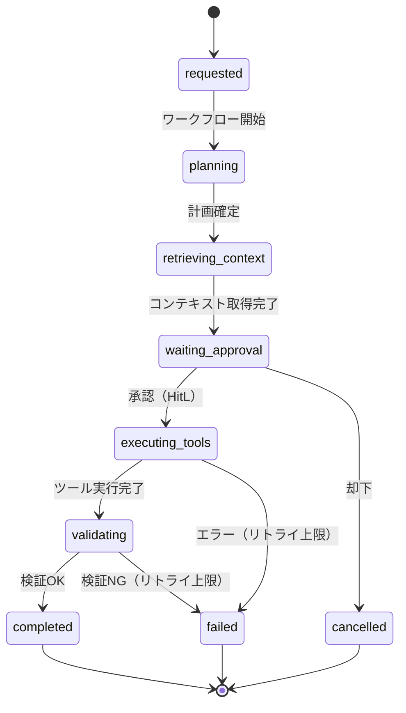

# RT-8 Durable Enterprise Agent Workflow（永続ワークフロー）

## 概要

「承認待ちで3時間止まっていたら、サーバーが再起動して処理が消えた」——同期 HTTP でエージェント処理を動かすと、こうした事態が起きる。このパターンは、エージェントの処理状態をステップ境界ごとに永続化し、障害・再起動・スケールアウトをまたいで処理を続行する。LLM の出力はアクティビティ境界で固定され、リプレイ時に別の結果が生まれるリスクもない。Temporal・Step Functions・Durable Functions で実装する。

## 解決する企業課題

エンタープライズの業務フローには、複数部門にまたがる承認待機（数時間〜数日）や、大量データの一括処理（数十分）が含まれる。同期HTTPで実行すると、ロードバランサのタイムアウト（通常60〜300秒）に引っかかり処理が消滅する。再実行しようとしても冪等性が保証されていなければ二重処理が発生する。

ワーカーの障害は常に起こりうる。Kubernetes Podの退避、デプロイ、インフラ障害など、実行途中でプロセスが停止するシナリオは珍しくない。長時間処理を同期的に保持しようとすると、コネクション占有・メモリ増加・タイムアウトが連鎖する。

冪等性と監査証跡の観点でも問題が生じる。処理が途中で失敗したとき、「どこまで実行できたか」が記録されていなければ安全に再開できない。また、エンタープライズの業務処理では各ステップの実行経緯が監査対象となるため、処理履歴の構造化記録が必要である。

## 解決策と設計

解決策の核心は「ワークフローの状態をワーカーから分離すること」である。状態をストアに外出しすることで、ワーカーが入れ替わっても処理を継続できる。LLMの推論結果はアクティビティ境界で固定し、リプレイ時に再呼び出ししない設計が、コスト増加と非決定性の問題を同時に解決する。

ワークフローは明確な状態遷移として定義する。各状態はイベントによって遷移し、アクティビティ（外部API呼び出し・LLM推論・ファイル操作など）は冪等に実装する。ステップ境界で状態をストアに書き込み、ワーカーがクラッシュしても再起動後に同じステップから再開できる。

LLMの推論結果はアクティビティが完了した時点でストアに書き込む。ワークフローエンジンがリプレイ（履歴からの再構築）を行う際は、保存済みの結果をそのまま使い、LLMを再呼び出ししない。これにより、リプレイの非決定性問題（再生成時に異なる結果が返る問題）を回避できる。

予算・時間・ステップ数の上限はワークフロー定義に組み込む。上限を超えた場合は `failed` または `cancelled` に遷移し、OB-1の監視基盤にアラートを送出する。

## 向き／不向き

**向いている条件**

- 数分〜数時間以上かかる処理（大量ドキュメント処理、マルチステップ調査、承認待ち）
- 人間の承認・却下を非同期で受け取りながら処理を進める業務フロー
- ワーカー障害時に処理を失いたくない高可用性要件のある処理
- 冪等性・監査証跡の要件が厳しい規制業種（金融、医療、公共）

**向いていない条件**

- 1〜3秒で完了するリアルタイム応答が必要な処理（チャットボットの単回応答など）
- 状態管理インフラ（Temporal/Step Functions等）の導入コストが許容できない小規模プロジェクト
- ワークフローエンジンへの依存を組織的に禁止している環境

## 要素技術・既存システム連携

- **ワークフローエンジン**：Temporal、AWS Step Functions、Azure Durable Functions
- **エージェントフレームワーク永続化**：LangGraph Persistence（チェックポイントを使った状態保存）
- **状態ストア**：PostgreSQL（Temporal）、DynamoDB（Step Functions）、Azure Storage（Durable Functions）
- **キュー**：SQS、ServiceBus、RabbitMQ（アクティビティのタスクキュー）
- **承認インターフェース**：Slack（承認ボタン）、ServiceNow（タスク）、メールフロー
- **監視連携**：OB-1 Observability Lakeへのワークフロー実行メトリクス・イベント送出

## 落とし穴／選定の勘所

!!! danger "長時間処理を同期HTTPに乗せない"
    最も典型的なアンチパターンは、長時間のエージェント処理をRESTエンドポイントで同期的に受け付け、処理完了まで接続を保持しようとすることである。ロードバランサ・APIゲートウェイのタイムアウトにより接続が切れると処理結果が失われ、クライアントはリトライするが冪等性がなければ二重実行が発生する。受付時にジョブIDを返し、非同期でポーリングまたはWebhookで結果を通知する設計にすること。

!!! warning "LLMをワークフローのオーケストレーターロジック内で直接呼ばない"
    Temporalなどのワークフローエンジンはワークフロー関数を決定論的に実装することを要求する。ワークフロー関数内でLLMを直接呼ぶと、リプレイ時に再呼び出しが発生し、異なる結果・追加課金・非決定性エラーが生じる。LLM呼び出しは必ずアクティビティ関数内に閉じ込め、結果をワークフロー履歴に保存すること。

!!! warning "予算・ステップ上限を設定しない暴走"
    エージェントが自律的にツール呼び出しを繰り返す構造では、上限なしでは無限ループや過剰API消費が発生する。最大ステップ数、最大実行時間、最大コストをワークフロー定義に組み込み、超過時に安全に打ち切る処理を必ず実装すること。

!!! warning "ワークフロー履歴の肥大化"
    長期間・大量ステップのワークフローは履歴サイズが数MB〜数GBに達することがある。TemporalのContinueAsNewや、Step FunctionsのMap状態の並列上限など、エンジン固有の制約を事前に把握し、設計段階で履歴分割やアーカイブを計画すること。

## 関連パターン

- [RT-7 Enterprise Saga Agent](rt7-enterprise-saga.md)：補完関係。SagaステップをDurable Workflow内のアクティビティとして実装し、補償フローをワークフロー定義に組み込む。
- [RT-4 Human Approval Chain](rt4-human-approval-chain.md)：補完関係。`waiting_approval` 状態でHitL承認を受け取る仕組みと組み合わせ、非同期承認待ちを永続化する。
- [RT-9 Enterprise Work Queue Agent](rt9-work-queue-agent.md)：補完関係。キューからタスクを取得しDurable Workflowとして処理するアーキテクチャに組み合わせる。
- [OB-1 Observability Lake](../ob-observability/ob1-observability-lake.md)：補完関係。ワークフロー実行状態・実行時間・コストを監視し、暴走検知と予算管理に活用する。
