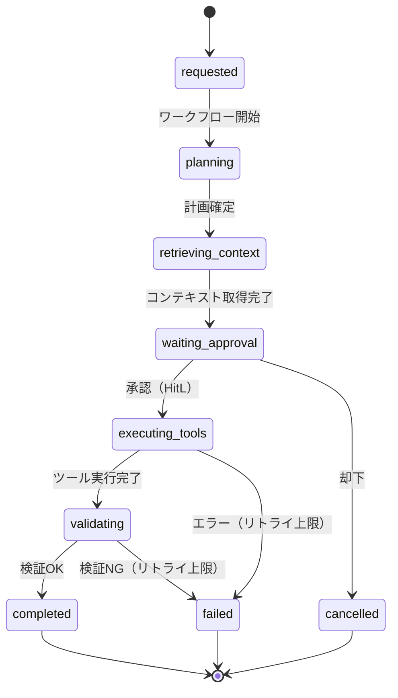

# RT-8 Durable Enterprise Agent Workflow（永続ワークフロー）

## 概要

「承認待ちで3時間止まっていたら、サーバーが再起動して処理が消えた」——同期 HTTP でエージェント処理を動かすと、こうした事態が起きます。このパターンはエージェントの処理状態をステップ境界ごとに永続化し、障害・再起動・スケールアウトをまたいで処理を継続させます。LLM の出力はアクティビティ境界で固定されるため、リプレイ時に別の結果が生まれるリスクもありません。Temporal・Step Functions・Durable Functions で実装します。

## 解決する企業課題

エンタープライズの業務フローには、複数部門にまたがる承認待機（数時間〜数日）や大量データの一括処理（数十分）が含まれます。同期 HTTP で実行すると、ロードバランサのタイムアウト（通常 60〜300 秒）に引っかかり処理が消えてしまいます。再実行しようとしても冪等性が保証されていなければ二重処理が発生します。

ワーカーの障害は常に起こりえます。Kubernetes Pod の退避・デプロイ・インフラ障害など、実行途中でプロセスが停止するシナリオは珍しくありません。長時間処理を同期的に保持しようとすると、コネクション占有・メモリ増加・タイムアウトが連鎖し、システム全体に波及します。

冪等性と監査証跡の観点でも問題が生じます。処理が途中で失敗したとき「どこまで実行できたか」が記録されていなければ安全に再開できません。エンタープライズの業務処理では各ステップの実行経緯が監査対象となるため、処理履歴の構造化記録が欠かせません。

!!! tip "最小成立条件（MVP）"
    Temporal または Step Functions 上で、LLM 呼び出しをアクティビティに閉じ込めた2〜3ステップのワークフローを1本実装する構成。承認待ち（HitL）を含む非同期フローが動けば最小成立です。

## 価値仮説

長時間ワークフローの中断耐性により、複雑な業務プロセスの完全自動化を支えます。障害時の自動再開は人間の介入工数を削減し、SLA遵守率を向上させます。

## 解決策と設計

解決策の核心は「ワークフローの状態をワーカーから分離すること」です。状態をストアに外出しすることで、ワーカーが入れ替わっても処理を継続できます。LLM の推論結果はアクティビティ境界で固定し、リプレイ時に再呼び出ししない設計にします。これによりコスト増加と非決定性の問題を同時に解決できます。

ワークフローは明確な状態遷移として定義します。各状態はイベントによって遷移し、アクティビティ（外部 API 呼び出し・LLM 推論・ファイル操作など）は冪等に実装します。ステップ境界で状態をストアに書き込むため、ワーカーがクラッシュしても再起動後に同じステップから再開できます。



LLM の推論結果はアクティビティが完了した時点でストアに書き込みます。ワークフローエンジンがリプレイ（履歴からの再構築）を行う際は、保存済みの結果をそのまま使い LLM を再呼び出ししません。こうすることで、再生成時に異なる結果が返るリプレイの非決定性問題を回避できます。

予算・時間・ステップ数の上限はワークフロー定義に組み込んでおきます。上限を超えた場合は `failed` または `cancelled` に遷移し、OB-1 の監視基盤にアラートを送出する設計にします。

## 向き／不向き

| 向き | 不向き |
|---|---|
| 数分〜数時間以上かかる処理（大量ドキュメント処理、マルチステップ調査、承認待ち） | 1〜3秒で完了するリアルタイム応答が必要な処理（チャットボットの単回応答など） |
| 人間の承認・却下を非同期で受け取りながら処理を進める業務フロー | 状態管理インフラ（Temporal/Step Functions等）の導入コストが許容できない小規模プロジェクト |
| ワーカー障害時に処理を失いたくない高可用性要件のある処理 | ワークフローエンジンへの依存を組織的に禁止している環境 |
| 冪等性・監査証跡の要件が厳しい規制業種（金融、医療、公共） | — |

## 要素技術・既存システム連携

- **ワークフローエンジン**：Temporal、AWS Step Functions、Azure Durable Functions
- **エージェントフレームワーク永続化**：LangGraph Persistence（チェックポイントを使った状態保存）
- **状態ストア**：PostgreSQL（Temporal）、DynamoDB（Step Functions）、Azure Storage（Durable Functions）
- **キュー**：SQS、ServiceBus、RabbitMQ（アクティビティのタスクキュー）
- **承認インターフェース**：Slack（承認ボタン）、ServiceNow（タスク）、メールフロー
- **監視連携**：OB-1 Observability Lakeへのワークフロー実行メトリクス・イベント送出

## 落とし穴／選定の勘所

!!! danger "長時間処理を同期HTTPに乗せないこと"
    最も典型的なアンチパターンは、長時間のエージェント処理をRESTエンドポイントで同期的に受け付け、処理完了まで接続を保持しようとすることです。ロードバランサ・APIゲートウェイのタイムアウトにより接続が切れると処理結果が失われ、クライアントはリトライしますが冪等性がなければ二重実行が発生します。受付時にジョブIDを返し、非同期でポーリングまたはWebhookで結果を通知する設計にしてください。

!!! warning "LLMをワークフローのオーケストレーターロジック内で直接呼ばないこと"
    Temporalなどのワークフローエンジンはワークフロー関数を決定論的に実装することを要求します。ワークフロー関数内でLLMを直接呼ぶと、リプレイ時に再呼び出しが発生し、異なる結果・追加課金・非決定性エラーが生じます。LLM呼び出しは必ずアクティビティ関数内に閉じ込め、結果をワークフロー履歴に保存してください。

!!! warning "予算・ステップ上限を設定しない暴走"
    エージェントが自律的にツール呼び出しを繰り返す構造では、上限なしでは無限ループや過剰API消費が発生します。最大ステップ数、最大実行時間、最大コストをワークフロー定義に組み込み、超過時に安全に打ち切る処理を必ず実装してください。

!!! warning "ワークフロー履歴の肥大化"
    長期間・大量ステップのワークフローは履歴サイズが数MB〜数GBに達することがあります。TemporalのContinueAsNewや、Step FunctionsのMap状態の並列上限など、エンジン固有の制約を事前に把握し、設計段階で履歴分割やアーカイブを計画してください。

## Interfaces

以下はこのパターンを実装する際の主要インターフェイスです。コーディングエージェントはこの定義からスタブコードを生成できます。

```yaml
interfaces:
  - name: Workflow Definition (State Machine)
    description: "Explicitly defined state transitions where each state is triggered by events; activity boundary results are persisted to the durable store."
    input:
      request: object
    output:
      response: object
    errors:
      - code: GENERAL_ERROR
        description: "Workflow Definition (State Machine) の処理中にエラーが発生"
    protocol: "REST / gRPC"
    implementation_hints:
      - "詳細は本文の「解決策と設計」節を参照"
    code_examples:
      typescript: |
        interface WorkflowDefinitionRequest {
          workflowId: string;
          initialState: string;
          inputPayload: object;
        }
        interface WorkflowDefinitionResponse {
          executionId: string;
          currentState: string;
          startedAt: Date;
        }
        interface WorkflowDefinition {
          workflowDefinition(req: WorkflowDefinitionRequest): Promise<WorkflowDefinitionResponse>;
        }
      python: |
        @dataclass
        class WorkflowDefinitionRequest:
            workflow_id: str
            initial_state: str
            input_payload: dict
        
        @dataclass
        class WorkflowDefinitionResponse:
            execution_id: str
            current_state: str
            started_at: datetime
        
        class WorkflowDefinition(Protocol):
            async def workflow_definition(self, req: WorkflowDefinitionRequest) -> WorkflowDefinitionResponse: ...
  - name: Activity Function
    description: "Wraps LLM calls and external API calls; implements idempotent execution and stores results in workflow history to avoid re-invocation on replay."
    input:
      request: object
    output:
      response: object
    errors:
      - code: GENERAL_ERROR
        description: "Activity Function の処理中にエラーが発生"
    protocol: "REST / gRPC"
    implementation_hints:
      - "詳細は本文の「解決策と設計」節を参照"
    code_examples:
      typescript: |
        interface ActivityFunctionRequest {
          activityId: string;
          inputPayload: object;
          executionId: string;
          idempotencyKey: string;
        }
        interface ActivityFunctionResponse {
          result: object;
          completed: boolean;
          cachedFromHistory: boolean;
        }
        interface ActivityFunction {
          activityFunction(req: ActivityFunctionRequest): Promise<ActivityFunctionResponse>;
        }
      python: |
        @dataclass
        class ActivityFunctionRequest:
            activity_id: str
            input_payload: dict
            execution_id: str
            idempotency_key: str
        
        @dataclass
        class ActivityFunctionResponse:
            result: dict
            completed: bool
            cached_from_history: bool
        
        class ActivityFunction(Protocol):
            async def activity_function(self, req: ActivityFunctionRequest) -> ActivityFunctionResponse: ...
  - name: Budget / Step Limit Guard
    description: "Enforces maximum step count, execution time, and cost limits in the workflow definition; triggers safe termination on breach."
    input:
      request: object
    output:
      response: object
    errors:
      - code: GENERAL_ERROR
        description: "Budget / Step Limit Guard の処理中にエラーが発生"
    protocol: "REST / gRPC"
    implementation_hints:
      - "詳細は本文の「解決策と設計」節を参照"
    code_examples:
      typescript: |
        interface BudgetStepLimitGuardRequest {
          executionId: string;
          stepCount: number;
          elapsedMs: number;
          totalCost: number;
        }
        interface BudgetStepLimitGuardResponse {
          withinBudget: boolean;
          terminationReason: string;
          terminatedAt: Date;
        }
        interface BudgetStepLimitGuard {
          budgetStepLimitGuard(req: BudgetStepLimitGuardRequest): Promise<BudgetStepLimitGuardResponse>;
        }
      python: |
        @dataclass
        class BudgetStepLimitGuardRequest:
            execution_id: str
            step_count: int
            elapsed_ms: int
            total_cost: float
        
        @dataclass
        class BudgetStepLimitGuardResponse:
            within_budget: bool
            termination_reason: str
            terminated_at: datetime
        
        class BudgetStepLimitGuard(Protocol):
            async def budget_step_limit_guard(self, req: BudgetStepLimitGuardRequest) -> BudgetStepLimitGuardResponse: ...
```

## 関連パターン

- [RT-7 Enterprise Saga Agent](rt7-enterprise-saga.md)：補完関係。SagaステップをDurable Workflow内のアクティビティとして実装し、補償フローをワークフロー定義に組み込みます。
- [RT-4 Human Approval Chain](rt4-human-approval-chain.md)：補完関係。`waiting_approval` 状態でHitL承認を受け取る仕組みと組み合わせ、非同期承認待ちを永続化します。
- [RT-9 Enterprise Work Queue Agent](rt9-work-queue-agent.md)：補完関係。キューからタスクを取得しDurable Workflowとして処理するアーキテクチャに組み合わせます。
- [OB-1 Observability Lake](../ob-observability/ob1-observability-lake.md)：補完関係。ワークフロー実行状態・実行時間・コストを監視し、暴走検知と予算管理に活用します。

## Decision Summary

```yaml
decision_summary:
  pattern: RT-8
  participates_in:
    - decision: TO-11
      role: option_b
  recommended_if:
    - "長時間実行（分〜時間）のワークフローがある"
    - "中断・再開・リトライが必要"
  avoid_if:
    - "数秒で完了する同期処理のみ"
  combines_with: [RT-7, RT-9, RT-10]
  conflicts_with: []
  value_outcome:
    drivers: [automation, project_productivity]
    kpis: [ワークフロー完了率, リトライ成功率]
  mvp: "1長時間プロセスをTemporal等で永続化"
  cost: M
```
