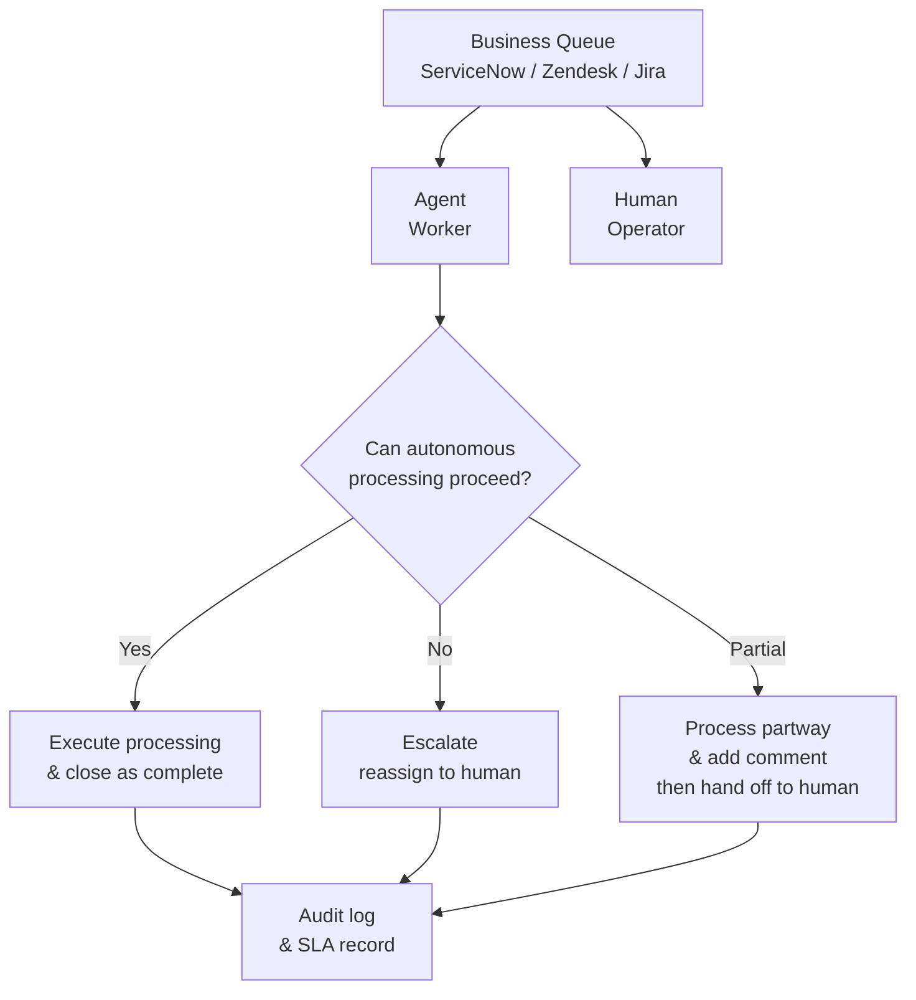

# RT-9 Enterprise Work Queue Agent (Business Queue Participation)

## Overview

Design agents not as "chatbots that answer when spoken to" but as "another operator" that picks up tickets from ServiceNow or Zendesk business queues and processes them. They line up in the same queue as humans, autonomously attempt processing, and escalate tasks they cannot handle to humans. SLA management, load balancing, and prioritization are handled by the existing queue infrastructure as-is, requiring no special mechanisms for AI.

## Enterprise Problem Addressed

The disconnection between AI processing and human business workflows is the central problem this pattern solves. Setting up a separate "AI-only chat screen" creates isolated processing cut off from existing business flows (SLA, priority, and assignment management in ServiceNow/Zendesk/Jira). It becomes impossible to track whether AI processed something or whether SLAs were met.

Organizations seek automation as an extension of existing business flows — not as a new channel — to handle after-hours and increased volume. Existing ITSM processes (ServiceNow/Zendesk/Jira) already embed SLA management, escalation rules, and load distribution logic; having agents maintain separate processing wastes these assets.

From an audit perspective, centrally managing "who (AI or human) processed what, when" as ticket history is a prerequisite for regulatory compliance and quality assurance. With AI-only channels, this information becomes disconnected from existing ITSM records.

!!! tip "Minimum Viable Configuration (MVP)"
    Connect an agent as a consumer for one category in an existing ticket system (ServiceNow or Zendesk), and run a minimum worker that completes processable tasks or immediately escalates non-processable ones.

## Value Hypothesis

Automatic routing and processing of routine tasks allows humans to focus on high-value work. Automating high-volume repetitive work such as ticket processing and application processing brings direct labor cost reduction and processing throughput improvement.

## Solution and Design

The core of the solution is "embedding the agent as a worker in the queue within existing business processes." The agent subscribes to the same queue as human operators and operates according to the same SLA rules. Handoffs when the agent determines it cannot handle something also ride on existing routing logic.

The agent operates as a queue consumer. It picks up tasks, determines whether they can be processed, and responds with completion or escalation.



When picking up a task, the agent evaluates its own processing scope (handleable categories, risk levels, permission ranges). Out-of-scope, high-risk, or ambiguous cases are immediately escalated to humans. Automatic escalation also occurs when SLA remaining time drops below a certain threshold. When the agent performs partial processing, it records investigation results and attempted actions as ticket comments before handoff — so the responsible party can understand the context when taking over.

## When to Use / When Not to Use

| When to Use | When Not to Use |
|---|---|
| Currently operating existing ITSM or customer support systems (ServiceNow, Zendesk, Jira Service Management) with needs for increased volume handling, after-hours coverage, or simple task automation | Cases where there is no task definition and the goal is a general-purpose assistant where "anything can be asked" (chat-type UI is more appropriate) |
| Organizations that want to centrally manage task completion, escalation, and SLA | Cases where the target business workflow has no SLA and priority management is unnecessary (queue complexity becomes over-engineering) |
| Business workflows where the agent's processing scope can be clearly defined and decision logic for handing off out-of-scope items to humans can be implemented | Business workflows with no human workers to escalate to (where 100% automation rate is the premise) |

## Component Technologies and System Integration

- **Queue/ticket systems**: ServiceNow (incidents, service requests), Zendesk (support tickets), Jira Service Management (development and operations tasks)
- **SLA management**: SLA policy settings in each ticket system, escalation rules
- **Assignment policy**: skill-based routing (ServiceNow Assignment Rules, Zendesk Triggers)
- **Human handoff**: comment-with-escalation from agent, Slack notification integration
- **Agent framework**: LangGraph, LangChain Agents (task processing logic)
- **Persistence**: combined with RT-8 Durable Workflow to execute task processing as crash-resilient workflows

## Pitfalls and Selection Criteria

!!! danger "Do not design as a chatbot"
    The approach of "creating a separate AI chat screen from existing systems" creates double management of business flows. Response status is not reflected in the SLA system, information is lost during handoffs, and audit trails become fragmented. Design agents as "workers" of existing systems that manage SLA and queues.

!!! warning "Ambiguous escalation criteria"
    Making escalation criteria ambiguous about when agents should escalate to humans results in either abandoned tasks left in queues or autonomous processing of high-risk tasks. Explicitly define escalation criteria (risk level, permission scope, category, SLA remaining time) as code or policy.

!!! warning "Abandoning without partial processing"
    Escalating without any comment when determined to be unprocessable causes the responsible party to lose their investigation starting point. Agents should record confirmed information, attempted actions, and identified cause candidates as ticket comments before escalating.

!!! warning "Operating without measuring SLA impact"
    Cases where agents monopolizing the queue push out tasks that humans should process immediately occur. Regularly measure agent processing speed, completion rate, escalation rate, and SLA achievement rate, and adjust queue routing policies.

## Interfaces

The following are the key interfaces for implementing this pattern. Coding agents can generate stub code from these definitions.

```yaml
interfaces:
  - name: Queue Consumer
    description: "Agent subscribes to the same queue as human operators with identical SLA rules and priority routing."
    input:
      request: object
    output:
      response: object
    errors:
      - code: GENERAL_ERROR
        description: "Error occurred during Queue Consumer processing"
    protocol: "REST / gRPC"
    implementation_hints:
      - "See the Solution and Design section for details"
  - name: Escalation Handler
    description: "Evaluates whether a task is within scope; if not, documents findings and attempts to date in ticket comments before reassigning to a human."
    input:
      request: object
    output:
      response: object
    errors:
      - code: GENERAL_ERROR
        description: "Error occurred during Escalation Handler processing"
    protocol: "REST / gRPC"
    implementation_hints:
      - "See the Solution and Design section for details"
  - name: SLA Monitor
    description: "Triggers automatic escalation to a human when SLA remaining time falls below threshold or processing cannot proceed."
    input:
      request: object
    output:
      response: object
    errors:
      - code: GENERAL_ERROR
        description: "Error occurred during SLA Monitor processing"
    protocol: "REST / gRPC"
    implementation_hints:
      - "See the Solution and Design section for details"
```

## Related Patterns

- [RT-8 Durable Enterprise Agent Workflow](rt8-durable-workflow.md): Complementary. Executes tasks picked up from queues as Durable Workflows to ensure fault tolerance for long-running processing and approval waits.
- [RT-4 Human Approval Chain](rt4-human-approval-chain.md): Complementary. Combined with the human approval flow at escalation time to structure decision-making for high-risk tasks.
- [RT-10 Event-Driven Enterprise Orchestrator](rt10-event-driven-orchestrator.md): Complementary. Combined with configurations that push tasks onto queues triggered by business events, linking passive queue processing with proactive event-driven processing.
- [EX-2 Embedded vs Portal](../ex-experience/ex2-embedded-vs-portal.md): Complementary. Referenced for UX design when embedding agents into existing tools (ServiceNow, etc.).
- [OB-1 Observability Lake](../ob-observability/ob1-observability-lake.md): Complementary. Monitors agent queue processing status, SLA achievement rate, and escalation rate for continuous improvement of routing policies.
