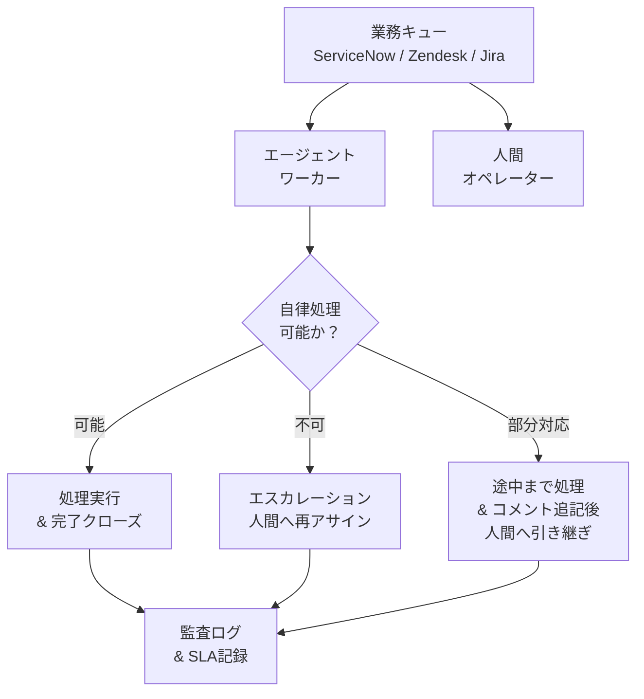

# RT-9 Enterprise Work Queue Agent（業務キュー参加）

## 概要

エージェントを「話しかけると答えるチャットボット」ではなく、ServiceNow や Zendesk の業務キューからチケットを取って処理する「もう一人のオペレーター」として設計します。人間と同じキューに並び、自律的に処理を試みて、できないタスクは人間にエスカレーションします。SLA 管理・負荷分散・優先度付けは既存のキュー基盤がそのまま担うため、AI のために特別な仕組みを用意する必要がありません。

## 解決する企業課題

AI 処理と人間業務ワークフローの断絶——これがこのパターンが解決する中心的な課題です。「AI 専用チャット画面」を別途設けると、既存業務フロー（ServiceNow/Zendesk/Jira で管理されている SLA・優先度・担当割り当て）から切り離された孤立した処理が生まれます。AI が処理したかどうか、SLA が守られたかどうかを追跡できなくなってしまいます。

組織は時間外対応や処理量の増加に対して、新規チャンネルではなく既存業務フローの延長として自動化を求めます。既存の ITSM プロセス（ServiceNow/Zendesk/Jira）には SLA 管理・エスカレーションルール・負荷分散のロジックがすでに組み込まれており、エージェントが別系統の処理を持つことはその資産を無駄にすることになります。

監査の観点でも重要です。「誰（AI か人間か）がいつ何を処理したか」をチケット履歴として一元管理することが、規制対応や品質保証の前提になります。AI 専用チャネルでは、この情報が既存の ITSM 記録と分断されてしまいます。

!!! tip "最小成立条件（MVP）"
    既存のチケットシステム（ServiceNow や Zendesk）の1カテゴリに対してエージェントをコンシューマとして接続し、処理可能なら完了・不可能なら即エスカレーションする最小ワーカーを1体稼働させる構成。

## 価値仮説

定型タスクの自動振り分けと処理により、人間は高付加価値業務に集中できます。チケット処理・申請処理等の大量反復業務の自動化は、直接的な人件費削減と処理スループット向上をもたらします。

## 解決策と設計

解決策の核心は「エージェントをキューのワーカーとして既存業務プロセスに組み込むこと」です。エージェントは人間オペレーターと同じキューを購読し、同じ SLA ルールに従って動作します。エージェントが対応不可と判断した場合のハンドオフも、既存のルーティングロジックに乗ります。

エージェントはキューのコンシューマとして動作します。タスクを取得し、処理可能かを判断し、完了またはエスカレーションという結果で応答します。



タスク取得時にエージェントは自身の処理スコープ（対応可能なカテゴリ・リスクレベル・権限範囲）を評価します。スコープ外・高リスク・判断困難なケースは即座に人間にエスカレーションします。SLA 残時間が一定値を下回った場合も自動でエスカレーションします。部分処理を行った場合は、調査結果・試行内容をチケットにコメントとして記録してから引き継いでください。担当者が経緯をすぐ把握できるようにするためです。

## 向き／不向き

| 向き | 不向き |
|---|---|
| 既存のITSMまたはカスタマーサポートシステム（ServiceNow、Zendesk、Jira Service Management）を運用中で、そこに処理量の増加・時間外対応・単純タスクの自動化ニーズがある | タスクの定義がなく「何でも聞ける」汎用アシスタントとして使いたい場合（チャット型UIのほうが適合します） |
| タスクの完了・エスカレーション・SLAを一元管理したい組織 | 処理対象業務のSLAが存在せず、優先度管理も不要な場合（キューの複雑性がオーバーエンジニアリングになります） |
| エージェントの処理スコープが明確に定義でき、スコープ外を人間に引き継ぐ判断ロジックを実装できる業務 | エスカレーション先の人間ワーカーが存在しない（自動化率100%が前提の）業務 |

## 要素技術・既存システム連携

- **キュー・チケットシステム**：ServiceNow（インシデント・サービスリクエスト）、Zendesk（サポートチケット）、Jira Service Management（開発・運用タスク）
- **SLA管理**：各チケットシステムのSLAポリシー設定、エスカレーションルール
- **アサインメントポリシー**：スキルベースルーティング（ServiceNow Assignment Rules、Zendesk Triggers）
- **人間ハンドオフ**：エージェントからのコメント付きエスカレーション、Slackへの通知連携
- **エージェントフレームワーク**：LangGraph、LangChain Agents（タスク処理ロジック）
- **永続化**：RT-8 Durable Workflowと組み合わせ、タスク処理をクラッシュ耐性のあるワークフローとして実行

## 落とし穴／選定の勘所

!!! danger "チャットボットとして設計しないこと"
    「AI用のチャット画面を既存システムとは別に作る」アプローチは、業務フローの二重管理を生みます。対応状況がSLAシステムに反映されず、ハンドオフ時の情報が失われ、監査証跡が分断されます。エージェントはSLAとキューを管理する既存システムの「ワーカー」として設計してください。

!!! warning "エスカレーション基準の曖昧さ"
    エージェントがいつ人間にエスカレーションすべきかを曖昧にすると、処理できないタスクをキューに放置したり、逆にリスクの高いタスクを自律処理してしまいます。エスカレーション基準（リスクレベル・権限範囲・カテゴリ・SLA残時間）をコードまたはポリシーとして明示的に定義してください。

!!! warning "部分処理なしの放棄"
    処理できないと判断した時点で何もコメントせずにエスカレーションすると、担当者が調査の出発点を失います。エージェントが確認した情報・試みたアクション・特定した原因候補はチケットにコメントとして記録してからエスカレーションしてください。

!!! warning "SLAへの影響を計測しないまま運用"
    エージェントがキューを占有することで、人間がすぐに処理すべきタスクの優先度が後ろに押し出されるケースがあります。エージェントの処理速度・完了率・エスカレーション率・SLA達成率を定期的に計測し、キューのルーティングポリシーを調整してください。

## Interfaces

以下はこのパターンを実装する際の主要インターフェイスです。コーディングエージェントはこの定義からスタブコードを生成できます。

```yaml
interfaces:
  - name: Queue Consumer
    description: "Agent subscribes to the same queue as human operators with identical SLA rules and priority routing."
    input:
      request: object
    output:
      response: object
    errors:
      - code: GENERAL_ERROR
        description: "Queue Consumer の処理中にエラーが発生"
    protocol: "REST / gRPC"
    implementation_hints:
      - "詳細は本文の「解決策と設計」節を参照"
    code_examples:
      typescript: |
        interface QueueConsumerRequest {
          queueId: string;
          agentId: string;
          maxConcurrent: number;
        }
        interface QueueConsumerResponse {
          taskId: string;
          task: object;
          assignedAt: Date;
        }
        interface QueueConsumer {
          queueConsumer(req: QueueConsumerRequest): Promise<QueueConsumerResponse>;
        }
      python: |
        @dataclass
        class QueueConsumerRequest:
            queue_id: str
            agent_id: str
            max_concurrent: int
        
        @dataclass
        class QueueConsumerResponse:
            task_id: str
            task: dict
            assigned_at: datetime
        
        class QueueConsumer(Protocol):
            async def queue_consumer(self, req: QueueConsumerRequest) -> QueueConsumerResponse: ...
  - name: Escalation Handler
    description: "Evaluates whether a task is within scope; if not, documents findings and attempts to date in ticket comments before reassigning to a human."
    input:
      request: object
    output:
      response: object
    errors:
      - code: GENERAL_ERROR
        description: "Escalation Handler の処理中にエラーが発生"
    protocol: "REST / gRPC"
    implementation_hints:
      - "詳細は本文の「解決策と設計」節を参照"
    code_examples:
      typescript: |
        interface EscalationHandlerRequest {
          taskId: string;
          agentId: string;
          inScopeCheck: boolean;
          findings: string;
        }
        interface EscalationHandlerResponse {
          escalated: boolean;
          assignedTo: string;
          escalationReason: string;
        }
        interface EscalationHandler {
          escalationHandler(req: EscalationHandlerRequest): Promise<EscalationHandlerResponse>;
        }
      python: |
        @dataclass
        class EscalationHandlerRequest:
            task_id: str
            agent_id: str
            in_scope_check: bool
            findings: str
        
        @dataclass
        class EscalationHandlerResponse:
            escalated: bool
            assigned_to: str
            escalation_reason: str
        
        class EscalationHandler(Protocol):
            async def escalation_handler(self, req: EscalationHandlerRequest) -> EscalationHandlerResponse: ...
  - name: SLA Monitor
    description: "Triggers automatic escalation to a human when SLA remaining time falls below threshold or processing cannot proceed."
    input:
      request: object
    output:
      response: object
    errors:
      - code: GENERAL_ERROR
        description: "SLA Monitor の処理中にエラーが発生"
    protocol: "REST / gRPC"
    implementation_hints:
      - "詳細は本文の「解決策と設計」節を参照"
    code_examples:
      typescript: |
        interface SlaMonitorRequest {
          taskId: string;
          slaThresholdMs: number;
          currentElapsedMs: number;
        }
        interface SlaMonitorResponse {
          slaBreached: boolean;
          alertSent: boolean;
          escalatedTo: string;
        }
        interface SlaMonitor {
          slaMonitor(req: SlaMonitorRequest): Promise<SlaMonitorResponse>;
        }
      python: |
        @dataclass
        class SlaMonitorRequest:
            task_id: str
            sla_threshold_ms: int
            current_elapsed_ms: int
        
        @dataclass
        class SlaMonitorResponse:
            sla_breached: bool
            alert_sent: bool
            escalated_to: str
        
        class SlaMonitor(Protocol):
            async def sla_monitor(self, req: SlaMonitorRequest) -> SlaMonitorResponse: ...
```

## 関連パターン

- [RT-8 Durable Enterprise Agent Workflow](rt8-durable-workflow.md)：補完関係。キューから取得したタスクをDurable Workflowとして実行し、長時間処理・承認待ちへの耐障害性を確保します。
- [RT-4 Human Approval Chain](rt4-human-approval-chain.md)：補完関係。エスカレーション時の人間承認フローと組み合わせ、高リスクタスクの意思決定を構造化します。
- [RT-10 Event-Driven Enterprise Orchestrator](rt10-event-driven-orchestrator.md)：補完関係。業務イベントをトリガーにキューへタスクを積む構成と組み合わせ、受動的なキュー処理と能動的なイベント駆動を連携させます。
- [EX-2 Embedded vs Portal](../ex-experience/ex2-embedded-vs-portal.md)：補完関係。エージェントを既存ツール（ServiceNow等）に組み込む際のUX設計の参考にします。
- [OB-1 Observability Lake](../ob-observability/ob1-observability-lake.md)：補完関係。エージェントのキュー処理状況・SLA達成率・エスカレーション率を監視し、ルーティングポリシーの継続改善に活用します。

## Decision Summary

```yaml
decision_summary:
  pattern: RT-9
  participates_in:
    - decision: TO-11
      role: option_b
    - decision: DC-9
      role: enabler
  recommended_if:
    - "既存の業務キューにエージェントを参加させたい"
    - "バッチ・非同期処理が中心"
  avoid_if:
    - "リアルタイム対話型のみ"
  combines_with: [RT-8, RT-10, IN-4]
  conflicts_with: []
  value_outcome:
    drivers: [automation]
    kpis: [キュー処理スループット, バックログ滞留時間]
  mvp: "既存業務キュー1本にエージェントワーカーを接続"
  cost: S
```
