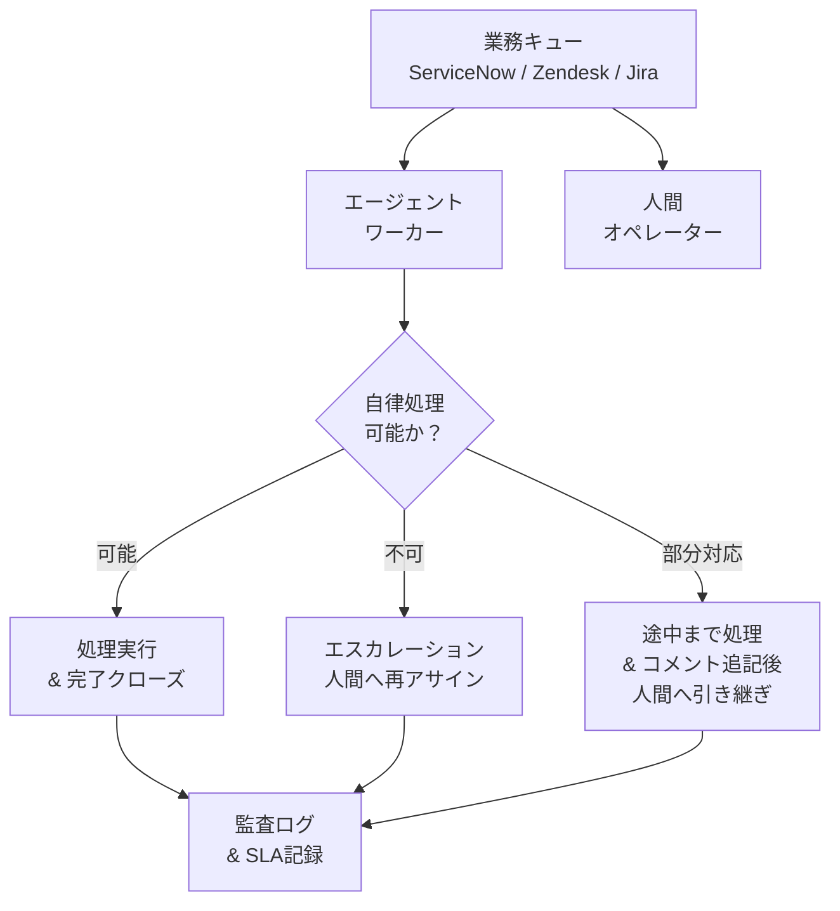

# RT-9 Enterprise Work Queue Agent（業務キュー参加）

## 概要

エージェントを「話しかけると答えるチャットボット」ではなく、ServiceNow や Zendesk の業務キューからチケットを取って処理する「もう一人のオペレーター」として設計する。人間と同じキューに並び、自律的に処理を試みて、できないタスクは人間にエスカレーションする。SLA 管理・負荷分散・優先度付けは既存のキュー基盤がそのまま担うため、AI のための特別な仕組みを作る必要がない。

## 解決する企業課題

AI 処理と人間業務ワークフローの断絶が、このパターンが解決する中心的な課題である。「AI 専用チャット画面」を別途設けると、既存業務フロー（ServiceNow/Zendesk/Jira で管理されている SLA・優先度・担当割り当て）から切り離された孤立した処理が生まれる。AI が処理したのかどうか、SLA が守られたかどうかが追跡できなくなる。

組織は時間外や処理量の増加に対応する手段として、新規チャンネルではなく既存の業務フローの延長としての自動化を求めている。既存の ITSM プロセス（ServiceNow/Zendesk/Jira）には SLA 管理・エスカレーションルール・負荷分散のロジックがすでに組み込まれており、エージェントが別系統の処理を持つことはその資産を無駄にする。

監査の観点では、「誰（AI か人間か）がいつ何を処理したか」をチケット履歴として一元管理することが規制対応や品質保証の前提になる。AI 専用チャネルでは、この情報が既存の ITSM 記録と分断される。

## 解決策と設計

解決策の核心は「エージェントをキューのワーカーとして既存業務プロセスに組み込むこと」である。エージェントは人間オペレーターと同じキューを購読し、同じSLAルールに従って動作する。エージェントが対応不可と判断した場合のハンドオフも、既存のルーティングロジックに乗る。

エージェントはキューのコンシューマとして動作する。タスクを取得し、処理可能か判断し、完了またはエスカレーションという結果で応答する。

タスク取得時にエージェントは自身の処理スコープ（対応可能なカテゴリ・リスクレベル・権限範囲）を評価する。スコープ外・高リスク・判断困難なケースは即座に人間にエスカレーションする。SLA 残時間が一定値を下回った場合も自動エスカレーションする。エージェントが部分処理を行った場合は、調査結果・試行内容をチケットにコメントとして記録してから引き継ぐ。担当者が引き継ぎ時に経緯を把握できるようにするためだ。

## 向き／不向き

**向いている条件**

- 既存のITSMまたはカスタマーサポートシステム（ServiceNow、Zendesk、Jira Service Management）を運用中で、そこに処理量の増加・時間外対応・単純タスクの自動化ニーズがある
- タスクの完了・エスカレーション・SLAを一元管理したい組織
- エージェントの処理スコープが明確に定義でき、スコープ外を人間に引き継ぐ判断ロジックを実装できる業務

**向いていない条件**

- タスクの定義がなく「何でも聞ける」汎用アシスタントとして使いたい場合（チャット型UIのほうが適合する）
- 処理対象業務のSLAが存在せず、優先度管理も不要な場合（キューの複雑性がオーバーエンジニアリングになる）
- エスカレーション先の人間ワーカーが存在しない（自動化率100%が前提の）業務

## 要素技術・既存システム連携

- **キュー・チケットシステム**：ServiceNow（インシデント・サービスリクエスト）、Zendesk（サポートチケット）、Jira Service Management（開発・運用タスク）
- **SLA管理**：各チケットシステムのSLAポリシー設定、エスカレーションルール
- **アサインメントポリシー**：スキルベースルーティング（ServiceNow Assignment Rules、Zendesk Triggers）
- **人間ハンドオフ**：エージェントからのコメント付きエスカレーション、Slackへの通知連携
- **エージェントフレームワーク**：LangGraph、LangChain Agents（タスク処理ロジック）
- **永続化**：RT-8 Durable Workflowと組み合わせ、タスク処理をクラッシュ耐性のあるワークフローとして実行

## 落とし穴／選定の勘所

!!! danger "チャットボットとして設計しない"
    「AI用のチャット画面を既存システムとは別に作る」アプローチは、業務フローの二重管理を生む。対応状況がSLAシステムに反映されず、ハンドオフ時の情報が失われ、監査証跡が分断される。エージェントはSLAとキューを管理する既存システムの「ワーカー」として設計すること。

!!! warning "エスカレーション基準の曖昧さ"
    エージェントがいつ人間にエスカレーションすべきかを曖昧にすると、処理できないタスクをキューに放置したり、逆にリスクの高いタスクを自律処理してしまう。エスカレーション基準（リスクレベル・権限範囲・カテゴリ・SLA残時間）をコードまたはポリシーとして明示的に定義すること。

!!! warning "部分処理なしの放棄"
    処理できないと判断した時点で何もコメントせずにエスカレーションすると、担当者が調査の出発点を失う。エージェントが確認した情報・試みたアクション・特定した原因候補はチケットにコメントとして記録してからエスカレーションすること。

!!! warning "SLAへの影響を計測しないまま運用"
    エージェントがキューを占有することで、人間がすぐに処理すべきタスクの優先度が後ろに押し出されるケースがある。エージェントの処理速度・完了率・エスカレーション率・SLA達成率を定期的に計測し、キューのルーティングポリシーを調整すること。

## 関連パターン

- [RT-8 Durable Enterprise Agent Workflow](rt8-durable-workflow.md)：補完関係。キューから取得したタスクをDurable Workflowとして実行し、長時間処理・承認待ちへの耐障害性を確保する。
- [RT-4 Human Approval Chain](rt4-human-approval-chain.md)：補完関係。エスカレーション時の人間承認フローと組み合わせ、高リスクタスクの意思決定を構造化する。
- [RT-10 Event-Driven Enterprise Orchestrator](rt10-event-driven-orchestrator.md)：補完関係。業務イベントをトリガーにキューへタスクを積む構成と組み合わせ、受動的なキュー処理と能動的なイベント駆動を連携させる。
- [EX-2 Embedded vs Portal](../ex-experience/ex2-embedded-vs-portal.md)：補完関係。エージェントを既存ツール（ServiceNow等）に組み込む際のUX設計の参考にする。
- [OB-1 Observability Lake](../ob-observability/ob1-observability-lake.md)：補完関係。エージェントのキュー処理状況・SLA達成率・エスカレーション率を監視し、ルーティングポリシーの継続改善に活用する。
